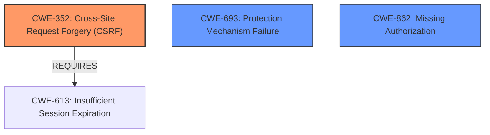

# Raw Analyzer Response for CVE-2021-21678

# Summary
| CWE ID | CWE Name | Confidence | CWE Abstraction Level | CWE Vulnerability Mapping Label | CWE-Vulnerability Mapping Notes |
|---|---|---|---|---|---|
| CWE-352 | Cross-Site Request Forgery (CSRF) | 1.0 | Compound | Allowed | Primary CWE |
| CWE-693 | Protection Mechanism Failure | 0.5 | Pillar | Discouraged | Secondary Candidate |
| CWE-862 | Missing Authorization | 0.5 | Class | Allowed-with-Review | Secondary Candidate |

## Evidence and Confidence

*   **Confidence Score:** 0.8
*   **Evidence Strength:** HIGH

## Relationship Analysis
The primary CWE, CWE-352 [CWE-352: Cross-Site Request Forgery (CSRF)], is a compound weakness. The relationships for CWE-352 [CWE-352: Cross-Site Request Forgery (CSRF)] include `Requires` CWE-346, CWE-441, CWE-642, and CWE-613 [CWE-613: Insufficient Session Expiration]. The other CWEs considered were higher level (CWE-693 [CWE-693: Protection Mechanism Failure] at the Pillar level) or related to missing authorization (CWE-862 [CWE-862: Missing Authorization]). The selection of CWE-352 [CWE-352: Cross-Site Request Forgery (CSRF)] as the primary CWE is due to the explicit mention of the **bypass of CSRF protection** in the vulnerability description.

## Vulnerability Chain
The vulnerability chain starts with the **failure** of the SAML plugin to properly implement CSRF protection, leading to the **bypass of CSRF protection**, ultimately allowing attackers to perform actions on the Jenkins instance with the user's permissions.

## Summary of Analysis
The initial assessment identified CWE-352 [CWE-352: Cross-Site Request Forgery (CSRF)] as the primary weakness due to the vulnerability description explicitly stating the **bypass of CSRF protection**. The retriever results also indicated a high relevance score for CWE-352 [CWE-352: Cross-Site Request Forgery (CSRF)].

The vulnerability description states "Jenkins SAML Plugin 2.0.7 and earlier allows attackers to craft URLs that would **bypass the CSRF protection** of any target URL in Jenkins."

The evidence provided in the "CVE Reference Links Content Summary" section further supports this assessment:
- "**Insufficient CSRF Protection:** The SAML plugin's implementation allowed attackers to **bypass CSRF protection** for *any* target URL, not just the intended redirect URL."

Other CWEs such as CWE-693 [CWE-693: Protection Mechanism Failure] and CWE-862 [CWE-862: Missing Authorization] were considered. However, CWE-352 [CWE-352: Cross-Site Request Forgery (CSRF)] is the most specific and accurate representation of the vulnerability.

The selected CWE is at the optimal level of specificity because it directly addresses the **weakness** described in the vulnerability.
Relevant CWE Information:

# Enhanced Context (25 CWEs)
The following CWEs were identified as potentially relevant to this vulnerability:

## CWE-425: Direct Request ('Forced Browsing')
**Abstraction Level**: Base
**Similarity Score**: 0.78
**Source**: dense

**Description**:
The web application does not adequately enforce appropriate authorization on all restricted URLs, scripts, or files.

**Mapping Guidance**:
- Usage: Allowed
- Rationale: This CWE entry is at the Base level of abstraction, which is a preferred level of abstraction for mapping to the root causes of vulnerabilities.

## CWE-807: Reliance on Untrusted Inputs in a Security Decision
**Abstraction Level**: Base
**Similarity Score**: 0.78
**Source**: dense

**Description**:
The product uses a protection mechanism that relies on the existence or values of an input, but the input can be modified by an untrusted actor in a way that bypasses the protection mechanism.

**Mapping Guidance**:
- Usage: Allowed
- Rationale: This CWE entry is at the Base level of abstraction, which is a preferred level of abstraction for mapping to the root causes of vulnerabilities.

## CWE-41: Improper Resolution of Path Equivalence
**Abstraction Level**: Base
**Similarity Score**: 0.78
**Source**: dense

**Description**:
The product is vulnerable to file system contents disclosure through path equivalence. Path equivalence involves the use of special characters in file and directory names. The associated manipulations are intended to generate multiple names for the same object.

**Mapping Guidance**:
- Usage: Allowed
- Rationale: This CWE entry is at the Base level of abstraction, which is a preferred level of abstraction for mapping to the root causes of vulnerabilities.

## CWE-472: External Control of Assumed-Immutable Web Parameter
**Abstraction Level**: Base
**Similarity Score**: 0.77
**Source**: dense

**Description**:
The web application does not sufficiently verify inputs that are assumed to be immutable but are actually externally controllable, such as hidden form fields.

**Mapping Guidance**:
- Usage: Allowed
- Rationale: This CWE entry is at the Base level of abstraction, which is a preferred level of abstraction for mapping to the root causes of vulnerabilities.

## CWE-668: Exposure of Resource to Wrong Sphere
**Abstraction Level**: Class
**Similarity Score**: 0.77
**Source**: dense

**Description**:
The product exposes a resource to the wrong control sphere, providing unintended actors with inappropriate access to the resource.

**Mapping Guidance**:
- Usage: Discouraged
- Rationale: CWE-668 is high-level and is often misused as a catch-all when lower-level CWE IDs might be applicable. It is sometimes used for low-information vulnerability reports [REF-1287]. It is a level-1 Class (i.e., a child of a Pillar). It is not useful for trend analysis.

## CWE-639: Authorization Bypass Through User-Controlled Key
**Abstraction Level**: Base
**Similarity Score**: 0.77
**Source**: dense

**Description**:
The system's authorization functionality does not prevent one user from gaining access to another user's data or record by modifying the key value identifying the data.

**Mapping Guidance**:
- Usage: Allowed
- Rationale: This CWE entry is at the Base level of abstraction, which is a preferred level of abstraction for mapping to the root causes of vulnerabilities.

## CWE-204: Observable Response Discrepancy
**Abstraction Level**: Base
**Similarity Score**: 0.77
**Source**: dense

**Description**:
The product provides different responses to incoming requests in a way that reveals internal state information to an unauthorized actor outside of the intended control sphere.

**Mapping Guidance**:
- Usage: Allowed
- Rationale: This CWE entry is at the Base level of abstraction, which is a preferred level of abstraction for mapping to the root causes of vulnerabilities.

## CWE-451: User Interface (UI) Misrepresentation of Critical Information
**Abstraction Level**: Class
**Similarity Score**: 0.77
**Source**: dense

**Description**:
The user interface (UI) does not properly represent critical information to the user, allowing the information - or its source - to be obscured or spoofed. This is often a component in phishing attacks.

**Mapping Guidance**:
- Usage: Allowed-with-Review
- Rationale: This CWE entry is a Class and might have Base-level children that would be more appropriate

## CWE-799: Improper Control of Interaction Frequency
**Abstraction Level**: Class
**Similarity Score**: 0.77
**Source**: dense

**Description**:
The product does not properly limit the number or frequency of interactions that it has with an actor, such as the number of incoming requests.

**Mapping Guidance**:
- Usage: Allowed-with-Review
- Rationale: This CWE entry is a Class and might have Base-level children that would be more appropriate

## CWE-208: Observable Timing Discrepancy
**Abstraction Level**: Base
**Similarity Score**: 0.77
**Source**: dense

**Description**:
Two separate operations in a product require different amounts of time to complete, in a way that is observable to an actor and reveals security-relevant information about the state of the product, such as whether