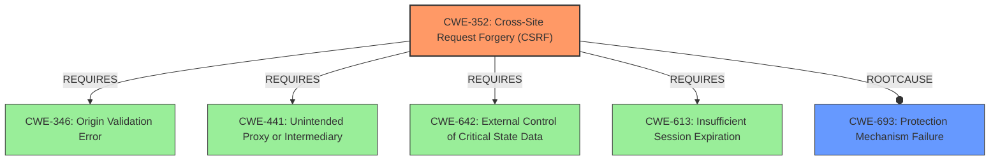

# Enhanced Analysis for CVE-2021-21679

# Summary
| CWE ID | CWE Name | Confidence | CWE Abstraction Level | CWE Vulnerability Mapping Label | CWE-Vulnerability Mapping Notes |
|---|---|---|---|---|---|
| CWE-352 | Cross-Site Request Forgery (CSRF) | 1.0 | Compound | Allowed | Primary CWE |
| CWE-693 | Protection Mechanism Failure | 0.6 | Pillar | Discouraged | Secondary Candidate |

## Evidence and Confidence

*   **Confidence Score:** 0.9
*   **Evidence Strength:** HIGH

## Relationship Analysis
The primary CWE is CWE-352, Cross-Site Request Forgery, a compound weakness that encapsulates the overall attack vector. It relies on the **failure of the protection mechanism** which could potentially be mapped to CWE-693, a higher-level abstraction. The relationships defined for CWE-352 show it **REQUIRES** other weaknesses like **CWE-346: Origin Validation Error**, **CWE-441: Unintended Proxy or Intermediary**, **CWE-642: External Control of Critical State Data**, and **CWE-613: Insufficient Session Expiration**, highlighting dependencies needed for a successful CSRF attack. These relationships help in understanding the full context of the vulnerability.



## Vulnerability Chain
The chain of events starts with the **improper implementation** of an extension point in the Azure AD Plugin, leading to **insufficient CSRF protection**. This **weakness** allows attackers to craft malicious URLs that bypass CSRF protection, enabling them to perform actions as a logged-in user without their knowledge. The root cause is the **failure to properly implement CSRF protection**, which results in the CSRF bypass vulnerability.

## Summary of Analysis
The initial assessment strongly points to CWE-352 as the primary weakness. The vulnerability description explicitly states that attackers can **bypass CSRF protection**, which aligns directly with the definition of CWE-352. The CVE Reference Links Content Summary further confirms this by highlighting the **insufficient CSRF protection** as a key aspect of the vulnerability.

The retriever results also list CWE-352 with a high score, reinforcing this assessment. While other CWEs like CWE-693 (Protection Mechanism Failure) and CWE-862 (Missing Authorization) were considered, they are either too general or not specific enough to capture the essence of the vulnerability. CWE-693 is a Pillar, and the rootcause shows it as a **failure of the protection mechanism** to prevent CSRF. CWE-862 is a Class and represents missing authorization, whereas the vulnerability is about bypassing an existing CSRF protection.

The final decision is to assign CWE-352 as the primary CWE because it accurately represents the vulnerability. It's a well-defined compound weakness that directly addresses the CSRF bypass issue. While CWE-693 is applicable as a high-level cause, it's too abstract. CWE-352 is at the optimal level of specificity for this vulnerability.

Relevant CWE Information:

# Enhanced Context (25 CWEs)
## CWE-425: Direct Request ('Forced Browsing')
**Abstraction Level**: Base
**Similarity Score**: 0.78
**Source**: dense

**Description**:
The web application does not adequately enforce appropriate authorization on all restricted URLs, scripts, or files.

**Mapping Guidance**:
- Usage: Allowed
- Rationale: This CWE entry is at the Base level of abstraction, which is a preferred level of abstraction for mapping to the root causes of vulnerabilities.

## CWE-807: Reliance on Untrusted Inputs in a Security Decision
**Abstraction Level**: Base
**Similarity Score**: 0.78
**Source**: dense

**Description**:
The product uses a protection mechanism that relies on the existence or values of an input, but the input can be modified by an untrusted actor in a way that bypasses the protection mechanism.

**Mapping Guidance**:
- Usage: Allowed
- Rationale: This CWE entry is at the Base level of abstraction, which is a preferred level of abstraction for mapping to the root causes of vulnerabilities.

## CWE-41: Improper Resolution of Path Equivalence
**Abstraction Level**: Base
**Similarity Score**: 0.77
**Source**: dense

**Description**:
The product is vulnerable to file system contents disclosure through path equivalence. Path equivalence involves the use of special characters in file and directory names. The associated manipulations are intended to generate multiple names for the same object.

**Mapping Guidance**:
- Usage: Allowed
- Rationale: This CWE entry is at the Base level of abstraction, which is a preferred level of abstraction for mapping to the root causes of vulnerabilities.

## CWE-639: Authorization Bypass Through User-Controlled Key
**Abstraction Level**: Base
**Similarity Score**: 0.77
**Source**: dense

**Description**:
The system's authorization functionality does not prevent one user from gaining access to another user's data or record by modifying the key value identifying the data.

**Mapping Guidance**:
- Usage: Allowed
- Rationale: This CWE entry is at the Base level of abstraction, which is a preferred level of abstraction for mapping to the root causes of vulnerabilities.

## CWE-472: External Control of Assumed-Immutable Web Parameter
**Abstraction Level**: Base
**Similarity Score**: 0.77
**Source**: dense

**Description**:
The web application does not sufficiently verify inputs that are assumed to be immutable but are actually externally controllable, such as hidden form fields.

**Mapping Guidance**:
- Usage: Allowed
- Rationale: This CWE entry is at the Base level of abstraction, which is a preferred level of abstraction for mapping to the root causes of vulnerabilities.

## CWE-204: Observable Response Discrepancy
**Abstraction Level**: Base
**Similarity Score**: 0.77
**Source**: dense

**Description**:
The product provides different responses to incoming requests in a way that reveals internal state information to an unauthorized actor outside of the intended control sphere.

**Mapping Guidance**:
- Usage: Allowed
- Rationale: This CWE entry is at the Base level of abstraction, which is a preferred level of abstraction for mapping to the root causes of vulnerabilities.

## CWE-668: Exposure of Resource to Wrong Sphere
**Abstraction Level**: Class
**Similarity Score**: 0.77
**Source**: dense

**Description**:
The product exposes a resource to the wrong control sphere, providing unintended actors with inappropriate access to the resource.

**Mapping Guidance**:
- Usage: Discouraged
- Rationale: CWE-668 is high-level and is often misused as a catch-all when lower-level CWE IDs might be applicable. It is sometimes used for low-information vulnerability reports [REF-1287]. It is a level-1 Class (i.e., a child of a Pillar). It is not useful for trend analysis.

## CWE-799: Improper Control of Interaction Frequency
**Abstraction Level**: Class
**Similarity Score**: 0.77
**Source**: dense

**Description**:
The product does not properly limit the number or frequency of interactions that it has with an actor, such as the number of incoming requests.

**Mapping Guidance**:
- Usage: Allowed-with-Review
- Rationale: This CWE entry is a Class and might have Base-level children that would be more appropriate

## CWE-451: User Interface (UI) Misrepresentation of Critical Information
**Abstraction Level**: Class
**Similarity Score**: 0.77
**Source**: dense

**Description**:
The user interface (UI) does not properly represent critical information to the user, allowing the information - or its source - to be obscured or spoofed. This is often a component in phishing attacks.

**Mapping Guidance**:
- Usage: Allowed-with-Review
- Rationale: This CWE entry is a Class and might have Base-level children that would be more appropriate

## CWE-923:


## CWE Relationship Analysis

Current CWEs represent these abstraction levels: .


### Vulnerability Chain Analysis

**Chain starting from CWE-862:**
- 862 (Missing Authorization) - ROOT


**Chain starting from CWE-41:**
- 41 (Improper Resolution of Path Equivalence) - ROOT


### CWE Relationship Diagram

```mermaid
graph TD
    classDef primary fill:#f96,stroke:#333,stroke-width:2px
    classDef secondary fill:#69f,stroke:#333
    classDef tertiary fill:#9e9,stroke:#333
```