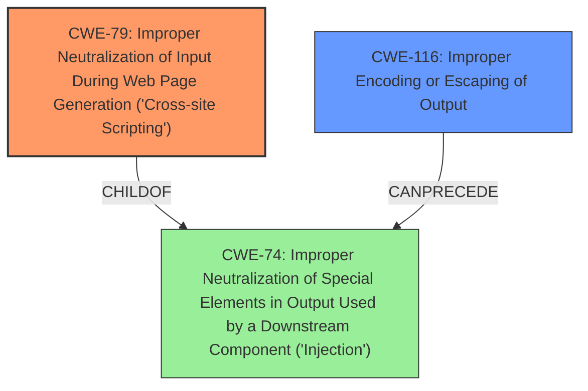

# Enhanced Analysis for CVE-2021-21684

# Summary
| CWE ID | CWE Name | Confidence | CWE Abstraction Level | CWE Vulnerability Mapping Label | CWE-Vulnerability Mapping Notes |
|---|---|---|---|---|---|
| CWE-79 | Improper Neutralization of Input During Web Page Generation ('Cross-site Scripting') | 1.0 | Base | Allowed | Primary CWE |
| CWE-116 | Improper Encoding or Escaping of Output | 0.75 | Class | Allowed-with-Review | Secondary Candidate |

## Evidence and Confidence

*   **Confidence Score:** 0.9
*   **Evidence Strength:** HIGH

## Relationship Analysis
The primary CWE is CWE-79, which is a base-level CWE describing improper neutralization of input during web page generation leading to XSS. CWE-116 is a class-level CWE describing improper encoding or escaping of output. CWE-79 is a child of CWE-74 (Improper Neutralization of Special Elements in Output Used by a Downstream Component ('Injection')). CWE-116 can precede CWE-74.



## Vulnerability Chain
The vulnerability chain starts with the **failure to escape the Git SHA-1 checksum parameters provided to commit notifications**. This leads to a stored cross-site scripting (XSS) vulnerability, which means that malicious scripts can be injected and executed in the context of users viewing the build cause page.

## Summary of Analysis
The primary weakness is CWE-79, because the Jenkins Git Plugin **does not escape the Git SHA-1 checksum parameters provided to commit notifications** when displaying them in a build cause, resulting in a stored cross-site scripting (XSS) vulnerability. This aligns directly with CWE-79's description: "The product does not neutralize or incorrectly neutralizes user-controllable input before it is placed in output that is used as a web page that is served to other users."

The "Vulnerability Description Key Phrases" section identifies the **rootcause** as "**does not escape the Git SHA-1 checksum parameters provided to commit notifications**" and the **impact** as "stored cross-site scripting". The "CVE Reference Links Content Summary" confirms that the plugin did not sanitize Git SHA-1 checksum parameters, which led to a stored XSS vulnerability.

CWE-116 was considered as a possible secondary CWE because the **failure to escape** is a form of improper encoding or escaping of output. However, since the impact is specifically XSS, CWE-79 is the more accurate primary CWE.

Other CWEs considered but not used:

*   CWE-352 (Cross-Site Request Forgery (CSRF)): This is not applicable as the vulnerability is about injecting malicious scripts, not forging requests.
*   CWE-862 (Missing Authorization): This is not applicable as the vulnerability is about input sanitization, not authorization.
*   CWE-549 (Missing Password Field Masking): This is not applicable as the vulnerability is about XSS, not password handling.
*   CWE-78 (Improper Neutralization of Special Elements used in an OS Command ('OS Command Injection')): This is not applicable as the vulnerability is about XSS, not OS command injection.
*   CWE-434 (Unrestricted Upload of File with Dangerous Type): This is not applicable as the vulnerability is about XSS, not file uploads.
*   CWE-138 (Improper Neutralization of Special Elements): This is a class-level CWE, and CWE-79 is a more specific base-level CWE.
*   CWE-668 (Exposure of Resource to Wrong Sphere): This is a high-level CWE, and CWE-79 is a more specific base-level CWE.

The selected CWE is at the optimal level of specificity (Base) because it directly addresses the **improper neutralization** of input leading to XSS.


## CWE Relationship Analysis

Current CWEs represent these abstraction levels: .


### Vulnerability Chain Analysis

**Chain starting from CWE-79:**
- 79 (Improper Neutralization of Input During Web Page Generation ('Cross-site Scripting')) - ROOT


**Chain starting from CWE-862:**
- 862 (Missing Authorization) - ROOT


### CWE Relationship Diagram

```mermaid
graph TD
    classDef primary fill:#f96,stroke:#333,stroke-width:2px
    classDef secondary fill:#69f,stroke:#333
    classDef tertiary fill:#9e9,stroke:#333
```