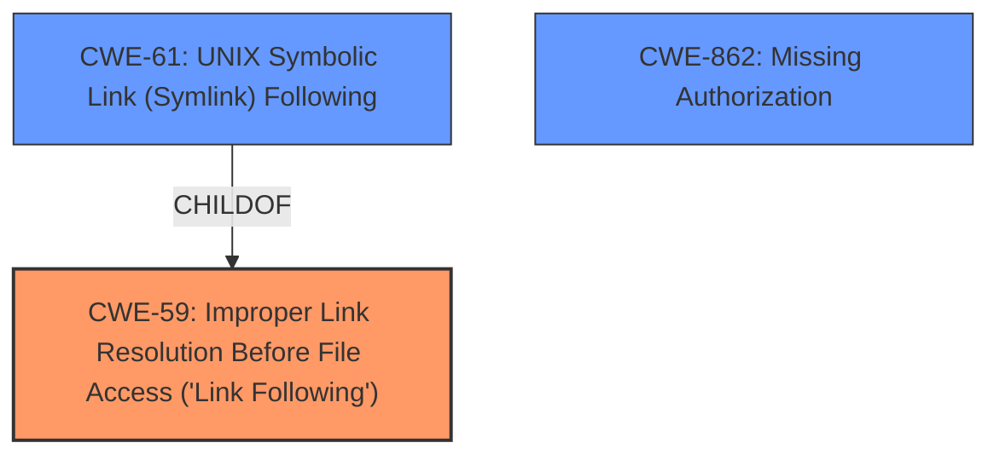

# Enhanced Analysis for CVE-2021-21687

# Summary
| CWE ID | CWE Name | Confidence | CWE Abstraction Level | CWE Vulnerability Mapping Label | CWE-Vulnerability Mapping Notes |
|---|---|---|---|---|---|
| CWE-59 | Improper Link Resolution Before File Access ('Link Following') | 0.9 | Base | Allowed | Primary CWE |
| CWE-862 | Missing Authorization | 0.7 | Class | Allowed-with-Review | Secondary Candidate |
| CWE-61 | UNIX Symbolic Link (Symlink) Following | 0.6 | Compound | Allowed | Secondary Candidate |

## Evidence and Confidence

*   **Confidence Score:** 0.8
*   **Evidence Strength:** HIGH

## Relationship Analysis
The primary CWE is CWE-59, which describes the fundamental issue of improperly handling symbolic links. CWE-61, a compound CWE, represents a specific scenario involving UNIX symbolic links and is a ChildOf CWE-59. CWE-862 represents a missing authorization check which contributed to the vulnerability. The hierarchical structure influenced the decision to prioritize CWE-59 due to its broader applicability, while acknowledging CWE-61 and CWE-862 for their specific contexts.



## Vulnerability Chain
The vulnerability chain starts with the **lack of proper authorization checks** in `FilePath#untar` (CWE-862), which leads to the **improper handling of symbolic links** (CWE-59). This allows an attacker to create arbitrary symbolic links, potentially leading to unauthorized access, modification, or deletion of files.

## Summary of Analysis
The initial assessment, based on the vulnerability description and CVE reference, points to the **improper handling of symbolic links** as the root cause. The evidence includes: "Jenkins... does not check agent-to-controller access to create symbolic links when unarchiving a symbolic link in FilePath#untar" and "Root cause of vulnerability: The `FilePath#untar` method in Jenkins did not check for permissions when creating symbolic links during unarchiving."

The graph relationships indicate that CWE-59 is a more general case, while CWE-61 is a specific compound case related to UNIX systems. Since the vulnerability description doesn't explicitly mention UNIX-specific aspects, CWE-59 is the more appropriate primary mapping. The **missing authorization check** (CWE-862) is a contributing factor, allowing the symbolic link creation in the first place.

The selected CWEs are at the optimal level of specificity because they directly address the root cause (CWE-59) and a contributing factor (CWE-862) of the vulnerability, based on the provided evidence.

Relevant CWE Information:

# Enhanced Context (25 CWEs)
The following CWEs were identified as potentially relevant to this vulnerability:

## CWE-59: Improper Link Resolution Before File Access ('Link Following')
**Abstraction Level**: Base
**Similarity Score**: 0.79
**Source**: dense

**Description**:
The product attempts to access a file based on the filename, but it does not properly prevent that filename from identifying a link or shortcut that resolves to an unintended resource.

**Mapping Guidance**:
- Usage: Allowed
- Rationale: This CWE entry is at the Base level of abstraction, which is a preferred level of abstraction for mapping to the root causes of vulnerabilities.

## CWE-61: UNIX Symbolic Link (Symlink) Following
**Abstraction Level**: Compound
**Similarity Score**: 0.76
**Source**: dense

**Description**:
The product, when opening a file or directory, does not sufficiently account for when the file is a symbolic link that resolves to a target outside of the intended control sphere. This could allow an attacker to cause the product to operate on unauthorized files.

**Mapping Guidance**:
- Usage: Allowed
- Rationale: This is a well-known Composite of multiple weaknesses that must all occur simultaneously, although it is attack-oriented in nature.

## CWE-862: Missing Authorization
**Abstraction Level**: Class
**Similarity Score**: 0.76
**Source**: dense

**Description**:
The product does not perform an authorization check when an actor attempts to access a resource or perform an action.

**Mapping Guidance**:
- Usage: Allowed-with-Review
- Rationale: This CWE entry is a Class and might have Base-level children that would be more appropriate

## CWE-22: Improper Limitation of a Pathname to a Restricted Directory ('Path Traversal')
**Abstraction Level**: Base
**Similarity Score**: 0.78
**Source**: dense

**Description**:
The product uses external input to construct a pathname that should be within a restricted directory, but it does not properly neutralize sequences such as ".." that can resolve to a location that is outside of that directory.

**Mapping Guidance**:
- Usage: Allowed
- Rationale: This CWE entry is at the Base level of abstraction, which is a preferred level of abstraction for mapping to the root causes of vulnerabilities.

### CWE Selection Details:

*   **CWE-59 Improper Link Resolution Before File Access ('Link Following')**
    *   **Explanation:** This CWE accurately describes the core vulnerability where the system fails to properly validate or restrict symbolic links, leading to potential access of unintended resources.
    *   **Evidence:** The vulnerability description states that Jenkins "does not check agent-to-controller access to create symbolic links when unarchiving a symbolic link in FilePath#untar." The CVE Reference Links Content Summary also mentions "Insufficient permission checks when creating symbolic links during the `untar` operation."
    *   **Security Implications:** Attackers can exploit this to create symbolic links pointing to sensitive files or directories, potentially gaining unauthorized access or control.
    *   **Relationships:** CWE-59 is a base-level CWE, providing a general description of the weakness.
    *   **Mapping Guidance:** The usage is "Allowed" and the rationale is that it's at the base level of abstraction, which aligns with identifying root causes.
*   **CWE-862 Missing Authorization**
    *   **Explanation:** This CWE highlights the **lack of an authorization check**, which allows the creation of symbolic links without proper validation.
    *   **Evidence:** The CVE Reference Links Content Summary mentions "Root cause of vulnerability: The `FilePath#untar` method in Jenkins did not check for permissions when creating symbolic links during unarchiving."
    *   **Security Implications:** Without authorization, any agent can create symbolic links, leading to potential privilege escalation or unauthorized access.
    *   **Relationships:** CWE-862 is a class-level CWE.
    *   **Mapping Guidance:** The usage is "Allowed-with-Review" because it's a class, suggesting a more specific child CWE might be more appropriate. However, in this case, the lack of any authorization is a significant contributing factor.
*   **CWE-61 UNIX Symbolic Link (Symlink) Following**
    *   **Explanation:** This CWE is a compound weakness that occurs when the product does not account for symbolic links resolving to targets outside the intended control sphere.
    *   **Evidence:** The vulnerability involves the creation of symbolic links, but it's not explicitly stated that it's specific to UNIX systems.
    *   **Security Implications:** Attackers could manipulate symbolic links to access or modify files they shouldn't have access to.
    *   **Relationships:** CWE-61 is a ChildOf CWE-59 and requires other CWEs like CWE-362 (Race Condition).
    *   **Mapping Guidance:** The usage is "Allowed", but the comments suggest performing root-cause analysis to identify the underlying weaknesses. Since the description lacks specific UNIX context, it's a secondary consideration.

### CWEs Considered but Not Used:

*   **CWE-22 Improper Limitation of a Pathname to a Restricted Directory ('Path Traversal')**: While the vulnerability involves path manipulation, it's primarily related to symbolic links rather than path traversal using "..". Therefore, it's not a direct fit.
*   **CWE-73 External Control of File Name or Path**: This CWE is relevant when user input directly controls the file name or path. While an attacker controls the archive contents, the immediate issue is the improper handling of symbolic links during unarchiving, making CWE-59 a more accurate fit.
*   **CWE-367 Time-of-check Time-of-use (TOCTOU) Race Condition**: While race conditions can potentially exacerbate symbolic link vulnerabilities, the primary issue here is the **missing authorization** and **improper link resolution**, not a TOCTOU condition.


## CWE Relationship Analysis

Current CWEs represent these abstraction levels: .


### Vulnerability Chain Analysis

**Chain starting from CWE-362:**
- 362 (Concurrent Execution using Shared Resource with Improper Synchronization ('Race Condition')) - ROOT


**Chain starting from CWE-862:**
- 862 (Missing Authorization) - ROOT


### CWE Relationship Diagram

```mermaid
graph TD
    classDef primary fill:#f96,stroke:#333,stroke-width:2px
    classDef secondary fill:#69f,stroke:#333
    classDef tertiary fill:#9e9,stroke:#333
```