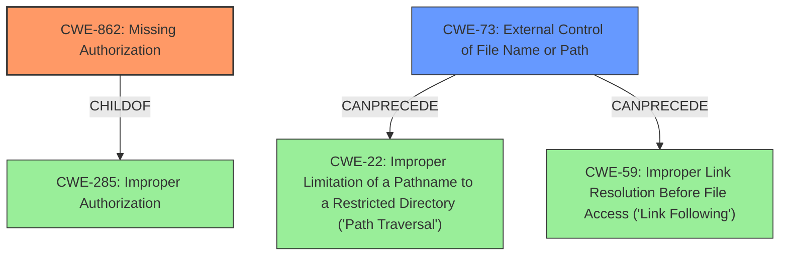

# Analysis Report for CVE-2021-21688

# Vulnerability Analysis Report: CVE-2021-21688

## Description


## Analysis (with Relationship Data)

# Summary
| CWE ID  | CWE Name  | Confidence | CWE Abstraction Level | CWE Vulnerability Mapping Label | CWE-Vulnerability Mapping Notes |
|-----------------|----------------------------------------------------------------------------------------------|----------------|---------------------------|-----------------------------------|-----------------------------------------------------------------|
| CWE-862 | Missing Authorization | 0.9 | Class  | Primary  | Allowed-with-Review |
| CWE-73  | External Control of File Name or Path | 0.7 | Base  | Secondary  | Allowed |

## Evidence and Confidence

*   **Confidence Score:** 0.8
*   **Evidence Strength:** HIGH

## Relationship Analysis
The primary relationship influencing the CWE selection is the ChildOf relationship between CWE-862 and its parent CWE-285 (Improper Authorization). While CWE-285 is a more general classification, the description clearly indicates a **missing** authorization check. Additionally, the CanPrecede relationship of CWE-73 to CWE-22 and CWE-59 highlights how external control of file paths can lead to path traversal or link following vulnerabilities. I chose the higher level CWE-862 because there are no authorization checks at all.



## Vulnerability Chain
The vulnerability chain starts with the **missing** authorization check in `FilePath#reading(FileVisitor)` (CWE-862). This leads to the ability for users to have unrestricted read access (impact) by creating archives or using `FilePath#copyRecursiveTo`. This unrestricted access is further facilitated by the external control of the file path (CWE-73). The lack of proper validation then allows for potential path traversal (CWE-22) or link following (CWE-59), enabling the reading of arbitrary files.

## Summary of Analysis
Initially, the description pointed towards a path traversal issue due to the unrestricted read access. However, after examining the CVE reference summary, the **root cause** is clearly the **missing** authorization check within the `FilePath#reading(FileVisitor)` method. This is supported by the statement: "This method does not properly validate or restrict operations...allowing unrestricted read access".

The retriever results also indicate CWE-862 and CWE-863 as potential candidates, further supporting the **missing** authorization aspect. While CWE-73 (External Control of File Name or Path) is also relevant, it is a consequence of the **missing** authorization check, rather than the primary **root cause**.

Therefore, the primary CWE is CWE-862 because the authorization check is **missing** entirely. The unrestricted file path is a secondary weakness (CWE-73) that facilitates the exploit.

The decision to use CWE-862 is based on the following evidence:

*   "does not reject any operations, allowing users to have unrestricted read access"
*   "The vulnerability lies in the `FilePath#reading(FileVisitor)` method...This method does not properly validate or restrict operations...allowing unrestricted read access."
*   "The fix for this vulnerability involves correctly rejecting operations if they operate on files outside allowed directories."

These statements explicitly indicate a **lack of authorization** checks, aligning perfectly with the definition of CWE-862.

Relevant CWE Information:

# Enhanced Context (25 CWEs)

## CWE-367: Time-of-check Time-of-use (TOCTOU) Race Condition
**Abstraction Level**: Base
**Similarity Score**: 0.79
**Source**: dense

**Description**:
The product checks the state of a resource before using that resource, but the resource's state can change between the check and the use in a way that invalidates the results of the check. This can cause the product to perform invalid actions when the resource is in an unexpected state.

**Mapping Guidance**:
- Usage: Allowed
- Rationale: This CWE entry is at the Base level of abstraction, which is a preferred level of abstraction for mapping to the root causes of vulnerabilities.

## CWE-59: Improper Link Resolution Before File Access ('Link Following')
**Abstraction Level**: Base
**Similarity Score**: 0.78
**Source**: dense

**Description**:
The product attempts to access a file based on the filename, but it does not properly prevent that filename from identifying a link or shortcut that resolves to an unintended resource.

**Mapping Guidance**:
- Usage: Allowed
- Rationale: This CWE entry is at the Base level of abstraction, which is a preferred level of abstraction for mapping to the root causes of vulnerabilities.

## CWE-41: Improper Resolution of Path Equivalence
**Abstraction Level**: Base
**Similarity Score**: 0.78
**Source**: dense

**Description**:
The product is vulnerable to file system contents disclosure through path equivalence. Path equivalence involves the use of special characters in file and directory names. The associated manipulations are intended to generate multiple names for the same object.

**Mapping Guidance**:
- Usage: Allowed
- Rationale: This CWE entry is at the Base level of abstraction, which is a preferred level of abstraction for mapping to the root causes of vulnerabilities.

## CWE-23: Relative Path Traversal
**Abstraction Level**: Base
**Similarity Score**: 0.77
**Source**: dense

**Description**:
The product uses external input to construct a pathname that should be within a restricted directory, but it does not properly neutralize sequences such as ".." that can resolve to a location that is outside of that directory.

**Mapping Guidance**:
- Usage: Allowed
- Rationale: This CWE entry is at the Base level of abstraction, which is a preferred level of abstraction for mapping to the root causes of vulnerabilities.

## CWE-73: External Control of File Name or Path
**Abstraction Level**: Base
**Similarity Score**: 0.77
**Source**: dense

**Description**:
The product allows user input to control or influence paths or file names that are used in filesystem operations.

**Mapping Guidance**:
- Usage: Allowed
- Rationale: This CWE entry is at the Base level of abstraction, which is a preferred level of abstraction for mapping to the root causes of vulnerabilities.

## CWE-668: Exposure of Resource to Wrong Sphere
**Abstraction Level**: Class
**Similarity Score**: 0.76
**Source**: dense

**Description**:
The product exposes a resource to the wrong control sphere, providing unintended actors with inappropriate access to the resource.

**Mapping Guidance**:
- Usage: Discouraged
- Rationale: CWE-668 is high-level and is often misused as a catch-all when lower-level CWE IDs might be applicable. It is sometimes used for low-information vulnerability reports [REF-1287]. It is a level-1 Class (i.e., a child of a Pillar). It is not useful for trend analysis.

## CWE-667: Improper Locking
**Abstraction Level**: Class
**Similarity Score**: 0.76
**Source**: dense

**Description**:
The product does not properly acquire or release a lock on a resource, leading to unexpected resource state changes and behaviors.

**Mapping Guidance**:
- Usage: Allowed-with-Review
- Rationale: This CWE entry is a Class and might have Base-level children that would be more appropriate

## CWE-404: Improper Resource Shutdown or Release
**Abstraction Level**: Class
**Similarity Score**: 0.76
**Source**: dense

**Description**:
The product does not release or incorrectly releases a resource before it is made available for re-use.

**Mapping Guidance**:
- Usage: Allowed-with-Review
- Rationale: This CWE entry is a Class and might have Base-level children that would be more appropriate

## CWE-362: Concurrent Execution using Shared Resource with Improper Synchronization ('Race Condition')
**Abstraction Level**: Class
**Similarity Score**: 0.76
**Source**: dense

**Description**:
The product contains a concurrent code sequence that requires temporary, exclusive access to a shared resource, but a timing window exists in which the shared resource can be modified by another code sequence operating concurrently.

**Mapping Guidance**:
- Usage: Allowed-with-Review
- Rationale: This CWE entry is a Class and might have Base-level children that would be more appropriate

## CWE-754: Improper Check for Unusual or Exceptional Conditions
**Abstraction Level**: Class


## CWE Relationship Analysis

Current CWEs represent these abstraction levels: .


### Vulnerability Chain Analysis

**Chain starting from CWE-667:**
- 667 (Improper Locking) - ROOT


**Chain starting from CWE-754:**
- 754 (Improper Check for Unusual or Exceptional Conditions) - ROOT


### CWE Relationship Diagram

```mermaid
graph TD
    classDef primary fill:#f96,stroke:#333,stroke-width:2px
    classDef secondary fill:#69f,stroke:#333
    classDef tertiary fill:#9e9,stroke:#333
```


*Report generated on 2025-04-02 04:52:50*
