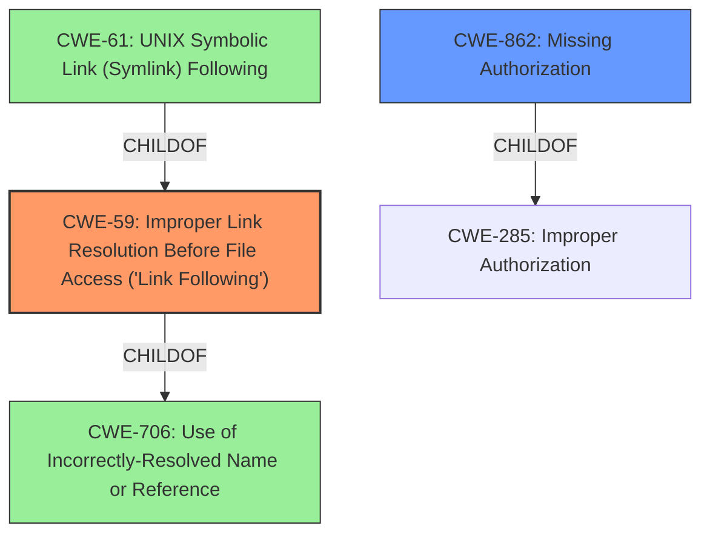

# Analysis for CVE-2021-21691

# Summary
| CWE ID | CWE Name | Confidence | CWE Abstraction Level | CWE Vulnerability Mapping Label | CWE-Vulnerability Mapping Notes |
|---|---|---|---|---|---|
| CWE-59 | Improper Link Resolution Before File Access ('Link Following') | 0.8 | Base | Allowed | Primary CWE |
| CWE-862 | Missing Authorization | 0.7 | Class | Allowed-with-Review | Secondary Candidate |

## Evidence and Confidence

*   **Confidence Score:** 0.75
*   **Evidence Strength:** HIGH

## Relationship Analysis
The primary relationship influencing the choice of CWE-59 is its direct relevance to the vulnerability description, as the vulnerability allows creating symbolic links without proper authorization, which can lead to improper link resolution. CWE-59 is a base-level CWE, which aligns well with the goal of identifying the root cause. The relationship between CWE-59 and CWE-61 (UNIX Symbolic Link Following) was considered. CWE-61 is a compound weakness that requires multiple conditions, whereas CWE-59 focuses specifically on the improper handling of link resolution, making it a more precise fit. CWE-862 (Missing Authorization) is also relevant, as the vulnerability occurs due to a lack of authorization checks before creating symbolic links. It is a class-level CWE, a level higher than Base, so it's considered a secondary candidate.

## Vulnerability Chain
The vulnerability chain begins with the **insufficient permission checks**, allowing the creation of symbolic links without the `symlink` permission. This leads to **improper link resolution**, potentially granting **arbitrary file system access** on the Jenkins controller, resulting in **information disclosure**, **data manipulation**, and potentially **privilege escalation**.

## Summary of Analysis
Initially, the analysis focused on the ability to create symbolic links without the necessary permissions. The "CVE Reference Links Content Summary" section explicitly states that the **weakness** is due to **insufficient permission checks**. This leads to the primary conclusion that CWE-59 (Improper Link Resolution Before File Access ('Link Following')) is the most appropriate mapping. The retriever results also ranked CWE-59 as the top combined result, further supporting this decision. While CWE-862 (Missing Authorization) was also considered, it is a more general class-level CWE. CWE-59 is more specific and directly addresses the **root cause** of the vulnerability, which is the **improper handling of link resolution** due to the **missing authorization** check.

The graph relationships highlight that CWE-59 is a child of CWE-706, indicating a more specific type of name resolution issue. The relationship with CWE-61 (UNIX Symbolic Link Following) shows that while related, CWE-61 is a compound weakness, whereas CWE-59 is a more direct representation of the vulnerability.

The selected CWEs are at the optimal level of specificity because CWE-59 directly addresses the **root cause** of the vulnerability, which is the **improper handling of link resolution**, while CWE-862 captures the broader issue of **missing authorization**.

Relevant CWE Information:

# Enhanced Context (25 CWEs)
The following CWEs were identified as potentially relevant to this vulnerability:

## CWE-59: Improper Link Resolution Before File Access ('Link Following')
**Abstraction Level**: Base
**Similarity Score**: 0.81
**Source**: dense

**Description**:
The product attempts to access a file based on the filename, but it does not properly prevent that filename from identifying a link or shortcut that resolves to an unintended resource.

**Mapping Guidance**:
- Usage: Allowed
- Rationale: This CWE entry is at the Base level of abstraction, which is a preferred level of abstraction for mapping to the root causes of vulnerabilities.

## CWE-862: Missing Authorization
**Abstraction Level**: Class
**Similarity Score**: 0.76
**Source**: sparse

**Description**:
The product does not perform an authorization check when an actor attempts to access a resource or perform an action.

**Mapping Guidance**:
- Usage: Allowed-with-Review
- Rationale: This CWE entry is a Class and might have Base-level children that would be more appropriate

## CWE-61: UNIX Symbolic Link (Symlink) Following
**Abstraction Level**: Compound
**Similarity Score**: 0.80
**Source**: dense

**Description**:
The product, when opening a file or directory, does not sufficiently account for when the file is a symbolic link that resolves to a target outside of the intended control sphere. This could allow an attacker to cause the product to operate on unauthorized files.

**Mapping Guidance**:
- Usage: Allowed
- Rationale: This is a well-known Composite of multiple weaknesses that must all occur simultaneously, although it is attack-oriented in nature.

## CWE-367: Time-of-check Time-of-use (TOCTOU) Race Condition
**Abstraction Level**: Base
**Similarity Score**: 0.79
**Source**: dense

**Description**:
The product checks the state of a resource before using that resource, but the resource's state can change between the check and the use in a way that invalidates the results of the check. This can cause the product to perform invalid actions when the resource is in an unexpected state.

**Mapping Guidance**:
- Usage: Allowed
- Rationale: This CWE entry is at the Base level of abstraction, which is a preferred level of abstraction for mapping to the root causes of vulnerabilities.