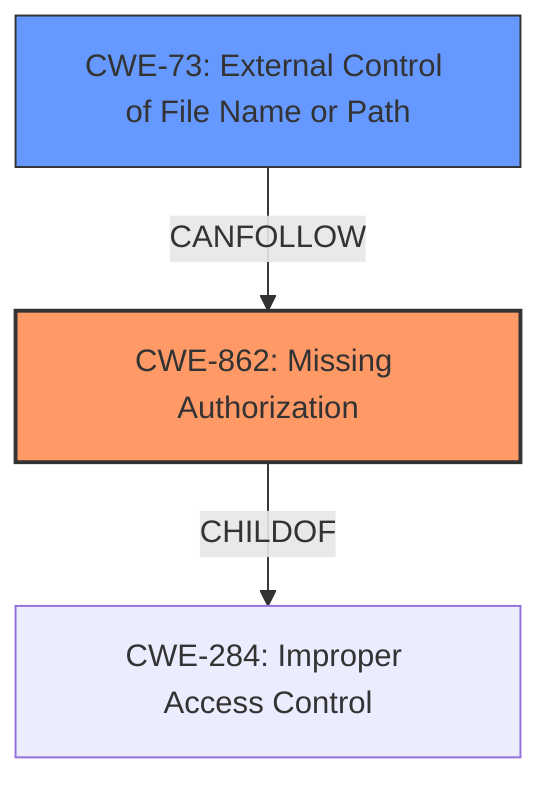

# Raw Analyzer Response for CVE-2021-21694

# Summary
| CWE ID | CWE Name | Confidence | CWE Abstraction Level | CWE Vulnerability Mapping Label | CWE-Vulnerability Mapping Notes |
|---|---|---|---|---|---|
| CWE-862 | Missing Authorization | 1.0 | Class | Primary | Allowed-with-Review |
| CWE-73 | External Control of File Name or Path | 0.7 | Base | Secondary | Allowed |

## Evidence and Confidence

*   **Confidence Score:** 0.9
*   **Evidence Strength:** HIGH

## Relationship Analysis
The primary relationship that influenced my decision was the parent-child relationship between CWE-284 (Improper Access Control) and CWE-862 (Missing Authorization) and CWE-863 (Incorrect Authorization). Since the vulnerability description explicitly mentions the **missing permission checks**, CWE-862 is a better fit than CWE-863. CWE-73 (External Control of File Name or Path) has a CANFOLLOW relationship with CWE-22 (Improper Limitation of a Pathname to a Restricted Directory ('Path Traversal')) which could be applicable if the missing authorization leads to path traversal issues. The abstraction levels were considered to ensure that the most specific and appropriate CWEs were selected.

## Vulnerability Chain
The vulnerability chain starts with the **missing permission checks** in the `FilePath` methods (CWE-862). This allows an attacker to potentially control file names or paths (CWE-73), leading to information disclosure about the Jenkins controller's file system.
  - Root Cause: CWE-862: Missing Authorization
  - Weakness: CWE-73: External Control of File Name or Path
  - Impact: Information Disclosure

## Summary of Analysis
The initial analysis identified **missing permission checks** in several `FilePath` methods within Jenkins, which aligns with CWE-862 (Missing Authorization). The vulnerability description key phrases and the CVE reference links content summary provide strong evidence for this classification. The relationship analysis highlighted the parent-child relationship between CWE-284 and CWE-862, further solidifying the choice.

The evidence from the CVE Reference Links Content Summary:
> **Missing Permission Checks:** The primary weakness is the absence of permission checks in the specified `FilePath` methods.

CWE-862 is the most specific and appropriate CWE as it directly addresses the root cause. CWE-73 is also considered as a secondary CWE because the missing authorization can potentially allow the attacker to control file names or paths, leading to information disclosure. Other CWEs like CWE-59 and CWE-22 were considered but deemed less relevant as the primary issue is the **lack of authorization**, not necessarily improper link resolution or path traversal, though these could be consequences. The final decision is based on the provided evidence and the CWE specifications, ensuring the selected CWEs accurately represent the vulnerability.

Relevant CWE Information:

# Enhanced Context (25 CWEs)
The following CWEs were identified as potentially relevant to this vulnerability:

## CWE-73: External Control of File Name or Path
**Abstraction Level**: Base
**Similarity Score**: 0.80
**Source**: dense

**Description**:
The product allows user input to control or influence paths or file names that are used in filesystem operations.

**Mapping Guidance**:
- Usage: Allowed
- Rationale: This CWE entry is at the Base level of abstraction, which is a preferred level of abstraction for mapping to the root causes of vulnerabilities.

## CWE-862: Missing Authorization
**Abstraction:** Class
**Status:** Incomplete

### Description
The product does not perform an authorization check when an actor attempts to access a resource or perform an action.

### Extended Description
Not provided

### Alternative Terms
AuthZ: "AuthZ" is typically used as an abbreviation of "authorization" within the web application security community. It is distinct from "AuthN" (or, sometimes, "AuthC") which is an abbreviation of "authentication." The use of "Auth" as an abbreviation is discouraged, since it could be used for either authentication or authorization.

### Relationships
ChildOf -> CWE-285
ChildOf -> CWE-284

### Mapping Guidance
**Usage:** Allowed-with-Review
**Rationale:** This CWE entry is a Class and might have Base-level children that would be more appropriate
**Comments:** Examine children of this entry to see if there is a better fit
**Reasons:**
- Abstraction

### Additional Notes
**[Terminology]** Assuming a user with a given identity, authorization is the process of determining whether that user can access a given resource, based on the user's privileges and any permissions or other access-control specifications that apply to the resource.

### Vulnerability Explanation and Justification

*   **CWE-862 Missing Authorization:**
    *   **Explanation:** The vulnerability lies in the fact that the `FilePath` methods in Jenkins do not perform authorization checks. This means that an attacker controlling an agent can call these methods without proper permissions, leading to information disclosure.
    *   **Match:** The vulnerability description states that `FilePath#toURI`, `FilePath#hasSymlink`, `FilePath#absolutize`, `FilePath#isDescendant`, and `FilePath#get*DiskSpace` do not check any permissions.
    *   **Security Implications:** This allows unauthorized access to sensitive information about the Jenkins controller's file system.
    *   **Relationship:** This is a child of CWE-284 (Improper Access Control).
    *   **Usage:** Allowed-with-Review
    *   **Confidence:** 1.0

*   **CWE-73 External Control of File Name or Path:**
    *   **Explanation:** Due to the **missing authorization**, an attacker might be able to influence the file names or paths used in file system operations, potentially reading arbitrary files or directories.
    *   **Match:** The **missing permission checks** in `FilePath` methods can lead to the attacker influencing file operations.
    *   **Security Implications:** This can lead to information disclosure.
    *   **Relationship:** This can follow CWE-862.
    *   **Usage:** Allowed
    *   **Confidence:** 0.7

*   **CWEs Considered but Not Used:**
    *   CWE-863 (Incorrect Authorization): While related to authorization, the vulnerability is due to **missing** authorization checks, not an incorrect check.
    *   CWE-59 (Improper Link Resolution Before File Access ('Link Following')): This is a potential consequence of the **missing authorization**, but not the primary cause. The primary issue is the **lack of authorization** to access the files in the first place.
    *   CWE-22 (Improper Limitation of a Pathname to a Restricted Directory ('Path Traversal')): This is a potential consequence of the **missing authorization**, but not the primary cause. The primary issue is the **lack of authorization** to access the files in the first place.
    *   CWE-379 (Creation of Temporary File in Directory with Insecure Permissions): Not relevant to the described vulnerability.