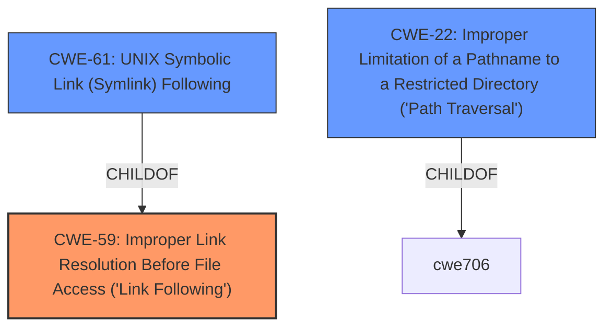

# Enhanced Analysis for CVE-2021-21695

# Summary
| CWE ID | CWE Name | Confidence | CWE Abstraction Level | CWE Vulnerability Mapping Label | CWE-Vulnerability Mapping Notes |
|---|---|---|---|---|---|
| CWE-59 | Improper Link Resolution Before File Access ('Link Following') | 0.9 | Base | Allowed | Primary CWE |
| CWE-61 | UNIX Symbolic Link (Symlink) Following | 0.7 | Compound | Allowed | Secondary Candidate |
| CWE-22 | Improper Limitation of a Pathname to a Restricted Directory ('Path Traversal') | 0.6 | Base | Allowed | Secondary Candidate |

## Evidence and Confidence

*   **Confidence Score:** 0.9
*   **Evidence Strength:** HIGH

## Relationship Analysis
The primary CWE selected is CWE-59, which represents the **improper link resolution**. CWE-61 (UNIX Symbolic Link Following) is a Compound CWE that is a child of CWE-59, representing a specific case of link following in UNIX systems. CWE-22 (Improper Limitation of a Pathname to a Restricted Directory) is related because the symlink following can lead to path traversal outside the intended directory.



## Vulnerability Chain
The vulnerability chain starts with the **improper handling of symbolic links** (CWE-59) within the `FilePath#listFiles` method. This leads to the ability to list files outside the intended directories, potentially causing information disclosure.

## Summary of Analysis
The initial analysis identified the **weakness** as the `FilePath#listFiles` method listing files outside allowed directories when following symbolic links. The CVE reference summary confirms this, stating that the method **does not properly check permissions when following symbolic links**, leading to a violation of access control.

The selection of CWE-59 is based on the clear evidence that the vulnerability involves **improper link resolution before file access**. The vulnerability description explicitly mentions "following symbolic links", which aligns directly with CWE-59. The retriever results also list CWE-59 as the top candidate.

CWE-61 was considered because the description mentions symbolic links, and it's a child of CWE-59 and specific to UNIX systems. However, the description doesn't explicitly state that the vulnerability is specific to UNIX, so choosing the more general CWE-59 is more appropriate. CWE-22 was considered because the symlink following could potentially lead to path traversal, but the core issue is with the **improper link resolution**, making CWE-59 the primary weakness.

The selected CWEs are at the appropriate level of specificity. CWE-59 is a Base CWE and accurately represents the root cause of the vulnerability.

# Relevant CWE Information:

The following CWEs were identified as potentially relevant to this vulnerability:

## CWE-59: Improper Link Resolution Before File Access ('Link Following')
**Abstraction Level**: Base
**Similarity Score**: 0.82
**Source**: dense

**Description**:
The product attempts to access a file based on the filename, but it **does not properly prevent that filename from identifying a link or shortcut that resolves to an unintended resource.**

**Mapping Guidance**:
- Usage: Allowed
- Rationale: This CWE entry is at the Base level of abstraction, which is a preferred level of abstraction for mapping to the root causes of vulnerabilities.

## CWE-61: UNIX Symbolic Link (Symlink) Following
**Abstraction Level**: Compound
**Similarity Score**: 0.77
**Source**: dense

**Description**:
The product, when opening a file or directory, **does not sufficiently account for when the file is a symbolic link that resolves to a target outside of the intended control sphere.** This could allow an attacker to cause the product to operate on unauthorized files.

**Mapping Guidance**:
- Usage: Allowed
- Rationale: This is a well-known Composite of multiple weaknesses that must all occur simultaneously, although it is attack-oriented in nature.

## CWE-22: Improper Limitation of a Pathname to a Restricted Directory ('Path Traversal')
**Abstraction Level**: Base
**Similarity Score**: 0.78
**Source**: dense

**Description**:
The product uses external input to construct a pathname that is intended to identify a file or directory that is located underneath a restricted parent directory, but the product **does not properly neutralize special elements within the pathname that can cause the pathname to resolve to a location that is outside of the restricted directory.**

**Mapping Guidance**:
- Usage: Allowed
- Rationale: This CWE entry is at the Base level of abstraction, which is a preferred level of abstraction for mapping to the root causes of vulnerabilities.


## CWE Relationship Analysis

Current CWEs represent these abstraction levels: .


### Vulnerability Chain Analysis

**Chain starting from CWE-61:**
- 61 (UNIX Symbolic Link (Symlink) Following) - ROOT


**Chain starting from CWE-59:**
- 59 (Improper Link Resolution Before File Access ('Link Following')) - ROOT


### CWE Relationship Diagram

```mermaid
graph TD
    classDef primary fill:#f96,stroke:#333,stroke-width:2px
    classDef secondary fill:#69f,stroke:#333
    classDef tertiary fill:#9e9,stroke:#333
```