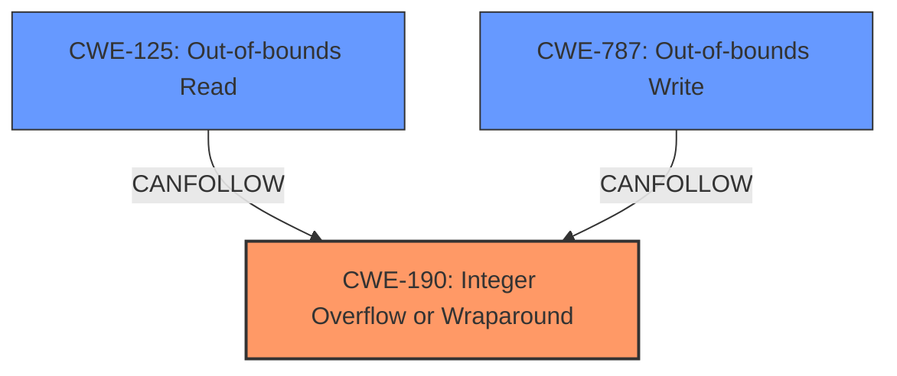

# Raw Analyzer Response for CVE-2021-21704

# Summary
| CWE ID    | CWE Name                                                                                                      | Confidence | CWE Abstraction Level | CWE Vulnerability Mapping Label | CWE-Vulnerability Mapping Notes |
| :---------- | :------------------------------------------------------------------------------------------------------------- | :--------- | :---------------------- | :------------------------------ | :------------------------------ |
| CWE-190     | Integer Overflow or Wraparound                                                                               | 0.9        | Base                    | Primary                         | Allowed                         |
| CWE-125     | Out-of-bounds Read                                                                                             | 0.7        | Base                    | Secondary                       | Allowed                         |
| CWE-787     | Out-of-bounds Write                                                                                             | 0.7        | Base                    | Secondary                       | Allowed                         |

## Evidence and Confidence

*   **Confidence Score:** 0.8
*   **Evidence Strength:** HIGH

## Relationship Analysis
The primary weakness is CWE-190 Integer Overflow or Wraparound. Out-of-bounds Read (CWE-125) and Out-of-bounds Write (CWE-787) are potential consequences.

## Vulnerability Chain
The vulnerability chain starts with an integer overflow (CWE-190) during memory allocation, which can lead to out-of-bounds read (CWE-125) or out-of-bounds write (CWE-787). This results in crashes, denial of service, and potentially memory corruption.
  - Initial Flaw: Integer Overflow (CWE-190)
  - Consequence: Out-of-bounds Read (CWE-125) or Write (CWE-787)
  - Impact: Crashes, Denial of Service, Memory Corruption

## Summary of Analysis
The primary weakness is an integer overflow vulnerability that can lead to memory corruption. The vulnerability description and CVE reference links provide sufficient evidence to support this classification.

The vulnerability lies in the `firebird_fetch_blob` function within the PDO Firebird extension of PHP. Specifically, when fetching BLOB data from a Firebird database, a missing check for integer overflow during memory allocation can lead to a crash. A malicious Firebird server or a man-in-the-middle attacker could send a crafted response with a large BLOB length value, causing `erealloc` to be called with a value that exceeds `ZEND_ULONG_MAX`, resulting in a crash due to memory allocation failure.

The evidence clearly points to an integer overflow as the root cause, with out-of-bounds read/write as potential consequences.

*   "missing check for integer overflow during memory allocation can lead to a crash"
*   "causing `erealloc` to be called with a value that exceeds `ZEND_ULONG_MAX`, resulting in a crash due to memory allocation failure."

Based on this evidence, CWE-190 is the most appropriate primary CWE.

CWE-125 and CWE-787 were considered as secondary CWEs due to their potential as consequences of the integer overflow.

Relevant CWE Information:

# Enhanced Context (25 CWEs)
The following CWEs were identified as potentially relevant to this vulnerability:

## CWE-1289: Improper Validation of Unsafe Equivalence in Input
**Abstraction Level**: Base
**Similarity Score**: 0.76

## CWE-703: Improper Check or Handling of Exceptional Conditions
**Abstraction Level**: Pillar
**Similarity Score**: 0.75

## CWE-754: Improper Check for Unusual or Exceptional Conditions
**Abstraction Level**: Class
**Similarity Score**: 0.75

## CWE-274: Improper Handling of Insufficient Privileges
**Abstraction Level**: Base
**Similarity Score**: 0.74

## CWE-404: Improper Resource Shutdown or Release
**Abstraction Level**: Class
**Similarity Score**: 0.73

## CWE-606: Unchecked Input for Loop Condition
**Abstraction Level**: Base
**Similarity Score**: 0.73

## CWE-653: Improper Isolation or Compartmentalization
**Abstraction Level**: Class
**Similarity Score**: 0.73

## CWE-184: Incomplete List of Disallowed Inputs
**Abstraction Level**: Base
**Similarity Score**: 0.73

## CWE-280: Improper Handling of Insufficient Permissions or Privileges
**Abstraction Level**: Base
**Similarity Score**: 0.73

## CWE-691: Insufficient Control Flow Management
**Abstraction Level**: Pillar
**Similarity Score**: 0.73

## CWE-1284: Improper Validation of Specified Quantity in Input
**Abstraction Level**: Base
**Similarity Score**: 7325.72

## CWE-190: Integer Overflow or Wraparound
**Abstraction Level**: Base
**Similarity Score**: 7141.10

## CWE-125: Out-of-bounds Read
**Abstraction Level**: Base
**Similarity Score**: 7087.99

## CWE-789: Memory Allocation with Excessive Size Value
**Abstraction Level**: Variant
**Similarity Score**: 6824.14

## CWE-119: Improper Restriction of Operations within the Bounds of a Memory Buffer
**Abstraction Level**: Class
**Similarity Score**: 6822.18

## CWE-41: Improper Resolution of Path Equivalence
**Abstraction Level**: base
**Similarity Score**: 5.03

## CWE-22: Improper Limitation of a Pathname to a Restricted Directory ('Path Traversal')
**Abstraction Level**: base
**Similarity Score**: 4.33

## CWE-770: Allocation of Resources Without Limits or Throttling
**Abstraction Level**: base
**Similarity Score**: 4.33

## CWE-73: External Control of File Name or Path
**Abstraction Level**: base
**Similarity Score**: 4.33

## CWE-190: Integer Overflow or Wraparound
**Abstraction Level**: base
**Similarity Score**: 4.33

## CWE-1284: Improper Validation of Specified Quantity in Input
**Abstraction Level**: base
**Similarity Score**: 4.33

## CWE-120: Buffer Copy without Checking Size of Input ('Classic Buffer Overflow')
**Abstraction Level**: base
**Similarity Score**: 4.33

## CWE-123: Write-what-where Condition
**Abstraction Level**: base
**Similarity Score**: 4.33

## CWE-131: Incorrect Calculation of Buffer Size
**Abstraction Level**: base
**Similarity Score**: 4.33

## CWE-125: Out-of-bounds Read
**Abstraction Level**: base
**Similarity Score**: 3.89

### CWE-190: Integer Overflow or Wraparound
The product performs a calculation that can produce an integer overflow or wraparound when the logic assumes that the resulting value will always be larger than the original value.

The vulnerability description indicates that a missing check for integer overflow during memory allocation can lead to a crash. A malicious server could send a crafted response with a large BLOB length value, causing `erealloc` to be called with a value that exceeds `ZEND_ULONG_MAX`. This directly aligns with the CWE-190 description.

### CWE-125: Out-of-bounds Read
The product reads data past the end, or before the beginning, of the intended buffer.

The CVE reference links mention potential memory corruption, which could manifest as out-of-bounds reads. While not the primary cause, it is a potential consequence.

### CWE-787: Out-of-bounds Write
The product writes data past the end, or before the beginning, of the intended buffer.

The CVE reference links mention potential memory corruption, which could manifest as out-of-bounds writes. While not the primary cause, it is a potential consequence.

### Other CWEs Considered and Rejected:
*   CWE-20: Improper Input Validation - While input validation is related, the specific root cause is the integer overflow during memory allocation.
*   CWE-1284: Improper Validation of Specified Quantity in Input - This is similar to CWE-20 but focuses on quantities. However, CWE-190 is more precise because the problem is the overflow itself, not just the lack of validation.
*   CWE-120: Buffer Copy without Checking Size of Input ('Classic Buffer Overflow') - While a buffer overflow can occur, the root cause is the integer overflow.

CWE-19