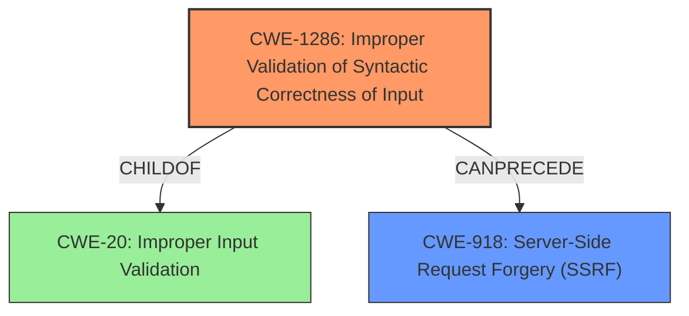

# Analysis for CVE-2021-21705

# Summary
| CWE ID | CWE Name | Confidence | CWE Abstraction Level | CWE Vulnerability Mapping Label | CWE-Vulnerability Mapping Notes |
|---|---|---|---|---|---|
| CWE-1286 | Improper Validation of Syntactic Correctness of Input | 0.9 | Base | Allowed | Primary CWE |
| CWE-918 | Server-Side Request Forgery (SSRF) | 0.7 | Base | Allowed | Secondary CWE |

## Evidence and Confidence

*   **Confidence Score:** 0.8
*   **Evidence Strength:** HIGH

## Relationship Analysis
The primary CWE is CWE-1286 (Improper Validation of Syntactic Correctness of Input), which is a Base level CWE. This vulnerability involves the URL validation via `filter_var()` function with `FILTER_VALIDATE_URL` parameter in PHP failing to properly validate the syntax of the `userinfo` component of a URL, leading to the acceptance of invalid URLs. CWE-1286 is a child of CWE-20 (Improper Input Validation), but CWE-1286 is more specific because it focuses on the syntactic correctness. The secondary CWE is CWE-918 (Server-Side Request Forgery), which is a consequence of the improper validation, where the server can be tricked into making requests to unintended destinations.

## Vulnerability Chain
The vulnerability chain starts with **improper validation** of URL syntax (CWE-1286). This leads to a malformed URL being accepted as valid. Consequently, this can result in the application contacting a wrong server, leading to SSRF (CWE-918).

## Summary of Analysis
The analysis focuses on identifying the root cause and subsequent impacts of the vulnerability. The primary weakness is the **improper validation** of the URL's syntactic correctness, specifically in how PHP's `filter_var()` handles the `userinfo` component. This **improper validation** allows crafted URLs to bypass security checks.

The vulnerability description states: "when using URL validation functionality via filter_var() function with FILTER_VALIDATE_URL parameter, an URL with invalid password field can be accepted as valid." This directly points to a validation issue. The CVE Reference Links Content Summary also confirms that the vulnerability stems from "insufficient validation of the `userinfo` component" and "the filter was not correctly enforcing the rules defined in RFC 3986 regarding allowed characters in the `userinfo` portion of a URL."

The retriever results list CWE-1286 (Improper Validation of Syntactic Correctness of Input) as the top candidate with a high score. The description of CWE-1286 aligns perfectly with the vulnerability where the product "does not validate or incorrectly validates that the input complies with the syntax." This is further supported by the mapping guidance, which allows for its usage and states that it is at the Base level of abstraction.

CWE-918 (Server-Side Request Forgery) is a consequence of the **improper validation**, where the application can be tricked into making requests to unintended destinations. The CVE Reference Links Content Summary states that "SSRF Bypass: The primary weakness is that malformed URLs with invalid characters in the username or password can bypass the `FILTER_VALIDATE_URL` check, leading to Server-Side Request Forgery (SSRF)."

Other CWEs such as CWE-79 (Improper Neutralization of Input During Web Page Generation ('Cross-site Scripting')) were considered but deemed less relevant as the primary issue is not about neutralizing input for web page generation, but rather about validating the URL's syntax.

My assessment is based on the provided evidence, including the vulnerability description and the CVE Reference Links Content Summary. The graph relationships helped clarify the chain of events, with **improper validation** leading to potential SSRF. The selected CWEs are at the optimal level of specificity, with CWE-1286 accurately representing the root cause and CWE-918 representing a potential impact.