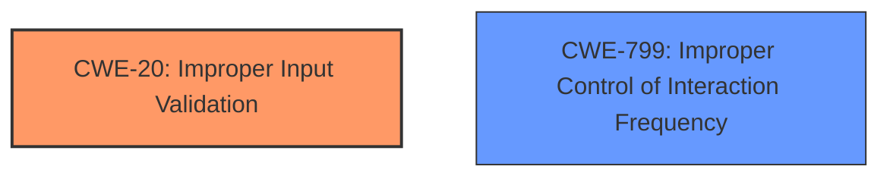

# Raw Analyzer Response for CVE-2021-21726

# Summary
| CWE ID | CWE Name | Confidence | CWE Abstraction Level | CWE Vulnerability Mapping Label | CWE-Vulnerability Mapping Notes |
|---|---|---|---|---|---|
| CWE-20 | Improper Input Validation | 1.0 | Class | Primary | Discouraged |
| CWE-799 | Improper Control of Interaction Frequency | 0.6 | Class | Secondary | Allowed-with-Review |

## Evidence and Confidence

*   **Confidence Score:** 0.8
*   **Evidence Strength:** HIGH

## Relationship Analysis
The primary CWE is CWE-20 **(Improper Input Validation)**, a Class-level CWE. It serves as a general categorization for issues stemming from missing or inadequate input validation. The vulnerability description explicitly mentions "**insufficient input verification**," making CWE-20 a relevant starting point. However, its discouraged usage suggests exploring more specific child CWEs if available evidence supports it.

CWE-799 **(Improper Control of Interaction Frequency)** is a Class-level CWE. The vulnerability description states that "an attacker with high privileges can cause process exception by repeatedly inputting illegal parameters," suggesting that the frequency of interactions is not properly controlled, leading to the exception. This makes CWE-799 a possible secondary weakness.

## Vulnerability Chain
The vulnerability chain begins with **insufficient input validation** (CWE-20) in the diagnostic function interface. This leads to an attacker being able to repeatedly input illegal parameters. The lack of proper control over the interaction frequency (CWE-799) then leads to a process exception, resulting in a denial-of-service (DoS).

## Summary of Analysis
The initial analysis identified CWE-20 **(Improper Input Validation)** as a potential candidate due to the explicit mention of "**insufficient input verification**" in the vulnerability description. However, since CWE-20 is a discouraged Class-level CWE, a search for more specific Base or Variant level CWEs was performed.

The analysis also considered that the vulnerability description mentioned that "an attacker with high privileges can cause process exception by repeatedly inputting illegal parameters," indicating a lack of control over the frequency of interactions. This led to the consideration of CWE-799 **(Improper Control of Interaction Frequency)**.

The final decision is to assign CWE-20 **(Improper Input Validation)** as the primary CWE because it directly reflects the root cause mentioned in the vulnerability description and CVE Reference Links Content Summary. CWE-799 **(Improper Control of Interaction Frequency)** has been assigned as a secondary CWE due to the vulnerability description mentioning the ability to repeatedly input illegal parameters.

Relevant CWE Information:

# Enhanced Context (25 CWEs)

## CWE-1289: Improper Validation of Unsafe Equivalence in Input
**Abstraction Level**: Base
**Similarity Score**: 0.74
**Source**: dense

**Description**:
The product receives an input value that is used as a resource identifier or other type of reference, but it does not validate or incorrectly validates that the input is equivalent to a potentially-unsafe value.

**Mapping Guidance**:
- Usage: Allowed
- Rationale: This CWE entry is at the Base level of abstraction, which is a preferred level of abstraction for mapping to the root causes of vulnerabilities.

**Why Not Selected**: This CWE is focused on validating equivalence to potentially unsafe values, which is not explicitly mentioned in the vulnerability description. The focus is on general input verification.

## CWE-113: Improper Neutralization of CRLF Sequences in HTTP Headers ('HTTP Request/Response Splitting')
**Abstraction Level**: Variant
**Similarity Score**: 0.73
**Source**: dense

**Description**:
The product receives data from an HTTP agent/component (e.g., web server, proxy, browser, etc.), but it does not neutralize or incorrectly neutralizes CR and LF characters before the data is included in outgoing HTTP headers.

**Mapping Guidance**:
- Usage: Allowed
- Rationale: This CWE entry is at the Variant level of abstraction, which is a preferred level of abstraction for mapping to the root causes of vulnerabilities.

**Why Not Selected**: This CWE is specific to HTTP headers, which is not mentioned in the vulnerability description. The vulnerability is in a diagnostic function interface, which may or may not involve HTTP.

## CWE-74: Improper Neutralization of Special Elements in Output Used by a Downstream Component ('Injection')
**Abstraction Level**: Class
**Similarity Score**: 0.73
**Source**: dense

**Description**:
The product constructs all or part of a command, data structure, or record using externally-influenced input from an upstream component, but it does not neutralize or incorrectly neutralizes special elements that could modify how it is parsed or interpreted when it is sent to a downstream component.

**Mapping Guidance**:
- Usage: Discouraged
- Rationale: CWE-74 is high-level and often misused when lower-level weaknesses are more appropriate.

**Why Not Selected**: While injection is a potential consequence of improper input validation, the description doesn't explicitly state that special elements are being injected. The focus is on causing a process exception through invalid parameters.

## CWE-80: Improper Neutralization of Script-Related HTML Tags in a Web Page (Basic XSS)
**Abstraction Level**: Variant
**Similarity Score**: 0.72
**Source**: dense

**Description**:
The product receives input from an upstream component, but it does not neutralize or incorrectly neutralizes special characters such as "<", ">", and "&" that could be interpreted as web-scripting elements when they are sent to a downstream component that processes web pages.

**Mapping Guidance**:
- Usage: Allowed
- Rationale: This CWE entry is at the Variant level of abstraction, which is a preferred level of abstraction for mapping to the root causes of vulnerabilities.

**Why Not Selected**: This CWE is specific to web scripting elements and XSS, which are not mentioned in the vulnerability description.

## CWE-807: Reliance on Untrusted Inputs in a Security Decision
**Abstraction Level**: Base
**Similarity Score**: 0.72
**Source**: dense

**Description**:
The product uses a protection mechanism that relies on the existence or values of an input, but the input can be modified by an untrusted actor in a way that bypasses the protection mechanism.

**Mapping Guidance**:
- Usage: Allowed
- Rationale: This CWE entry is at the Base level of abstraction, which is a preferred level of abstraction for mapping to the root causes of vulnerabilities.

**Why Not Selected**: The vulnerability is primarily about the lack of input verification. While relying on untrusted inputs could be a factor, the description highlights the **insufficient verification** as the main issue.

## CWE-799: Improper Control of Interaction Frequency
**Abstraction Level**: Class
**Similarity Score**: 0.72
**Source**: dense

**Description**:
The product does not properly limit the number or frequency of interactions that it has with an actor, such as the number of incoming requests.

**Mapping Guidance**:
- Usage: Allowed-with-Review
- Rationale: This CWE entry is a Class and might have Base-level children that would be more appropriate

**Why Selected**: The vulnerability description explicitly mentions that the process exception is caused by "repeatedly inputting illegal parameters," suggesting a lack of control over the interaction frequency.

## CWE-41: Improper Resolution of Path Equivalence
**Abstraction Level**: Base
**Similarity Score**: 0.72
**Source**: dense

**Description**:
The product is vulnerable to file system contents disclosure through path equivalence. Path equivalence involves the use of special characters in file and directory names. The associated manipulations are intended to generate multiple names for the same object.

**Mapping Guidance**:
- Usage: Allowed
- Rationale: This CWE entry is at the Base level of abstraction, which is a preferred level of abstraction for mapping to the root causes of vulnerabilities.

**Why Not Selected**: This CWE is specific to path equivalence and file system vulnerabilities, which are not mentioned in the vulnerability description.

## CWE-472: External Control of Assumed-Immutable Web Parameter
**Abstraction Level**: Base
**Similarity Score**: 0.71
**Source**: dense

**Description**:
The web application does not sufficiently verify inputs that are assumed to be immutable but are actually externally controllable, such as hidden form fields.

**Mapping Guidance**:
- Usage: Allowed
- Rationale: This CWE entry is at the Base level of abstraction, which is a preferred level of abstraction for mapping to the root causes of vulnerabilities.

**Why Not Selected**: This CWE is specific to web applications and immutable parameters, which are not mentioned in the vulnerability description.

## CWE-444: Inconsistent Interpretation of HTTP Requests ('HTTP Request/Response Smuggling')
**Abstraction Level**: Base
**Similarity Score**: 0.71
**Source**: dense

**Description**:
The product acts as an intermediary HTTP agent
         (such as a proxy or firewall) in the data flow between two
         entities such as a client and server, but