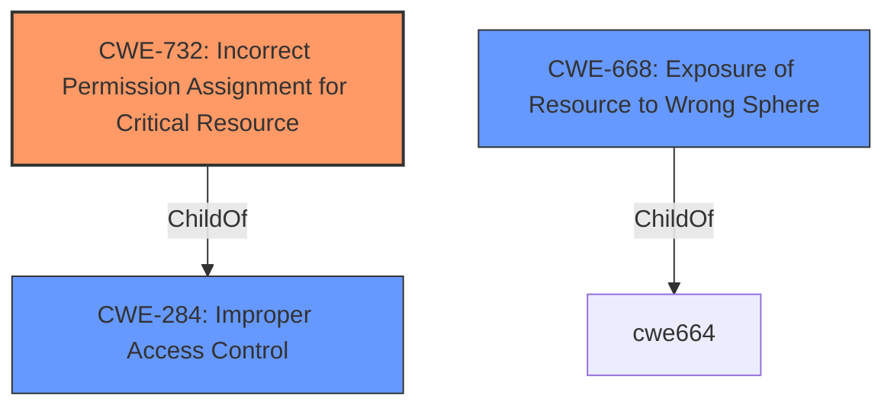

# Analysis Report for CVE-2021-21732

# Vulnerability Analysis Report: CVE-2021-21732

## Description


## Analysis (with Relationship Data)

# Summary
| CWE ID | CWE Name | Confidence | CWE Abstraction Level | CWE Vulnerability Mapping Label | CWE-Vulnerability Mapping Notes |
|---|---|---|---|---|---|
| CWE-732 | Incorrect Permission Assignment for Critical Resource | 0.9 | Base | Allowed | Primary CWE |
| CWE-668 | Exposure of Resource to Wrong Sphere | 0.6 | Class | Discouraged | Secondary Candidate |

## Evidence and Confidence

*   **Confidence Score:** 0.9
*   **Evidence Strength:** HIGH

## Relationship Analysis
The primary relationship that influenced the CWE selection was the parent-child relationship. CWE-732 (Incorrect Permission Assignment for Critical Resource) is a child of CWE-284 (Improper Access Control). While the description contains **improper access control**, the root cause is specifically related to incorrect permission settings, making CWE-732 a more precise and appropriate choice. CWE-668 is also a child of CWE-664 but is a high level description.



## Vulnerability Chain
The chain of events is as follows:
1.  **Root Cause:** **Improper permission settings** on files in the `/proc` file system (CWE-732).
2.  **Weakness:** Third-party applications can read these files without authorization.
3.  **Impact:** Attackers obtain sensitive information.

## Summary of Analysis
Initially, the vulnerability description points towards a general access control issue. The phrase "**improper access control**" and "**improper permission settings**" are significant. However, the CVE Reference Links Content Summary clearly states that the root cause is that "**Improper permission settings allow third-party applications to read files in the `/proc` file system without authorization.**" This level of detail allows us to move beyond a general **improper access control** and focus on the specific issue of incorrect permission assignments.

The Retriever Results initially suggested CWE-285 (Improper Authorization) and CWE-284 (Improper Access Control), but these are discouraged due to their high-level nature. CWE-863 (Incorrect Authorization) was also considered.

CWE-732 (Incorrect Permission Assignment for Critical Resource) directly addresses the root cause described in the vulnerability. The description states that due to "**improper permission settings**", third-party applications can read files without authorization. This aligns perfectly with CWE-732, which focuses on incorrect permission assignments for critical resources.

CWE-668 (Exposure of Resource to Wrong Sphere) was considered, but while it broadly fits, it's less specific than CWE-732. CWE-668 is also discouraged. The vulnerability specifically describes a file permission issue, which is directly covered by CWE-732.

Therefore, CWE-732 is the most appropriate choice because it accurately represents the **root cause** of the vulnerability and is at the recommended base level of abstraction.

Relevant CWE Information:

# Enhanced Context (25 CWEs)
The following CWEs were identified as potentially relevant to this vulnerability:

## CWE-668: Exposure of Resource to Wrong Sphere
**Abstraction Level**: Class
**Similarity Score**: 0.74
**Source**: dense

**Description**:
The product exposes a resource to the wrong control sphere, providing unintended actors with inappropriate access to the resource.

**Mapping Guidance**:
- Usage: Discouraged
- Rationale: CWE-668 is high-level and is often misused as a catch-all when lower-level CWE IDs might be applicable. It is sometimes used for low-information vulnerability reports [REF-1287]. It is a level-1 Class (i.e., a child of a Pillar). It is not useful for trend analysis.

## CWE-732: Incorrect Permission Assignment for Critical Resource
**Abstraction Level**: Base

### Description
The product assigns permissions for a critical resource that allows unintended users to gain access, or modify/delete the resource, which can lead to compromise.

### Extended Description
Not provided

### Alternative Terms
None

### Relationships
ChildOf -> CWE-285

### Mapping Guidance
**Usage:** Allowed
**Rationale:** This CWE entry is at the Base level of abstraction, which is a preferred level of abstraction for mapping to the root causes of vulnerabilities.
**Comments:** Carefully read both the name and description to ensure that this mapping is an appropriate fit. Do not try to 'force' a mapping to a lower-level Base/Variant simply to comply with this preferred level of abstraction.
**Reasons:**
- Acceptable-Use


## CWE Relationship Analysis

Current CWEs represent these abstraction levels: .


### Vulnerability Chain Analysis

**Chain starting from CWE-732:**
- 732 (Incorrect Permission Assignment for Critical Resource) - ROOT


**Chain starting from CWE-664:**
- 664 (Improper Control of a Resource Through its Lifetime) - ROOT


### CWE Relationship Diagram

```mermaid
graph TD
    classDef primary fill:#f96,stroke:#333,stroke-width:2px
    classDef secondary fill:#69f,stroke:#333
    classDef tertiary fill:#9e9,stroke:#333
```


*Report generated on 2025-04-02 06:10:50*
