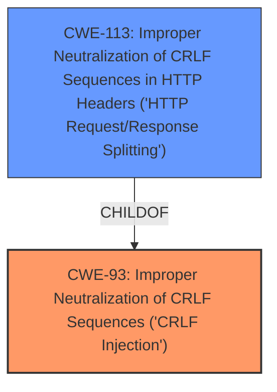

# Raw Analyzer Response for CVE-2021-21743

# Summary
| CWE ID | CWE Name | Confidence | CWE Abstraction Level | CWE Vulnerability Mapping Label | CWE-Vulnerability Mapping Notes |
|---|---|---|---|---|---|
| CWE-93 | Improper Neutralization of CRLF Sequences ('CRLF Injection') | 1.0 | Base | Allowed | Primary CWE |
| CWE-113 | Improper Neutralization of CRLF Sequences in HTTP Headers ('HTTP Request/Response Splitting') | 0.8 | Variant | Allowed | Secondary Candidate |

## Evidence and Confidence

*   **Confidence Score:** 0.9
*   **Evidence Strength:** HIGH

## Relationship Analysis
The primary relationship influencing the CWE selection is the parent-child relationship between CWE-93 and CWE-113. CWE-93, "Improper Neutralization of CRLF Sequences ('CRLF Injection')", is a parent of CWE-113, "Improper Neutralization of CRLF Sequences in HTTP Headers ('HTTP Request/Response Splitting')". Given the vulnerability involves **CRLF injection** specifically in HTTP headers, CWE-113 is a more specific variant of CWE-93. However, since the description focuses on the **CRLF injection** itself, CWE-93 is chosen as the primary weakness, with CWE-113 considered a secondary candidate.

## Vulnerability Chain
The vulnerability chain starts with the **improper neutralization of CRLF sequences** in HTTP requests, leading to the ability to modify HTTP response headers.

## Summary of Analysis
The initial analysis focused on identifying the root cause of the vulnerability based on the provided description. The description explicitly states a "**CRLF injection** vulnerability," and the **CVE Reference Links Content Summary** confirms this. The **weakness** lies in the **improper handling of carriage return and line feed characters**, which allows an attacker to inject these characters into the HTTP response header.

The **Retriever Results** identified CWE-93 as the top candidate, which aligns perfectly with the **CRLF injection** vulnerability. CWE-113, a variant of CWE-93, was also considered due to its specificity regarding HTTP headers. However, the core issue is the **CRLF injection** itself, making CWE-93 the more appropriate primary classification.

The relationship analysis highlights the hierarchical connection between CWE-93 and CWE-113. While CWE-113 is more specific, the vulnerability description focuses on the broader issue of **CRLF injection**, justifying the selection of CWE-93 as the primary CWE.

The final decision is based on direct evidence from the vulnerability description and the **CVE Reference Links Content Summary**, which explicitly mentions the **CRLF injection** vulnerability. The selection of CWE-93 is further supported by its higher relevance score in the **Retriever Results**.

Relevant CWE Information:

# Enhanced Context (25 CWEs)

## CWE-134: Use of Externally-Controlled Format String
**Abstraction Level**: Base
**Similarity Score**: 0.78
**Source**: dense

**Description**:
The product uses a function that accepts a format string as an argument, but the format string originates from an external source.

**Mapping Guidance**:
- Usage: Allowed
- Rationale: This CWE entry is at the Base level of abstraction, which is a preferred level of abstraction for mapping to the root causes of vulnerabilities.

*Reasoning for not selecting*: Although this CWE is a base level CWE, it is not relevant to the description which has a **CRLF injection** vulnerability.

## CWE-74: Improper Neutralization of Special Elements in Output Used by a Downstream Component ('Injection')
**Abstraction Level**: Class
**Similarity Score**: 0.77
**Source**: dense

**Description**:
The product constructs all or part of a command, data structure, or record using externally-influenced input from an upstream component, but it does not neutralize or incorrectly neutralizes special elements that could modify how it is parsed or interpreted when it is sent to a downstream component.

**Mapping Guidance**:
- Usage: Discouraged
- Rationale: CWE-74 is high-level and often misused when lower-level weaknesses are more appropriate.

*Reasoning for not selecting*: Although this CWE relates to injections, the specific weakness is **CRLF injection**. Also this is a class level CWE which is not preferred.

## CWE-113: Improper Neutralization of CRLF Sequences in HTTP Headers ('HTTP Request/Response Splitting')
**Abstraction Level**: Variant
**Similarity Score**: 0.77
**Source**: dense

**Description**:
The product receives data from an HTTP agent/component (e.g., web server, proxy, browser, etc.), but it does not neutralize or incorrectly neutralizes CR and LF characters before the data is included in outgoing HTTP headers.

**Mapping Guidance**:
- Usage: Allowed
- Rationale: This CWE entry is at the Variant level of abstraction, which is a preferred level of abstraction for mapping to the root causes of vulnerabilities.

*Reasoning for considering*: This is a more specific CWE as it relates to HTTP Headers which the CVE description includes.

## CWE-80: Improper Neutralization of Script-Related HTML Tags in a Web Page (Basic XSS)
**Abstraction Level**: Variant
**Similarity Score**: 0.77
**Source**: dense

**Description**:
The product receives input from an upstream component, but it does not neutralize or incorrectly neutralizes special characters such as "<", ">", and "&" that could be interpreted as web-scripting elements when they are sent to a downstream component that processes web pages.

**Mapping Guidance**:
- Usage: Allowed
- Rationale: This CWE entry is at the Variant level of abstraction, which is a preferred level of abstraction for mapping to the root causes of vulnerabilities.

*Reasoning for not selecting*: This CWE is related to Cross-Site Scripting (XSS) which the CVE description does not include.

## CWE-184: Incomplete List of Disallowed Inputs
**Abstraction Level**: Base
**Similarity Score**: 0.76
**Source**: dense

**Description**:
The product implements a protection mechanism that relies on a list of inputs (or properties of inputs) that are not allowed by policy or otherwise require other action to neutralize before additional processing takes place, but the list is incomplete.

**Mapping Guidance**:
- Usage: Allowed
- Rationale: This CWE entry is at the Base level of abstraction, which is a preferred level of abstraction for mapping to the root causes of vulnerabilities.

*Reasoning for not selecting*: This CWE is related to incomplete lists of disallowed inputs, which the CVE description does not include.

## CWE-138: Improper Neutralization of Special Elements
**Abstraction Level**: Class
**Similarity Score**: 0.76
**Source**: dense

**Description**:
The product receives input from an upstream component, but it does not neutralize or incorrectly neutralizes special elements that could be interpreted as control elements or syntactic markers when they are sent to a downstream component.

**Mapping Guidance**:
- Usage: Discouraged
- Rationale: This CWE entry is a level-1 Class (i.e., a child of a Pillar). It might have lower-level children that would be more appropriate

*Reasoning for not selecting*: This is a class level CWE which is not preferred.

## CWE-150: Improper Neutralization of Escape, Meta, or Control Sequences
**Abstraction Level**: Variant
**Similarity Score**: 0.76
**Source**: dense

**Description**:
The product receives input from an upstream component, but it does not neutralize or incorrectly neutralizes special elements that could be interpreted as escape, meta, or control character sequences when they are sent to a downstream component.

**Mapping Guidance**:
- Usage: Allowed
- Rationale: This CWE entry is at the Variant level of abstraction, which is a preferred level of abstraction for mapping to the root causes of vulnerabilities.

*Reasoning for not selecting*: Although this CWE relates to improper neutralization, the specific weakness is **CRLF injection**.

## CWE-162: Improper Neutralization of Trailing Special Elements
**Abstraction Level**: Variant
**Similarity Score**: 0.75
**Source**: dense

**Description**:
The product receives input from an upstream component, but it does not neutralize or incorrectly neutralizes trailing special elements that could be interpreted in unexpected ways when they are sent to a downstream component.

**Mapping Guidance**:
- Usage: Allowed
- Rationale: This CWE entry is at the Variant level of abstraction, which is a preferred level of abstraction for mapping to the root causes of vulnerabilities.

*Reasoning for not selecting*: Although this CWE relates to improper neutralization, the specific weakness is **CRLF injection**.

## CWE-917: Improper Neutralization of Special Elements used in an Expression Language Statement ('Expression Language Injection')
**Abstraction Level**: Base
**Similarity Score**: 0.