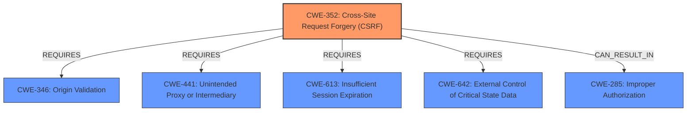

# Analysis Report for CVE-2021-21745

# Vulnerability Analysis Report: CVE-2021-21745

## Description


## Analysis (with Relationship Data)

# Summary
| CWE ID | CWE Name | Confidence | CWE Abstraction Level | CWE Vulnerability Mapping Label | CWE-Vulnerability Mapping Notes |
|---|---|---|---|---|---|
| CWE-352 | Cross-Site Request Forgery (CSRF) | 1.0 | Compound | Primary | Allowed |
| CWE-285 | Improper Authorization | 0.6 | Class | Secondary | Discouraged |

## Evidence and Confidence

*   **Confidence Score:** 0.9
*   **Evidence Strength:** HIGH

## Relationship Analysis
The primary relationship influencing the decision is that CWE-352 [Cross-Site Request Forgery (CSRF)] is a compound weakness comprising multiple conditions. The vulnerability description explicitly mentions the absence of CSRF verification as the root cause of the **authentication bypass**. CWE-285 [Improper Authorization] is considered as a secondary candidate because the end result is unauthorized actions, but the root cause is the missing CSRF protection. CWE-352 requires missing or insufficient session expiration (CWE-613), lack of anti-automation (CWE-441), improper validation of referrer (CWE-346), and weaknesses in state management (CWE-642).



## Vulnerability Chain
The vulnerability chain starts with the **missing CSRF protection** (CWE-352), which allows an attacker to trick a user into making an unintentional request. The lack of CSRF verification leads to an **authentication bypass**, and ultimately allows the attacker to perform **illegal authorization operations**.
- CWE-352 [Cross-Site Request Forgery (CSRF)] (Root Cause)
- Leads to **Authentication Bypass**
- Results in **Illegal Authorization Operations** (Impact)

## Summary of Analysis
The initial assessment identified that the root cause was a **missing CSRF protection**. The vulnerability description states, "ZTE MF971R product has a Referer **authentication bypass** vulnerability. Without CSRF verification, an attacker could use this vulnerability to perform illegal authorization operations by sending a request to the user to click." The CVE Reference Links Content Summary further supports this by explicitly stating: "The vulnerability exists due to the lack of CSRF (Cross-Site Request Forgery) verification."

The retriever results listed CWE-352 [Cross-Site Request Forgery (CSRF)] as the top combined result, with a compound abstraction level, which is a known composite of multiple weaknesses that must all occur simultaneously.

CWE-285 [Improper Authorization] was considered but deemed a secondary issue, representing the impact rather than the root cause. While the vulnerability leads to **illegal authorization operations**, the underlying problem is the **missing CSRF protection**.

The final decision prioritizes CWE-352 [Cross-Site Request Forgery (CSRF)] as the primary CWE because it directly addresses the root cause of the vulnerability: the absence of CSRF verification.

Relevant CWE Information:
- CWE-352 [Cross-Site Request Forgery (CSRF)]: The web application does not, or cannot, sufficiently verify whether a well-formed, valid, consistent request was intentionally provided by the user who submitted the request.


## CWE Relationship Analysis

Current CWEs represent these abstraction levels: .


### Vulnerability Chain Analysis

**Chain starting from CWE-285:**
- 285 (Improper Authorization) - ROOT


**Chain starting from CWE-346:**
- 346 (Origin Validation Error) - ROOT


### CWE Relationship Diagram

```mermaid
graph TD
    classDef primary fill:#f96,stroke:#333,stroke-width:2px
    classDef secondary fill:#69f,stroke:#333
    classDef tertiary fill:#9e9,stroke:#333
```


*Report generated on 2025-04-02 00:16:32*
