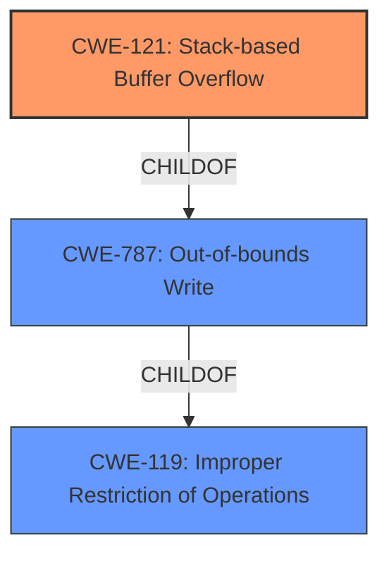

# Raw Analyzer Response for CVE-2021-21748

# Summary
| CWE ID | CWE Name | Confidence | CWE Abstraction Level | CWE Vulnerability Mapping Label | CWE-Vulnerability Mapping Notes |
|---|---|---|---|---|---|
| CWE-121 | Stack-based Buffer Overflow | 1.0 | Variant | Allowed | Primary CWE |

## Evidence and Confidence

*   **Confidence Score:** 1.0
*   **Evidence Strength:** HIGH

## Relationship Analysis
The primary relationship that influenced the selection of CWE-121 is its position as a Variant of CWE-787 (Out-of-bounds Write) and CWE-119 (Improper Restriction of Operations within the Bounds of a Memory Buffer). Since the vulnerability description explicitly mentions a "stack-based buffer overflow", using the more specific CWE-121 is appropriate instead of the more general CWE-787 or CWE-119.

## Vulnerability Chain
The vulnerability chain is straightforward: a **stack-based buffer overflow** (CWE-121) allows an attacker to execute arbitrary code.

## Summary of Analysis
The analysis is based on the explicit mention of "**stack-based buffer overflow**" in the vulnerability description and "**Root cause of vulnerability: Stack-based buffer overflow.**" in the CVE Reference Links Content Summary. The primary CWE match from the "CWE for similar CVE Descriptions" section is CWE-787, but given the explicit mention of 'stack-based,' the more specific CWE-121 is the better choice.

The selection of CWE-121 is at the optimal level of specificity because the vulnerability description clearly indicates that the buffer overflow occurs on the stack. This is a Variant level CWE, which is a preferred level of abstraction. Other CWEs like CWE-119 (Improper Restriction of Operations within the Bounds of a Memory Buffer) and CWE-787 (Out-of-bounds Write) are too general.