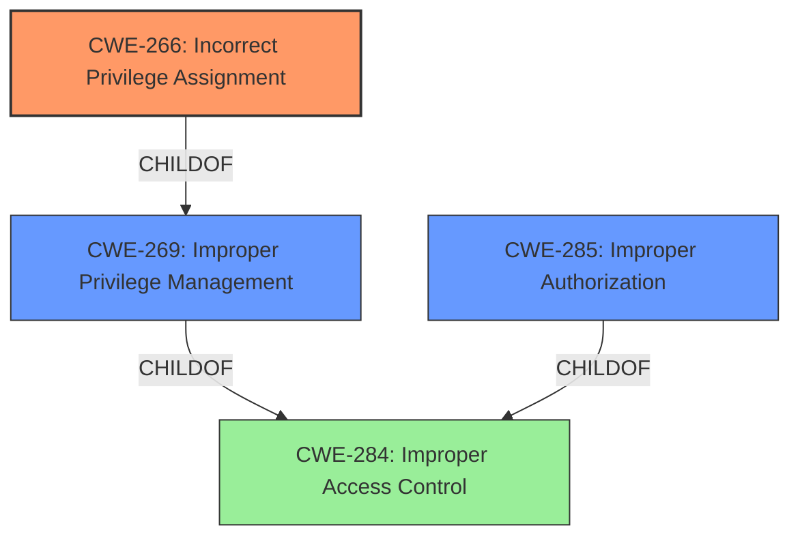

# Raw Analyzer Response for CVE-2021-21750

# Summary
| CWE ID | CWE Name | Confidence | CWE Abstraction Level | CWE Vulnerability Mapping Label | CWE-Vulnerability Mapping Notes |
|---|---|---|---|---|---|
| CWE-266 | Incorrect Privilege Assignment | 0.9 | Base | Primary | Allowed |
| CWE-269 | Improper Privilege Management | 0.7 | Class | Secondary | Discouraged |
| CWE-285 | Improper Authorization | 0.6 | Class | Secondary | Discouraged |

## Evidence and Confidence

*   **Confidence Score:** 0.9
*   **Evidence Strength:** HIGH

## Relationship Analysis
The primary relationship considered was the parent-child relationship between CWE-269 (Improper Privilege Management), CWE-266 (Incorrect Privilege Assignment), and CWE-285 (Improper Authorization). CWE-266, being a Base-level CWE, is more specific than CWE-269 and CWE-285, both Class-level CWEs. Therefore, I chose CWE-266 as the primary CWE.

## Vulnerability Chain
The vulnerability chain starts with the **improper management of timed task modification privilege** (root cause) which leads to privilege escalation (impact). Specifically, an attacker with ordinary user permissions can modify timed tasks, resulting in unauthorized access.

## Summary of Analysis
The analysis is primarily based on the provided vulnerability description and the CVE Reference Links Content Summary. The key phrase "**improper management of timed task modification privilege**" directly points to a problem with privilege management.

The initial assessment considered CWE-269 (Improper Privilege Management) due to its direct relevance to the vulnerability description. However, the MITRE mapping guidance discourages the use of CWE-269 due to its broadness and potential for misuse. The guidance suggests examining its children for more specific CWEs. CWE-266 (Incorrect Privilege Assignment) is a child of CWE-269 and provides a more precise description of the vulnerability, as it involves the incorrect assignment of a privilege, allowing an ordinary user to modify timed tasks.

CWE-285 (Improper Authorization) was also considered because the vulnerability ultimately leads to unauthorized access. However, CWE-266 more accurately captures the root cause, which is the incorrect assignment of privileges that enables the bypass of authorization checks.

Therefore, CWE-266 (Incorrect Privilege Assignment) is the most appropriate CWE because it is a Base-level CWE that directly addresses the root cause of the vulnerability: the **improper management of timed task modification privilege**, which allows ordinary users to gain unauthorized access. This aligns with the evidence from the vulnerability description and the CVE reference links.

Relevant CWE Information:

# Enhanced Context (25 CWEs)
The following CWEs were identified as potentially relevant to this vulnerability:

## CWE-274: Improper Handling of Insufficient Privileges
**Abstraction Level**: Base
**Similarity Score**: 0.77
**Source**: dense

**Description**:
The product does not handle or incorrectly handles when it has insufficient privileges to perform an operation, leading to resultant weaknesses.

**Mapping Guidance**:
- Usage: Discouraged
- Rationale: This CWE entry could be deprecated in a future version of CWE.

**Why Not Used:** This CWE describes cases where a product doesn't handle a lack of privileges correctly. The current vulnerability is about incorrectly *assigning* privileges, not about handling situations where privileges are missing.

## CWE-266: Incorrect Privilege Assignment
**Abstraction Level**: Base
**Similarity Score**: 0.76
**Source**: dense

**Description**:
A product incorrectly assigns a privilege to a particular actor, creating an unintended sphere of control for that actor.

**Mapping Guidance**:
- Usage: Allowed
- Rationale: This CWE entry is at the Base level of abstraction, which is a preferred level of abstraction for mapping to the root causes of vulnerabilities.

**Why Used:** This CWE accurately describes the root cause of the vulnerability, which is the **improper management of timed task modification privilege**. This results in an ordinary user gaining unauthorized access.

## CWE-280: Improper Handling of Insufficient Permissions or Privileges
**Abstraction Level**: Base
**Similarity Score**: 0.76
**Source**: dense

**Description**:
The product does not handle or incorrectly handles when it has insufficient privileges to access resources or functionality as specified by their permissions. This may cause it to follow unexpected code paths that may leave the product in an invalid state.

**Mapping Guidance**:
- Usage: Allowed
- Rationale: This CWE entry is at the Base level of abstraction, which is a preferred level of abstraction for mapping to the root causes of vulnerabilities.

**Why Not Used:** Similar to CWE-274, this CWE is about handling insufficient privileges, not about the incorrect assignment of privileges.

## CWE-1220: Insufficient Granularity of Access Control
**Abstraction Level**: Base
**Similarity Score**: 0.75
**Source**: dense

**Description**:
The product implements access controls via a policy or other feature with the intention to disable or restrict accesses (reads and/or writes) to assets in a system from untrusted agents. However, implemented access controls lack required granularity, which renders the control policy too broad because it allows accesses from unauthorized agents to the security-sensitive assets.

**Mapping Guidance**:
- Usage: Allowed
- Rationale: This CWE entry is at the Base level of abstraction, which is a preferred level of abstraction for mapping to the root causes of vulnerabilities.

**Why Not Used:** The vulnerability is not necessarily about the lack of granularity in access control. It is more specifically about the assignment of a privilege to the wrong user role.

## CWE-653: Improper Isolation or Compartmentalization
**Abstraction Level**: Class
**Similarity Score**: 0.75
**Source**: dense

**Description**:
The product does not properly compartmentalize or isolate functionality, processes, or resources that require different privilege levels, rights, or permissions.

**Mapping Guidance**:
- Usage: Allowed
- Rationale: This CWE entry is at the Base level of abstraction, which is a preferred level of abstraction for mapping to the root causes of vulnerabilities.

**Why Not Used:** While improper isolation could be a contributing factor, the root cause is more precisely the **improper management of timed task modification privilege**, which directly relates to privilege assignment.

## CWE-267: Privilege Defined With Unsafe Actions
**Abstraction Level**: Base
**Similarity Score**: 0.74
**Source**: dense

**Description**:
A particular privilege, role, capability, or right can be used to perform unsafe actions that were not intended, even when it is assigned to the correct entity.

**Mapping Guidance**:
- Usage: Allowed
- Rationale: This CWE entry is at the Base level of abstraction, which is a preferred level of abstraction for mapping to the root causes of vulnerabilities.

**Why Not Used:** The issue is not that the privilege itself allows unsafe actions, but that the privilege is assigned to the wrong user.

## CWE-664: Improper Control of a Resource Through its Lifetime
**Abstraction Level**: Pillar
**Similarity Score**: 0.73
**Source**: dense

**Description**:
The product does not maintain or incorrectly maintains control over a resource throughout its lifetime of creation, use, and release.

**Mapping Guidance**:
- Usage: Discouraged
- Rationale: This CWE entry is high-level when lower-level children are available.

**Why Not Used:** This is a very high-level CWE and not specific to privilege management.

## CWE-1263: Improper Physical Access Control
**Abstraction Level**: Class
**Similarity Score**: 0.73
**Source**: dense

**Description**:
The product is designed with access restricted to certain information, but it does not sufficiently protect against an unauthorized actor with physical access to these areas.

**Mapping Guidance**:
- Usage: Allowed-with-Review
- Rationale: This CWE entry is a Class and might have Base-level children that would be more appropriate

**Why Not Used:** The vulnerability is not related to physical access control.

## CWE-807: Reliance on Untrusted Inputs in a Security Decision
**Abstraction Level**: Base
**Similarity Score**: 0.73
**Source**: dense

**Description**:
The product uses a protection mechanism that relies on the existence or values of an input, but the input can be modified by an untrusted actor in a way that bypasses