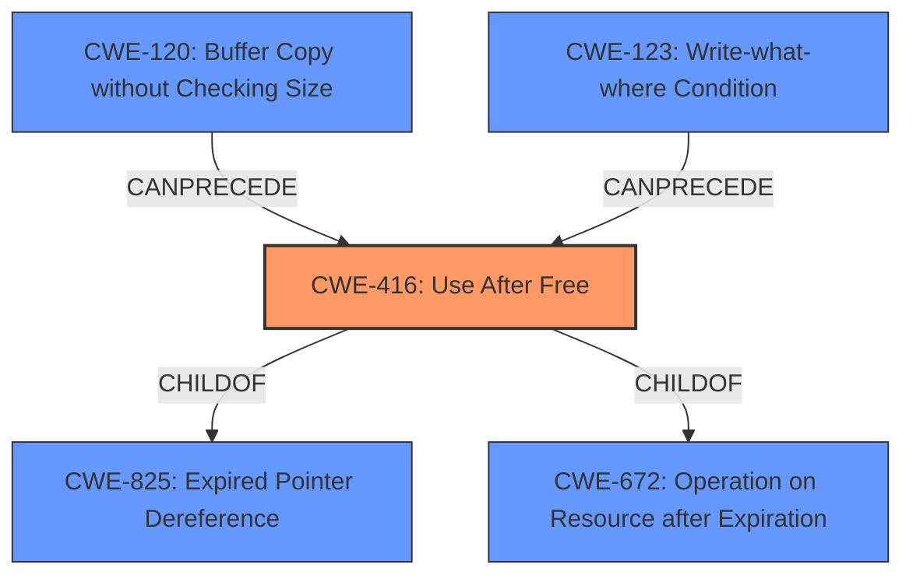

# Enhanced Analysis for CVE-2021-21775

# Summary
| CWE ID  | CWE Name                                                                                                                                   | Confidence | CWE Abstraction Level | CWE Vulnerability Mapping Label | CWE-Vulnerability Mapping Notes |
| :-------- | :------------------------------------------------------------------------------------------------------------------------------------------ | :----------- | :---------------------- | :------------------------------ | :------------------------------ |
| CWE-416 | Use After Free                                                                                                                             | 1          | Variant                 | Primary                       | Allowed                       |

## Evidence and Confidence

*   **Confidence Score:** 1
*   **Evidence Strength:** HIGH

## Relationship Analysis
The primary CWE is CWE-416 (**Use After Free**), which is a **Variant**. It is related to other CWEs through parent-child and chain relationships, mainly being a child of CWE-825 (**Expired Pointer Dereference**) and CWE-672 (**Operation on Resource after Expiration**). Additionally, CWE-416 can be preceded by CWE-120 (**Buffer Copy without Checking Size of Input**) and CWE-123 (**Write-what-where Condition**). These relationships highlight that **Use After Free** often arises from other coding errors related to memory management and resource handling. The selection of CWE-416 as the primary weakness is supported by the vulnerability description and the retriever results.



## Vulnerability Chain
The vulnerability chain starts with the **improper handling of ImageLoader objects**, leading to a **dangling pointer**. This dangling pointer is then accessed after the memory has been freed, resulting in a **Use After Free** (CWE-416). The impact includes a potential **information leak** and **memory corruption**, which could further lead to **arbitrary code execution**.

## Summary of Analysis
The analysis is primarily based on the provided vulnerability description and the CVE reference links content summary. The description explicitly mentions a **use-after-free** vulnerability in WebKitGTK. The CVE reference elaborates on the root cause, stating that the vulnerability lies in how certain events are processed for `ImageLoader` objects, leading to a stale reference being accessed after the object is freed.

> **Vulnerability Description:**
> A **use-after-free** vulnerability exists in the way certain events are processed for ImageLoader objects of Webkit WebKitGTK 2.30.4. A specially crafted web page can lead to a potential information leak and further memory corruption.

> **CVE Reference Links Content Summary:**
> **Use-After-Free:** The core issue is that a reference to an `ImageLoader` object becomes stale (dangling pointer) after the object has been freed. This stale reference is then accessed, leading to a crash or potential for further exploitation.

The retriever results also strongly support the selection of CWE-416, with a score of 1.000. Other CWEs were considered, such as CWE-362 (**Concurrent Execution using Shared Resource with Improper Synchronization ('Race Condition')**), CWE-122 (**Heap-based Buffer Overflow**), CWE-401 (**Missing Release of Memory after Effective Lifetime**), and CWE-415 (**Double Free**). However, these were deemed less relevant as the primary weakness is clearly the **use-after-free** condition.

The selection of CWE-416 as a **Variant** is appropriate because it is a specific type of memory corruption issue. The provided evidence directly supports this classification, making it the optimal level of specificity.

Relevant CWE Information:

# Enhanced Context (25 CWEs)
The following CWEs were identified as potentially relevant to this vulnerability:

## CWE-226: Sensitive Information in Resource Not Removed Before Reuse
**Abstraction Level**: Base
**Similarity Score**: 0.77
**Source**: dense

**Description**:
The product releases a resource such as memory or a file so that it can be made available for reuse, but it does not clear or "zeroize" the information contained in the resource before the product performs a critical state transition or makes the resource available for reuse by other entities.

**Mapping Guidance**:
- Usage: Allowed
- Rationale: This CWE entry is at the Base level of abstraction, which is a preferred level of abstraction for mapping to the root causes of vulnerabilities.

## CWE-665: Improper Initialization
**Abstraction Level**: Class
**Similarity Score**: 0.76
**Source**: dense

**Description**:
The product does not initialize or incorrectly initializes a resource, which might leave the resource in an unexpected state when it is accessed or used.

**Mapping Guidance**:
- Usage: Discouraged
- Rationale: This CWE entry is a level-1 Class (i.e., a child of a Pillar). It might have lower-level children that would be more appropriate

## CWE-404: Improper Resource Shutdown or Release
**Abstraction Level**: Class
**Similarity Score**: 0.75
**Source**: dense

**Description**:
The product does not release or incorrectly releases a resource before it is made available for re-use.

**Mapping Guidance**:
- Usage: Allowed-with-Review
- Rationale: This CWE entry is a Class and might have Base-level children that would be more appropriate

## CWE-667: Improper Locking
**Abstraction Level**: Class
**Similarity Score**: 0.75
**Source**: dense

**Description**:
The product does not properly acquire or release a lock on a resource, leading to unexpected resource state changes and behaviors.

**Mapping Guidance**:
- Usage: Allowed-with-Review
- Rationale: This CWE entry is a Class and might have Base-level children that would be more appropriate

## CWE-909: Missing Initialization of Resource
**Abstraction Level**: Class
**Similarity Score**: 0.75
**Source**: dense

**Description**:
The product does not initialize a critical resource.

**Mapping Guidance**:
- Usage: Allowed-with-Review
- Rationale: This CWE entry is a Class and might have Base-level children that would be more appropriate

## CWE-908: Use of Uninitialized Resource
**Abstraction Level**: Base
**Similarity Score**: 0.74
**Source**: dense

**Description**:
The product uses or accesses a resource that has not been initialized.

**Mapping Guidance**:
- Usage: Allowed
- Rationale: This CWE entry is at the Base level of abstraction, which is a preferred level of abstraction for mapping to the root causes of vulnerabilities.

## CWE-366: Race Condition within a Thread
**Abstraction Level**: Base
**Similarity Score**: 0.73
**Source**: dense

**Description**:
If two threads of execution use a resource simultaneously, there exists the possibility that resources may be used while invalid, in turn making the state of execution undefined.

**Mapping Guidance**:
- Usage: Allowed
- Rationale: This CWE entry is at the Base level of abstraction, which is a preferred level of abstraction for mapping to the root causes of vulnerabilities.

## CWE-457: Use of Uninitialized Variable
**Abstraction Level**: Variant
**Similarity Score**: 0.73
**Source**: dense

**Description**:
The code uses a variable that has not been initialized, leading to unpredictable or unintended results.

**Mapping Guidance**:
- Usage: Allowed
- Rationale: This CWE entry is at the Variant level of abstraction, which is a preferred level of abstraction for mapping to the root causes of vulnerabilities.

## CWE-664: Improper Control of a Resource Through its Lifetime
**Abstraction Level**: Pillar
**Similarity Score**: 0.73
**Source**: dense

**Description**:
The product does not maintain or incorrectly maintains control over a resource throughout its lifetime of creation, use, and release.

**Mapping Guidance**:
- Usage: Discouraged
- Rationale: This CWE entry is high-level when lower-level children are available.

## CWE-131: Incorrect Calculation of Buffer Size
**Abstraction Level**: Base
**Similarity Score**: 0.73
**Source**: dense

**Description**:
The product does not correctly calculate the size to be used when allocating a buffer, which could lead to a buffer overflow.

**Mapping Guidance**:
- Usage: Allowed
- Rationale: This CWE entry is at the Base level of abstraction, which is a preferred level of abstraction for


## CWE Relationship Analysis

Current CWEs represent these abstraction levels: .


### Vulnerability Chain Analysis

**Chain starting from CWE-123:**
- 123 (Write-what-where Condition) - ROOT


**Chain starting from CWE-404:**
- 404 (Improper Resource Shutdown or Release) - ROOT


### CWE Relationship Diagram

```mermaid
graph TD
    classDef primary fill:#f96,stroke:#333,stroke-width:2px
    classDef secondary fill:#69f,stroke:#333
    classDef tertiary fill:#9e9,stroke:#333
```