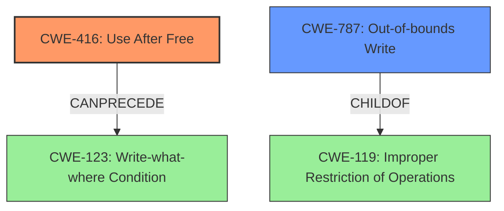

# Enhanced Analysis for CVE-2021-21779

# Summary
| CWE ID | CWE Name | Confidence | CWE Abstraction Level | CWE Vulnerability Mapping Label | CWE-Vulnerability Mapping Notes |
|---|---|---|---|---|---|
| CWE-416 | Use After Free | 1.0 | Variant | Allowed | Primary CWE |
| CWE-787 | Out-of-bounds Write | 0.7 | Base | Allowed | Secondary CWE |

## Evidence and Confidence

*   **Confidence Score:** 0.9
*   **Evidence Strength:** HIGH

## Relationship Analysis
The primary weakness is a **use-after-free** condition (CWE-416), which can potentially lead to an out-of-bounds write (CWE-787). The hierarchical relationship shows that CWE-787 is a child of CWE-119 (Improper Restriction of Operations Within the Bounds of a Memory Buffer), reflecting a broader class of memory safety issues. CWE-416 can precede other weaknesses, such as CWE-123 (Write-what-where Condition), as the memory corruption caused by a UAF can allow an attacker to write arbitrary values to arbitrary memory locations.



## Vulnerability Chain
The vulnerability chain begins with a **use-after-free** (CWE-416) in WebKit's `GraphicsContext`, triggered by manipulating the height attribute of a canvas element. This leads to memory corruption and potentially an out-of-bounds write (CWE-787). The final impact includes information leakage and the potential for arbitrary code execution if the attacker can control memory reuse.

## Summary of Analysis
The analysis strongly supports the primary classification of CWE-416 (**Use After Free**). The vulnerability description explicitly mentions a **use-after-free** condition in WebKitGTK, and the CVE Reference Links Content Summary confirms that the root cause is due to accessing memory after it has been deallocated: "The core issue is a use-after-free condition arising from changes in the `m_height` attribute of the `HTMLCanvasElement`... a gradient object may still try to read from memory that was previously associated with the old GraphicsContext, causing a use-after-free vulnerability." The **Retriever Results** also strongly support CWE-416 as the primary CWE.

Additionally, the memory corruption resulting from the **use-after-free** can potentially lead to an out-of-bounds write (CWE-787), so I am including this as a secondary CWE.

The CWEs were selected at the optimal level of specificity. CWE-416 is a Variant-level CWE, which is preferred, and accurately describes the specific **use-after-free** vulnerability. CWE-787 is a Base-level CWE, which is also preferred, and accurately describes the potential for writing data past the end of a buffer.

CWEs Considered and Not Used:

*   CWE-362, CWE-366 (Race Conditions): Although concurrency issues can sometimes lead to **use-after-free** vulnerabilities, there is no explicit evidence of a race condition in the provided description. The vulnerability is triggered by a specific sequence of operations on the canvas element, rather than concurrent access to shared resources.
*   CWE-122 (Heap-based Buffer Overflow): While memory corruption is mentioned, the root cause is the **use-after-free**, not a buffer overflow.
*   CWE-415 (Double Free): There is no evidence to suggest a double free condition, so this CWE was not selected.
*   CWE-190 (Integer Overflow or Wraparound): There is no evidence to suggest an integer overflow or wraparound, so this CWE was not selected.
*   CWE-123 (Write-what-where Condition): This is a potential consequence of the **use-after-free**, but not the root cause. Therefore, it is not selected as a primary CWE.
*   CWE-401 (Missing Release of Memory after Effective Lifetime): This CWE describes a memory leak, where memory is not freed after use. The vulnerability here involves using memory *after* it has been freed, not failing to free it in the first place.
*   CWE-665 (Improper Initialization): The vulnerability isn't about improper initialization, but rather using memory after it's been freed.
*   CWE-131 (Incorrect Calculation of Buffer Size): There is no mention of incorrect buffer size calculation.
*   CWE-125 (Out-of-bounds Read): The primary issue is a **use-after-free** leading to potential out-of-bounds write, not read.
*   CWE-681 (Incorrect Conversion between Numeric Types): The description doesn't suggest issues with numeric type conversions.
*   CWE-789 (Memory Allocation with Excessive Size Value): The description doesn't suggest issues with allocation size.
*   CWE-404 (Improper Resource Shutdown or Release): Similar to CWE-401, this focuses on incorrect releasing, not using freed memory.
*   CWE-364 (Signal Handler Race Condition): This is specific to signal handlers, which are not mentioned in the vulnerability description.
*   CWE-170 (Improper Null Termination): This is specific to null termination, which is not mentioned in the vulnerability description.
*   CWE-1341 (Multiple Releases of Same Resource or Handle): This is specific to multiple releases, which is not mentioned in the vulnerability description.
*   CWE-1284 (Improper Validation of Specified Quantity in Input): The **use-after-free** is not a result of improper input validation.


## CWE Relationship Analysis

Current CWEs represent these abstraction levels: .


### Vulnerability Chain Analysis

**Chain starting from CWE-787:**
- 787 (Out-of-bounds Write) - ROOT


**Chain starting from CWE-123:**
- 123 (Write-what-where Condition) - ROOT


### CWE Relationship Diagram

```mermaid
graph TD
    classDef primary fill:#f96,stroke:#333,stroke-width:2px
    classDef secondary fill:#69f,stroke:#333
    classDef tertiary fill:#9e9,stroke:#333
```