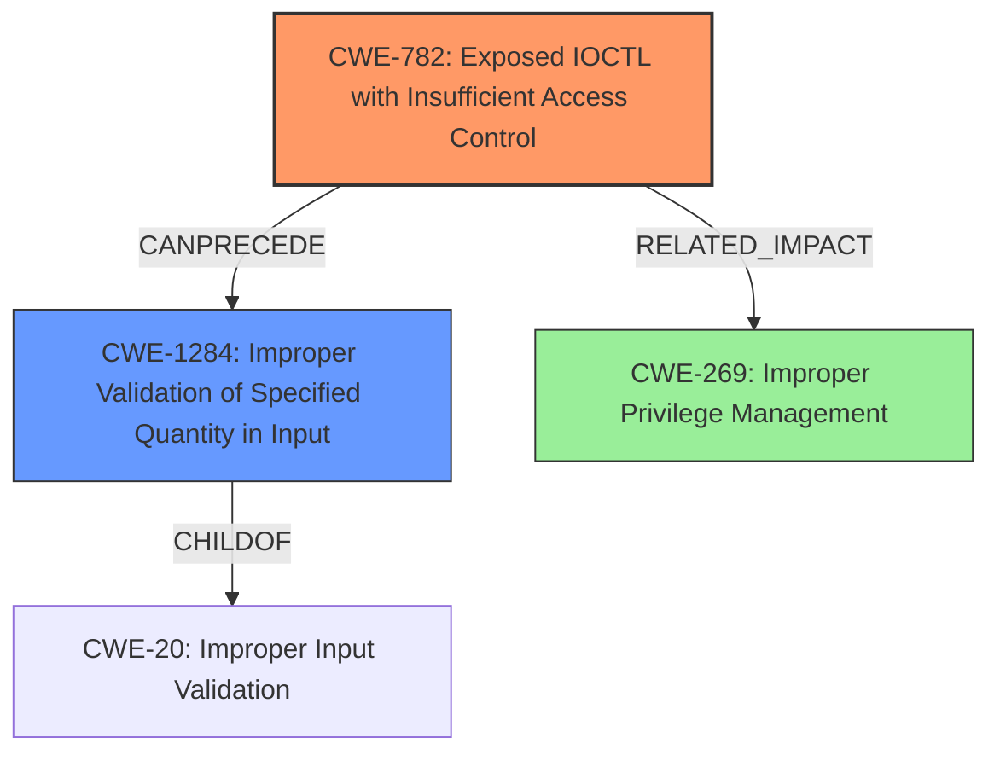

# Analysis Report for CVE-2021-21786

# Vulnerability Analysis Report: CVE-2021-21786

## Description


## Analysis (with Relationship Data)

# Summary
| CWE ID | CWE Name | Confidence | CWE Abstraction Level | CWE Vulnerability Mapping Label | CWE-Vulnerability Mapping Notes |
|---|---|---|---|---|---|
| CWE-782 | Exposed IOCTL with Insufficient Access Control | 0.9 | Variant | Allowed | Primary CWE. The IOCTL 0x9c406144 is exposed without proper access control. |
| CWE-1284 | Improper Validation of Specified Quantity in Input | 0.7 | Base | Allowed | Secondary CWE. The driver uses the user-provided data from the IRP to specify parameters for the `HalGetBusDataByOffset` function without any checks. |
| CWE-269 | Improper Privilege Management | 0.5 | Class | Discouraged | Secondary CWE. This vulnerability leads to **privilege escalation**, however, it's an impact, not the root cause. |

## Evidence and Confidence

*   **Confidence Score:** 0.8
*   **Evidence Strength:** HIGH

## Relationship Analysis
The primary weakness is CWE-782, as the IOCTL is exposed without proper access control. CWE-1284 is included because the driver directly uses user-provided data without validation. CWE-269 is related to the **privilege escalation** impact, but is too high-level to be the primary cause.



## Vulnerability Chain
1.  Exposed IOCTL without Access Control (CWE-782)
2.  Improper Input Validation (CWE-1284)
3.  Privilege Escalation (CWE-269 - Impact)

## Summary of Analysis
Initial analysis focused on the **privilege escalation** aspect, leading to consideration of CWE-269. However, the root cause is the exposed IOCTL and lack of input validation. The CVSS score and vulnerability description key phrases both emphasize **privilege escalation**, but the CVE Reference Links Content Summary provides the crucial details about the exposed IOCTL (CWE-782) and the unvalidated user input (CWE-1284).

The relationships shown in the graph influenced the final selection by illustrating the chain of events: an exposed IOCTL allows unvalidated input to be processed, leading to **privilege escalation**.

The selected CWEs are at the optimal level of specificity: CWE-782 and CWE-1284 are both at the Variant and Base levels, respectively, providing detailed information about the vulnerability.
Specifically, "The IOCTL 0x9c406144 is exposed without proper access control, allowing any unprivileged user to send IRPs to it" supports CWE-782. Also, "The driver directly uses the user-provided data from the IRP to specify parameters for the `HalGetBusDataByOffset` function without any checks" supports CWE-1284.

Relevant CWE Information:

# Enhanced Context (25 CWEs)

## CWE-782: Exposed IOCTL with Insufficient Access Control
**Technical Explanation:** The vulnerability exists because the IOCTL `0x9c406144` is accessible without adequate permission checks. An attacker can leverage this to send malicious IRPs. This matches the CWE's description: "The product implements an IOCTL with functionality that should be restricted, but it does not properly enforce access control for the IOCTL."
**Security Implications:** Attackers can bypass intended security restrictions and gain unauthorized access.
**Relationship Analysis:** This is the primary weakness that allows the subsequent exploitation. It can precede other weaknesses if the lack of access control leads to further vulnerabilities.

## CWE-1284: Improper Validation of Specified Quantity in Input
**Technical Explanation:** The driver directly utilizes user-provided data without validation, allowing manipulation of parameters. The vulnerability description states: "The driver directly uses the user-provided data from the IRP to specify parameters for the `HalGetBusDataByOffset` function without any checks." This directly relates to CWE-1284 because it does not validate the specified quantity (parameters) in the input.
**Security Implications:** Attackers can influence the behavior of the `HalGetBusDataByOffset` function.
**Relationship Analysis:** It follows from the exposed IOCTL (CWE-782).

## CWE-269: Improper Privilege Management
**Technical Explanation:** The vulnerability leads to **privilege escalation**, but this is an impact, not the root cause. The vulnerability description indicates "A specially crafted I/O request packet (IRP) can lead to increased privileges." This describes the effect, not the cause.
**Security Implications:** Attackers can gain higher privileges than intended.
**Relationship Analysis:** This is a consequence of the exposed IOCTL (CWE-782) and the lack of input validation (CWE-1284). It is related to CWE-284 (Improper Access Control) as a parent.
**Justification for Exclusion:** While the vulnerability results in **privilege escalation**, CWE-269 is too high-level and doesn't describe the underlying coding error. It is an impact of the vulnerability, not the root cause.

## CWEs Considered but Not Used:
*   **CWE-119: Improper Restriction of Operations within the Bounds of a Memory Buffer:** This was considered due to the potential for writing to arbitrary memory locations. However, the root cause is more specifically related to the exposed IOCTL and lack of input validation rather than a direct buffer overflow.
*   **CWE-20: Improper Input Validation:** While input validation is missing (addressed by CWE-1284), focusing on CWE-20 is too broad. CWE-1284 provides a more specific description of the vulnerability.
*   **CWE-787: Out-of-bounds Write:** Although an out-of-bounds write is possible, the root cause is the lack of access control on the IOCTL and the improper validation of user input.
*   **CWE-190: Integer Overflow or Wraparound:** This was considered, but there is no direct evidence of integer overflow in the provided description.


## CWE Relationship Analysis

Current CWEs represent these abstraction levels: .


### Vulnerability Chain Analysis

**Chain starting from CWE-787:**
- 787 (Out-of-bounds Write) - ROOT


**Chain starting from CWE-782:**
- 782 (Exposed IOCTL with Insufficient Access Control) - ROOT


### CWE Relationship Diagram

```mermaid
graph TD
    classDef primary fill:#f96,stroke:#333,stroke-width:2px
    classDef secondary fill:#69f,stroke:#333
    classDef tertiary fill:#9e9,stroke:#333
```


*Report generated on 2025-04-02 07:38:01*
