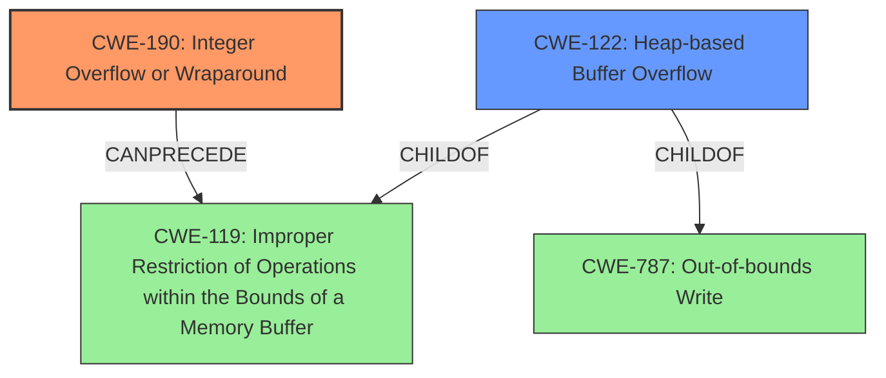

# Raw Analyzer Response for CVE-2021-21795

# Summary
| CWE ID | CWE Name | Confidence | CWE Abstraction Level | CWE Vulnerability Mapping Label | CWE-Vulnerability Mapping Notes |
|---|---|---|---|---|---|
| CWE-190 | Integer Overflow or Wraparound | 1 | Base | Primary | Allowed |
| CWE-122 | Heap-based Buffer Overflow | 1 | Variant | Secondary | Allowed |

## Evidence and Confidence

*   **Confidence Score:** 1
*   **Evidence Strength:** HIGH

## Relationship Analysis
The primary weakness is **CWE-190 (Integer Overflow or Wraparound)**, which can **CanPrecede** **CWE-119 (Improper Restriction of Operations within the Bounds of a Memory Buffer)**. The vulnerability ultimately manifests as **CWE-122 (Heap-based Buffer Overflow)**, a variant of **CWE-787 (Out-of-bounds Write)**. Thus, a chain exists from the integer overflow to the heap buffer overflow. The abstraction levels guide the selection, with **CWE-190** at the Base level and **CWE-122** at the Variant level, providing the most specific classifications possible with the evidence available.

## Vulnerability Chain
The vulnerability chain starts with:
1.  **CWE-190 (Integer Overflow or Wraparound)**: An integer overflow occurs when calculating the size of the buffer.
2.  **CWE-119 (Improper Restriction of Operations within the Bounds of a Memory Buffer)**: The integer overflow leads to allocating less memory than required.
3.  **CWE-122 (Heap-based Buffer Overflow)**: Writing more data than allocated leads to a heap-based buffer overflow.

The root cause is the integer overflow (**CWE-190**), which results in a heap buffer overflow (**CWE-122**).

## Summary of Analysis
The analysis indicates a clear vulnerability chain starting with an integer overflow leading to a heap-based buffer overflow. The vulnerability description explicitly states, "A specially crafted malformed file can lead to an integer overflow that, in turn, leads to a heap buffer overflow." This statement provides strong evidence for mapping **CWE-190** as the primary cause and **CWE-122** as the resulting vulnerability.

The graph relationships confirm that **CWE-190** can precede **CWE-119** and that **CWE-122** is a child of **CWE-787**. The **Retriever Results** also support these mappings with high scores for **CWE-190**.

The selected CWEs are at the optimal level of specificity because **CWE-190** accurately describes the integer overflow, and **CWE-122** specifies that the buffer overflow occurs on the heap. Using **CWE-119** alone would be too general, as it doesn't specify the root cause (integer overflow) or the location of the buffer (heap).

Relevant CWE Information:

# Enhanced Context (25 CWEs)

## CWE-191: Integer Underflow (Wrap or Wraparound)
**Abstraction Level**: Base
**Similarity Score**: 0.79
**Source**: dense

**Description**:
The product subtracts one value from another, such that the result is less than the minimum allowable integer value, which produces a value that is not equal to the correct result.

**Mapping Guidance**:
- Usage: Allowed
- Rationale: This CWE entry is at the Base level of abstraction, which is a preferred level of abstraction for mapping to the root causes of vulnerabilities.

*Not Selected*: While related, the vulnerability description specifies an *overflow*, not an underflow.

## CWE-197: Numeric Truncation Error
**Abstraction Level**: Base
**Similarity Score**: 0.78
**Source**: dense

**Description**:
Truncation errors occur when a primitive is cast to a primitive of a smaller size and data is lost in the conversion.

**Mapping Guidance**:
- Usage: Allowed
- Rationale: This CWE entry is at the Base level of abstraction, which is a preferred level of abstraction for mapping to the root causes of vulnerabilities.

*Not Selected*: The vulnerability description doesn't specify a truncation error. While truncation could potentially be involved, the primary issue is the integer overflow in calculating the buffer size.

## CWE-131: Incorrect Calculation of Buffer Size
**Abstraction Level**: Base
**Similarity Score**: 0.78
**Source**: dense

**Description**:
The product does not correctly calculate the size to be used when allocating a buffer, which could lead to a buffer overflow.

**Mapping Guidance**:
- Usage: Allowed
- Rationale: This CWE entry is at the Base level of abstraction, which is a preferred level of abstraction for mapping to the root causes of vulnerabilities.

*Not Selected*: While the buffer size is calculated incorrectly, the description explicitly states that it's due to an integer overflow. **CWE-190** is therefore a more precise root cause.

## CWE-681: Incorrect Conversion between Numeric Types
**Abstraction Level**: Base
**Similarity Score**: 0.78
**Source**: dense

**Description**:
When converting from one data type to another, such as long to integer, data can be omitted or translated in a way that produces unexpected values. If the resulting values are used in a sensitive context, then dangerous behaviors may occur.

**Mapping Guidance**:
- Usage: Allowed
- Rationale: This CWE entry is at the Base level of abstraction, which is a preferred level of abstraction for mapping to the root causes of vulnerabilities.

*Not Selected*: Similar to **CWE-197**, there's no explicit mention of incorrect conversion between numeric types in the description.

## CWE-129: Improper Validation of Array Index
**Abstraction Level**: Variant
**Similarity Score**: 0.76
**Source**: dense

**Description**:
The product uses untrusted input when calculating or using an array index, but the product does not validate or incorrectly validates the index to ensure the index references a valid position within the array.

**Mapping Guidance**:
- Usage: Allowed
- Rationale: This CWE entry is at the Variant level of abstraction, which is a preferred level of abstraction for mapping to the root causes of vulnerabilities.

*Not Selected*: This CWE is not applicable because the vulnerability involves a buffer overflow, not an array index issue.

## CWE-125: Out-of-bounds Read
**Abstraction Level**: Base
**Similarity Score**: 0.75
**Source**: dense

**Description**:
The product reads data past the end, or before the beginning, of the intended buffer.

**Mapping Guidance**:
- Usage: Allowed
- Rationale: This CWE entry is at the Base level of abstraction, which is a preferred level of abstraction for mapping to the root causes of vulnerabilities.

*Not Selected*: The vulnerability is an out-of-bounds write, not a read.

## CWE-805: Buffer Access with Incorrect Length Value
**Abstraction Level**: Base
**Similarity Score**: 0.75
**Source**: dense

**Description**:
The product uses a sequential operation to read or write a buffer, but it uses an incorrect length value that causes it to access memory that is outside of the bounds of the buffer.

**Mapping Guidance**:
- Usage: Allowed
- Rationale: This CWE entry is at the Base level of abstraction, which is a preferred level of abstraction for mapping to the root causes of vulnerabilities.

*Not Selected*: While the buffer access uses an incorrect length value, the root cause is the integer overflow, making **CWE-190** more accurate.

## CWE-193: Off-by-one Error
**Abstraction Level**: Base
**Similarity Score**: 0.75
**Source**: dense

**Description**:
A product calculates or uses an incorrect maximum or minimum value that is 1 more, or 1 less, than the correct value.

**Mapping Guidance**:
- Usage: Allowed
- Rationale: This CWE entry is at the Base level of abstraction, which is a preferred level of abstraction for mapping to the root causes of vulnerabilities.

*Not Selected*: The incorrect calculation of the buffer size is due to an integer overflow, not necessarily an off-by-one error.