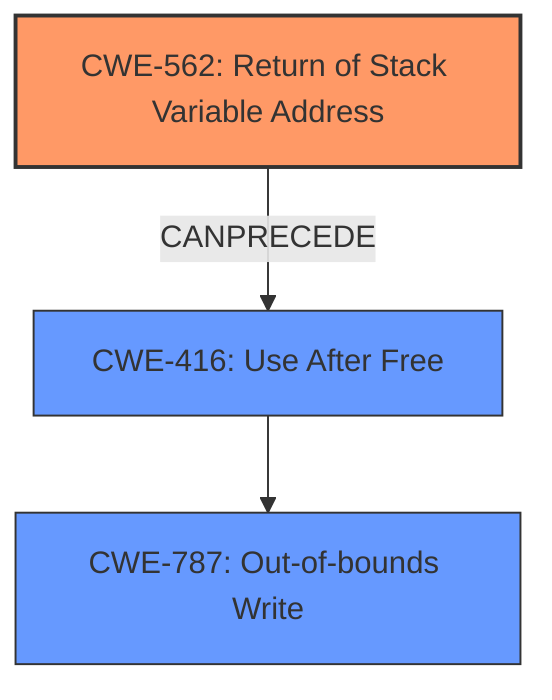

# Analysis for CVE-2021-21798

# Summary
| CWE ID  | CWE Name                                                                              | Confidence | CWE Abstraction Level | CWE Vulnerability Mapping Label | CWE-Vulnerability Mapping Notes |
| :-------- | :------------------------------------------------------------------------------------- | :---------- | :----------------------- | :------------------------------- | :------------------------------ |
| CWE-562 | Return of Stack Variable Address                                                      | 0.9         | Base                    | Primary                          | Allowed                         |
| CWE-416 | Use After Free                                                                      | 0.8         | Base                    | Secondary                        | Allowed                         |
| CWE-787 | Out-of-bounds Write                                                                   | 0.6         | Base                    | Secondary                        | Allowed                         |

## Evidence and Confidence

*   **Confidence Score:** 0.8
*   **Evidence Strength:** HIGH

## Relationship Analysis
The primary CWE selected is CWE-562 (Return of Stack Variable Address) as the **stack variable goes out of scope**. This can lead to a use-after-free condition (CWE-416) when the application dereferences the stale pointer, potentially resulting in an out-of-bounds write (CWE-787) if the memory is reallocated and overwritten. The relationship between CWE-562 and CWE-416 is that CWE-562 **CanPrecede** CWE-416. The CWE-787 is related because **use-after-free** can lead to an **out-of-bounds write.**

## Vulnerability Chain
The vulnerability chain starts with returning a stack variable address (CWE-562). Because the **stack variable goes out of scope**, this results in a dangling pointer. When the application dereferences this dangling pointer, it leads to a use-after-free condition (CWE-416). The use-after-free can then result in an out-of-bounds write (CWE-787) if the memory is reallocated and overwritten, ultimately leading to code execution.

## Summary of Analysis
The initial assessment focused on the description that a **stack variable goes out of scope** when `Document.flattenPages` Javascript function raises a C++ exception which creates a dangling pointer. The SpiderMonkey library then uses the stale `JSStackFrame` which will later be written to, leading to a use-after-free condition.
The primary CWE is CWE-562 (Return of Stack Variable Address), because that is what initially happens where the **stack variable goes out of scope**. The use-after-free condition (CWE-416) is a direct consequence of the dangling pointer being dereferenced, and the out-of-bounds write (CWE-787) is a potential outcome of the use-after-free.
The high retriever score for CWE-562 and the description match, the evidence from the vulnerability description is high. The evidence from the CVE Reference Links Content Summary is also high.
The selection of CWE-562 as the primary CWE is based on the direct evidence from the vulnerability description "stack variable to go out of scope", supported by the retriever results and the understanding that this action sets the stage for the subsequent use-after-free vulnerability.

Relevant CWE Information:

# Enhanced Context (25 CWEs)
The following CWEs were identified as potentially relevant to this vulnerability:

## CWE-476: NULL Pointer Dereference
**Abstraction Level**: Base
**Similarity Score**: 0.78
**Source**: dense

**Description**:
The product dereferences a pointer that it expects to be valid but is NULL.

**Mapping Guidance**:
- Usage: Allowed
- Rationale: This CWE entry is at the Base level of abstraction, which is a preferred level of abstraction for mapping to the root causes of vulnerabilities.

## CWE-824: Access of Uninitialized Pointer
**Abstraction Level**: Base
**Similarity Score**: 0.77
**Source**: dense

**Description**:
The product accesses or uses a pointer that has not been initialized.

**Mapping Guidance**:
- Usage: Allowed
- Rationale: This CWE entry is at the Base level of abstraction, which is a preferred level of abstraction for mapping to the root causes of vulnerabilities.

## CWE-197: Numeric Truncation Error
**Abstraction Level**: Base
**Similarity Score**: 0.77
**Source**: dense

**Description**:
Truncation errors occur when a primitive is cast to a primitive of a smaller size and data is lost in the conversion.

**Mapping Guidance**:
- Usage: Allowed
- Rationale: This CWE entry is at the Base level of abstraction, which is a preferred level of abstraction for mapping to the root causes of vulnerabilities.

## CWE-822: Untrusted Pointer Dereference
**Abstraction Level**: Base
**Similarity Score**: 0.77
**Source**: dense

**Description**:
The product obtains a value from an untrusted source, converts this value to a pointer, and dereferences the resulting pointer.

**Mapping Guidance**:
- Usage: Allowed
- Rationale: This CWE entry is at the Base level of abstraction, which is a preferred level of abstraction for mapping to the root causes of vulnerabilities.

## CWE-191: Integer Underflow (Wrap or Wraparound)
**Abstraction Level**: Base
**Similarity Score**: 0.76
**Source**: dense

**Description**:
The product subtracts one value from another, such that the result is less than the minimum allowable integer value, which produces a value that is not equal to the correct result.

**Mapping Guidance**:
- Usage: Allowed
- Rationale: This CWE entry is at the Base level of abstraction, which is a preferred level of abstraction for mapping to the root causes of vulnerabilities.

## CWE-125: Out-of-bounds Read
**Abstraction Level**: Base
**Similarity Score**: 0.76
**Source**: dense

**Description**:
The product reads data past the end, or before the beginning, of the intended buffer.

**Mapping Guidance**:
- Usage: Allowed
- Rationale: This CWE entry is at the Base level of abstraction, which is a preferred level of abstraction for mapping to the root causes of vulnerabilities.

## CWE-823: Use of Out-of-range Pointer Offset
**Abstraction Level**: Base
**Similarity Score**: 0.76
**Source**: dense

**Description**:
The product performs pointer arithmetic on a valid pointer, but it uses an offset that can point outside of the intended range of valid memory locations for the resulting pointer.

**Mapping Guidance**:
- Usage: Allowed
- Rationale: This CWE entry is at the Base level of abstraction, which is a preferred level of abstraction for mapping to the root causes of vulnerabilities.

## CWE-131: Incorrect Calculation of Buffer Size
**Abstraction Level**: Base
**Similarity Score**: 0.76
**Source**: dense

**Description**:
The product does not correctly calculate the size to be used when allocating a buffer, which could lead to a buffer overflow.

**Mapping Guidance**:
- Usage: Allowed
- Rationale: This CWE entry is at the Base level of abstraction, which is a preferred level of abstraction for mapping to the root causes of vulnerabilities.

## CWE-252: Unchecked Return Value
**Abstraction Level**: Base
**Similarity Score**: 0.76
**Source**: dense

**Description**:
The product does not check the return value from a method or function, which can prevent it from detecting unexpected states and conditions.

**Mapping Guidance**:
- Usage: Allowed
- Rationale: This CWE entry is at the Base level of abstraction, which is a preferred level of abstraction for mapping to the root causes of vulnerabilities.

## CWE-681: Incorrect Conversion between Numeric Types
**Abstraction Level**: Base
**Similarity Score**: 0.75
**Source**: dense

**Description**:
When converting from one data type to another, such as long to integer, data can be omitted or translated in a way that produces unexpected values. If the resulting values are used in a sensitive context, then dangerous behaviors may occur.

**Mapping Guidance**:
- Usage: Allowed
- Rationale: This CWE entry is at the Base level of abstraction, which is a preferred level of abstraction for mapping to the root causes of vulnerabilities.

## CWE-190: Integer Overflow or Wraparound
**Abstraction Level**: Base
**Similarity Score**: 6771.26
**Source**: sparse

**Description**:
The product performs a calculation that can
         produce an integer overflow or wraparound when the logic
         assumes that the resulting value will always be larger than
         the original value. This occurs when an

# Enhanced Query for CVE-2021-21798

## Vulnerability Description
An exploitable return of stack variable address vulnerability exists in the JavaScript implementation of Nitro Pro PDF. A specially crafted document can cause a **stack variable to go out of scope**, resulting in the application dereferencing a stale pointer. This can lead to code execution under the context of the application. An attacker can convince a user to open a document to trigger the vulnerability.

### Vulnerability Description Key Phrases
- **weakness:** **stack variable to go out of scope**
- **impact:** code execution
- **vector:** specially crafted document
- **attacker:** attacker
- **product:** Nitro Pro PDF
- **component:** JavaScript implementation

## CVE Reference Links Content Summary
The provided content is a detailed vulnerability report for CVE-2021-21798, which is a stack-based use-after-free vulnerability in Nitro Pro PDF's JavaScript implementation.

**Root Cause of Vulnerability:**
The vulnerability arises from a combination of factors:
1.  The `Document.flattenPages` Javascript function in Nitro Pro PDF can raise a C++ exception due to incorrect annotation handling.
2.  When the exception is raised, the `JSStackFrame` created by `js32u.dll!js_Invoke` goes out of scope, but a pointer to this stack frame is left in the `JSContext.fp` field, leading to a dangling pointer.
3.  Later, when the SpiderMonkey library tries to evaluate javascript code, the library uses the stale `JSStackFrame` from `JSContext.fp` when setting up a new stack frame via the `js32u.dll!MaybeSetupFrame` function. This out-of-scope `JSStackFrame` pointer is written into the new linked list of `JSStackFrame` which will then later be written to, leading to a use-after-free condition.

**Weaknesses/Vulnerabilities Present:**
- **Use-After-Free:** A `JSStackFrame` object allocated on the stack is deallocated (goes out of scope) while a pointer to it is still stored in a `JSContext` structure. This dangling pointer is later dereferenced leading to a use-after-free.
- **C++ Exception Handling Issues:** Improper exception handling in the `Document.flattenPages` function prevents the `JSContext.fp` from being correctly restored by the `js32u.dll!js_Invoke` function, which normally deallocates the stack frame after executing Javascript bindings, leading to the dangling pointer.
- **Stack Variable Address Return:** The `JSStackFrame` structure is allocated on the stack and its address is later used, leading to the vulnerability when this stack space is later deallocated.

**Impact of Exploitation:**
- **Code Execution:** By exploiting the use-after-free, an attacker can overwrite memory within the context of the application, eventually leading to arbitrary code execution. The attacker can manipulate the stale `JSStackFrame` on the stack to control program flow and execute shellcode.
- **Application Crash:** The memory corruption may cause a crash if the overwritten memory leads to an invalid memory access.

**Attack Vectors:**
- **Specially Crafted PDF Document:** The vulnerability is triggered by opening a specially crafted PDF document containing malicious JavaScript code that calls `Document.flattenPages` with specific parameters that trigger the exception path.

**Required Attacker Capabilities/Position:**
- **User Interaction:** The attacker needs to convince a user to open the malicious PDF document. No other special privileges or network access is needed to trigger the vulnerability.

**Additional Notes:**
- The vulnerability report provides a detailed breakdown of the vulnerable code paths within the Nitro Pro PDF application as well as the underlying SpiderMonkey JavaScript library.
- It includes the specific function calls in `js32u.dll` and `np_java_script.dll` which cause the use-after-free condition.
- The report also shows how to use a debugger to observe the state of the program and reproduce the vulnerability using a proof-of-concept PDF file.
- The report also provides a mitigation measure by disabling JavaScript in the application preferences.
- The report also includes a timeline of the disclosure process, and patch release.

## Retriever Results

### Top Combined Results

| Rank | CWE ID | Name | Abstraction | Usage  | Retrievers | Individual Scores |
|------|--------|------|-------------|-------|------------|-------------------|
| 1 | 562 | Return of Stack Variable Address | Base | Allowed | sparse | 0.717 |
| 2 | 190 | Integer Overflow or Wraparound | Base | Allowed | sparse | 0.455 |
| 3 | 674 | Uncontrolled Recursion | Class | Allowed-with-Review | sparse | 0.447 |
| 4 | 121 | Stack-based Buffer Overflow | Variant | Allowed | sparse | 0.446 |
| 5 | 457 | Use of Uninitialized Variable | Variant | Allowed | sparse | 0.442 |
| 6 | 823 | Use of Out-of-range Pointer Offset | Base | Allowed | dense | 0.537 |
| 7 | 1339 | Insufficient Precision or Accuracy of a Real Number | Base | Allowed | graph | 0.002 |
| 8 | 197 | Numeric Truncation Error | Base | Allowed | sparse | 0.441 |
| 9 | 787 | Out-of-bounds Write | Base | Allowed | sparse | 0.436 |
| 10 | 476 | NULL Pointer Dereference | Base | Allowed | sparse | 0.425 |

# Complete CWE Specifications

## CWE-562: Return of Stack Variable Address
**Abstraction:** Base
**Status:** Draft

### Description
A function returns the address of a stack variable, which will cause unintended program behavior, typically in the form of a crash.

### Extended Description
Because local variables are allocated on the stack, when a program returns a pointer to a local variable, it is returning a stack address. A subsequent function call is likely to re-use this same stack address, thereby overwriting the value of the pointer, which no longer corresponds to the same variable since a function's stack frame is invalidated when it returns. At best this will cause the value of the pointer to change unexpectedly. In many cases it causes the program to crash the next time the pointer is dereferenced.

### Alternative Terms
None

### Relationships
ChildOf -> CWE-758
CanPrecede -> CWE-672
CanPrecede -> CWE-825

### Mapping Guidance
**Usage:** Allowed
**Rationale:** This CWE entry is at the Base level of abstraction, which is a preferred level of abstraction for mapping to the root causes of vulnerabilities.
**Comments:** Carefully read both the name and description to ensure that this mapping is an appropriate fit. Do not try to 'force' a mapping to a lower-level Base/Variant simply to comply with this preferred level of abstraction.
**Reasons:**
- Acceptable-Use

## CWE-190: Integer Overflow or Wraparound
**Abstraction:** Base
**Status:** Stable

### Description
The product performs a calculation that can
         produce an integer overflow or wraparound when the logic
         assumes that the resulting value will always be larger than
         the original value. This occurs when an integer value is
         incremented to a value that is too large to store in the
         associated representation. When this occurs, the value may
         become a very small or negative number.

### Extended Description
Not provided

### Alternative Terms
Overflow: The terms "overflow" and "wraparound" are used interchangeably by some people, but they can have more precise distinctions by others. See Terminology Notes.
Wraparound: The terms "overflow" and "wraparound" are used interchangeably by some people, but they can have more precise distinctions by others. See Terminology Notes.
wrap, wrap-around, wrap around: Alternate spellings of "wraparound"

### Relationships
ChildOf -> CWE-682
ChildOf -> CWE-682
ChildOf -> CWE-20
CanPrecede -> CWE-119

### Mapping Guidance
**Usage:** Allowed
**Rationale:** This CWE entry is at the Base level of abstraction, which is a preferred level of abstraction for mapping to the root causes of vulnerabilities.
**Comments:** Be careful of terminology problems with "overflow," "underflow," and "wraparound" - see Terminology Notes. Carefully read both the name and description to ensure that this mapping is an appropriate fit. Do not try to 'force' a mapping to a lower-level Base/Variant simply to comply with this preferred level of abstraction.
**Reasons:**
- Acceptable-Use
**Suggested Alternatives:**
- CWE-191: Integer Underflow (Wrap or Wraparound). Consider CWE-191 when the result is less than the minimum value that can be represented (sometimes called "underflows").

### Additional Notes
**[Relationship]** Integer overflows can be primary to buffer overflows when they cause less memory to be allocated than expected.

**[Terminology]** 

"Integer overflow" is sometimes used to cover several types of errors, including signedness errors, or buffer overflows that involve manipulation of integer data types instead of characters. Part of the confusion results from the fact that 0xffffffff is -1 in a signed context. Other confusion also arises because of the role that integer overflows have in chains.

A "wraparound" is a well-defined, standard behavior that follows specific rules for how to handle situations when the intended numeric value is too large or too small to be represented, as specified in standards such as C11.

"Overflow" is sometimes conflated with "wraparound" but typically indicates a non-standard or undefined behavior.

The "overflow" term is sometimes used to indicate cases where either the maximum or the minimum is exceeded, but others might only use "overflow" to indicate exceeding the maximum while using "underflow" for exceeding the minimum.

Some people use "overflow" to mean any value outside the representable range - whether greater than the maximum, or less than the minimum - but CWE uses "underflow" for cases in which the intended result is less than the minimum.

See [REF-1440] for additional explanation of the ambiguity of terminology.

**[Other]** While there may be circumstances in which the logic intentionally relies on wrapping - such as with modular arithmetic in timers or counters - it can have security consequences if the wrap is unexpected. This is especially the case if the integer overflow can be triggered using user-supplied inputs.

### Observed Examples
- **CVE-2021-43537:** Chain: in a web browser, an unsigned 64-bit integer is forcibly cast to a 32-bit integer (CWE-681) and potentially leading to an integer overflow (CWE-190). If an integer overflow occurs, this can cause heap memory corruption (CWE-122)
- **CVE-2022-21668:** Chain: Python library does not limit the resources used to process images that specify a very large number of bands (CWE-1284), leading to excessive memory consumption (CWE-789) or an integer overflow (CWE-190).
- **CVE-2022-0545:** Chain: 3D renderer has an integer overflow (CWE-190) leading to write-what-where condition (CWE-123) using a crafted image.

## CWE-674: Uncontrolled Recursion
**Abstraction:** Class
**Status:** Draft

### Description
The product does not properly control the amount of recursion that takes place,  consuming excessive resources, such as allocated memory or the program stack.

### Extended Description
Not provided

### Alternative Terms
Stack Exhaustion

### Relationships
ChildOf -> CWE-834

### Mapping Guidance
**Usage:** Allowed-with-Review
**Rationale:** This CWE entry is a Class and might have Base-level children that would be more appropriate
**Comments:** Examine children of this entry to see if there is a better fit
**Reasons:**
- Abstraction

### Observed Examples
- **CVE-2007-1285:** Deeply nested arrays trigger stack exhaustion.
- **CVE-2007-3409:** Self-referencing pointers create infinite loop and resultant stack exhaustion.
- **CVE-2016-10707:** Javascript application accidentally changes input in a way that prevents a recursive call from detecting an exit condition.

## CWE-121: Stack-based Buffer Overflow
**Abstraction:** Variant
**Status:** Draft

### Description
A stack-based buffer overflow condition is a condition where the buffer being overwritten is allocated on the stack (i.e., is a local variable or, rarely, a parameter to a function).

### Extended Description
Not provided

### Alternative Terms
Stack Overflow: "Stack Overflow" is often used to mean the same thing as stack-based buffer overflow, however it is also used on occasion to mean stack exhaustion, usually a result from an excessively recursive function call. Due to the ambiguity of the term, use of stack overflow to describe either circumstance is discouraged.

### Relationships
ChildOf -> CWE-788
ChildOf -> CWE-787

### Mapping Guidance
**Usage:** Allowed
**Rationale:** This CWE entry is at the Variant level of abstraction, which is a preferred level of abstraction for mapping to the root causes of vulnerabilities.
**Comments:** Carefully read both the name and description to ensure that this mapping is an appropriate fit. Do not try to 'force' a mapping to a lower-level Base/Variant simply to comply with this preferred level of abstraction.
**Reasons:**
- Acceptable-Use

### Additional Notes
**[Other]** Stack-based buffer overflows can instantiate in return address overwrites, stack pointer overwrites or frame pointer overwrites. They can also be considered function pointer overwrites, array indexer overwrites or write-what-where condition, etc.

### Observed Examples
- **CVE-2021-35395:** Stack-based buffer overflows in SFK for wifi chipset used for IoT/embedded devices, as exploited in the wild per CISA KEV.

## CWE-457: Use of Uninitialized Variable
**Abstraction:** Variant
**Status:** Draft

### Description
The code uses a variable that has not been initialized, leading to unpredictable or unintended results.

### Extended Description
In some languages such as C and C++, stack variables are not initialized by default. They generally contain junk data with the contents of stack memory before the function was invoked. An attacker can sometimes control or read these contents. In other languages or conditions, a variable that is not explicitly initialized can be given a default value that has security implications, depending on the logic of the program. The presence of an uninitialized variable can sometimes indicate a typographic error in the code.

### Alternative Terms
None

### Relationships
ChildOf -> CWE-908
ChildOf -> CWE-665
ChildOf -> CWE-665

### Mapping Guidance
**Usage:** Allowed
**Rationale:** This CWE entry is at the Variant level of abstraction, which is a preferred level of abstraction for mapping to the root causes of vulnerabilities.
**Comments:** Carefully read both the name and description to ensure that this mapping is an appropriate fit. Do not try to 'force' a mapping to a lower-level Base/Variant simply to comply with this preferred level of abstraction.
**Reasons:**
- Acceptable-Use

### Observed Examples
- **CVE-2019-15900:** Chain: sscanf() call is used to check if a username and group exists, but the return value of sscanf() call is not checked (CWE-252), causing an uninitialized variable to be checked (CWE-457), returning success to allow authorization bypass for executing a privileged (CWE-863).
- **CVE-2008-3688:** Chain: A denial of service may be caused by an uninitialized variable (CWE-457) allowing an infinite loop (CWE-835) resulting from a connection to an unresponsive server.
- **CVE-2008-0081:** Uninitialized variable leads to code execution in popular desktop application.

## CWE-823: Use of Out-of-range Pointer Offset
**Abstraction:** Base
**Status:** Incomplete

### Description
The product performs pointer arithmetic on a valid pointer, but it uses an offset that can point outside of the intended range of valid memory locations for the resulting pointer.

### Extended Description

While a pointer can contain a reference to any arbitrary memory location, a program typically only intends to use the pointer to access limited portions of memory, such as contiguous memory used to access an individual array.

Programs may use offsets in order to access fields or sub-elements stored within structured data. The offset might be out-of-range if it comes from an untrusted source, is the result of an incorrect calculation, or occurs because of another error.

If an attacker can control or influence the offset so that it points outside of the intended boundaries of the structure, then the attacker may be able to read or write to memory locations that are used elsewhere in the product. As a result, the attack might change the state of the product as accessed through program variables, cause a crash or instable behavior, and possibly lead to code execution.

### Alternative Terms
Untrusted pointer offset: This term is narrower than the concept of "out-of-range" offset, since the offset might be the result of a calculation or other error that does not depend on any externally-supplied values.

### Relationships
ChildOf -> CWE-119
ChildOf -> CWE-119
ChildOf -> CWE-119
CanPrecede -> CWE-125
CanPrecede -> CWE-787

### Mapping Guidance
**Usage:** Allowed
**Rationale:** This CWE entry is at the Base level of abstraction, which is a preferred level of abstraction for mapping to the root causes of vulnerabilities.
**Comments:** Carefully read both the name and description to ensure that this mapping is an appropriate fit. Do not try to 'force' a mapping to a lower-level Base/Variant simply to comply with this preferred level of abstraction.
**Reasons:**
- Acceptable-Use

### Additional Notes
**[Maintenance]** There are close relationships between incorrect pointer dereferences and other weaknesses related to buffer operations. There may not be sufficient community agreement regarding these relationships. Further study is needed to determine when these relationships are chains, composites, perspective/layering, or other types of relationships. As of September 2010, most of the relationships are being captured as chains.

**[Terminology]** Many weaknesses related to pointer dereferences fall under the general term of "memory corruption" or "memory safety." As of September 2010, there is no commonly-used terminology that covers the lower-level variants.

### Observed Examples
- **CVE-2010-2160:** Invalid offset in undocumented opcode leads to memory corruption.
- **CVE-2010-1281:** Multimedia player uses untrusted value from a file when using file-pointer calculations.
- **CVE-2009-3129:** Spreadsheet program processes a record with an invalid size field, which is later used as an offset.

## CWE-1339: Insufficient Precision or Accuracy of a Real Number
**Abstraction:** Base
**Status:** Draft

### Description
The product processes a real number with an implementation in which the number's representation does not preserve required accuracy and precision in its fractional part, causing an incorrect result.

### Extended Description

When a security decision or calculation requires highly precise, accurate numbers such as financial calculations or prices, then small variations in the number could be exploited by an attacker. 

There are multiple ways to store the fractional part of a real number in a computer. In all of these cases, there is a limit to the accuracy of recording a fraction. If the fraction can be represented in a fixed number of digits (binary or decimal), there might not be enough digits assigned to represent the number. In other cases the number cannot be represented in a fixed number of digits due to repeating in decimal or binary notation (e.g. 0.333333...) or due to a transcendental number such as Π or √2. Rounding of numbers can lead to situations where the computer results do not adequately match the result of sufficiently accurate math. 

### Alternative Terms
None

### Relationships
ChildOf -> CWE-682
PeerOf -> CWE-190
CanPrecede -> CWE-834
CanPrecede -> CWE-119

### Mapping Guidance
**Usage:** Allowed
**Rationale:** This CWE entry is at the Base level of abstraction, which is a preferred level of abstraction for mapping to the root causes of vulnerabilities.
**Comments:** Carefully read both the name and description to ensure that this mapping is an appropriate fit. Do not try to 'force' a mapping to a lower-level Base/Variant simply to comply with this preferred level of abstraction.
**Reasons:**
- Acceptable-Use

### Observed Examples
- **CVE-2018-16069:** Chain: series of floating-point precision errors (CWE-1339) in a web browser rendering engine causes out-of-bounds read (CWE-125), giving access to cross-origin data
- **CVE-2017-7619:** Chain: rounding error in floating-point calculations (CWE-1339) in image processor leads to infinite loop (CWE-835)
- **CVE-2021-29529:** Chain: machine-learning product can have a heap-based buffer overflow (CWE-122) when some integer-oriented bounds are calculated by using ceiling() and floor() on floating point values (CWE-1339)

## CWE-197: Numeric Truncation Error
**Abstraction:** Base
**Status:** Incomplete

### Description
Truncation errors occur when a primitive is cast to a primitive of a smaller size and data is lost in the conversion.

### Extended Description
When a primitive is cast to a smaller primitive, the high order bits of the large value are lost in the conversion, potentially resulting in an unexpected value that is not equal to the original value. This value may be required as an index into a buffer, a loop iterator, or simply necessary state data. In any case, the value cannot be trusted and the system will be in an undefined state. While this method may be employed viably to isolate the low bits of a value, this usage is rare, and truncation usually implies that an implementation error has occurred.

### Alternative Terms
None

### Relationships
ChildOf -> CWE-681
ChildOf -> CWE-681
ChildOf -> CWE-681
CanAlsoBe -> CWE-195
CanAlsoBe -> CWE-196
CanAlsoBe -> CWE-192
CanAlsoBe -> CWE-194

### Mapping Guidance
**Usage:** Allowed
**Rationale:** This CWE entry is at the Base level of abstraction, which is a preferred level of abstraction for mapping to the root causes of vulnerabilities.
**Comments:** Carefully read both the name and description to ensure that this mapping is an appropriate fit. Do not try to 'force' a mapping to a lower-level Base/Variant simply to comply with this preferred level of abstraction.
**Reasons:**
- Acceptable-Use

### Additional Notes
**[Research Gap]** This weakness has traditionally been under-studied and under-reported, although vulnerabilities in popular software have been published in 2008 and 2009.

### Observed Examples
- **CVE-2020-17087:** Chain: integer truncation (CWE-197) causes small buffer allocation (CWE-131) leading to out-of-bounds write (CWE-787) in kernel pool, as exploited in the wild per CISA KEV.
- **CVE-2009-0231:** Integer truncation of length value leads to heap-based buffer overflow.
- **CVE-2008-3282:** Size of a particular type changes for 64-bit platforms, leading to an integer truncation in document processor causes incorrect index to be generated.

## CWE-787: Out-of-bounds Write
**Abstraction:** Base
**Status:** Draft

### Description
The product writes data past the end, or before the beginning, of the intended buffer.

### Extended Description
Not provided

### Alternative Terms
Memory Corruption: Often used to describe the consequences of writing to memory outside the bounds of a buffer, or to memory that is otherwise invalid.

### Relationships
ChildOf -> CWE-119
ChildOf -> CWE-119
ChildOf -> CWE-119
ChildOf -> CWE-119

### Mapping Guidance
**Usage:** Allowed
**Rationale:** This CWE entry is at the Base level of abstraction, which is a preferred level of abstraction for mapping to the root causes of vulnerabilities.
**Comments:** Carefully read both the name and description to ensure that this mapping is an appropriate fit. Do not try to 'force' a mapping to a lower-level Base/Variant simply to comply with this preferred level of abstraction.
**Reasons:**
- Acceptable-Use

### Observed Examples
- **CVE-2023-1017:** The reference implementation code for a Trusted Platform Module does not implement length checks on data, allowing for an attacker to write 2 bytes past the end of a buffer.
- **CVE-2021-21220:** Chain: insufficient input validation (CWE-20) in browser allows heap corruption (CWE-787), as exploited in the wild per CISA KEV.
- **CVE-2021-28664:** GPU kernel driver allows memory corruption because a user can obtain read/write access to read-only pages, as exploited in the wild per CISA KEV.

## CWE-476: NULL Pointer Dereference
**Abstraction:** Base
**Status:** Stable

### Description
The product dereferences a pointer that it expects to be valid but is NULL.

### Extended Description
Not provided

### Alternative Terms
NPD: Common abbreviation for Null Pointer Dereference
null deref: Common abbreviation for Null Pointer Dereference
NPE: Common abbreviation for Null Pointer Exception
nil pointer dereference: used for access of nil in Go programs

### Relationships
ChildOf -> CWE-710
ChildOf -> CWE-754
ChildOf -> CWE-754

### Mapping Guidance
**Usage:** Allowed
**Rationale:** This CWE entry is at the Base level of abstraction, which is a preferred level of abstraction for mapping to the root causes of vulnerabilities.
**Comments:** Carefully read both the name and description to ensure that this mapping is an appropriate fit. Do not try to 'force' a mapping to a lower-level Base/Variant simply to comply with this preferred level of abstraction.
**Reasons:**
- Acceptable-Use

### Observed Examples
- **CVE-2005-3274:** race condition causes a table to be corrupted if a timer activates while it is being modified, leading to resultant NULL dereference; also involves locking.
- **CVE-2002-1912:** large number of packets leads to NULL dereference
- **CVE-2005-0772:** packet with invalid error status value triggers NULL dereference

