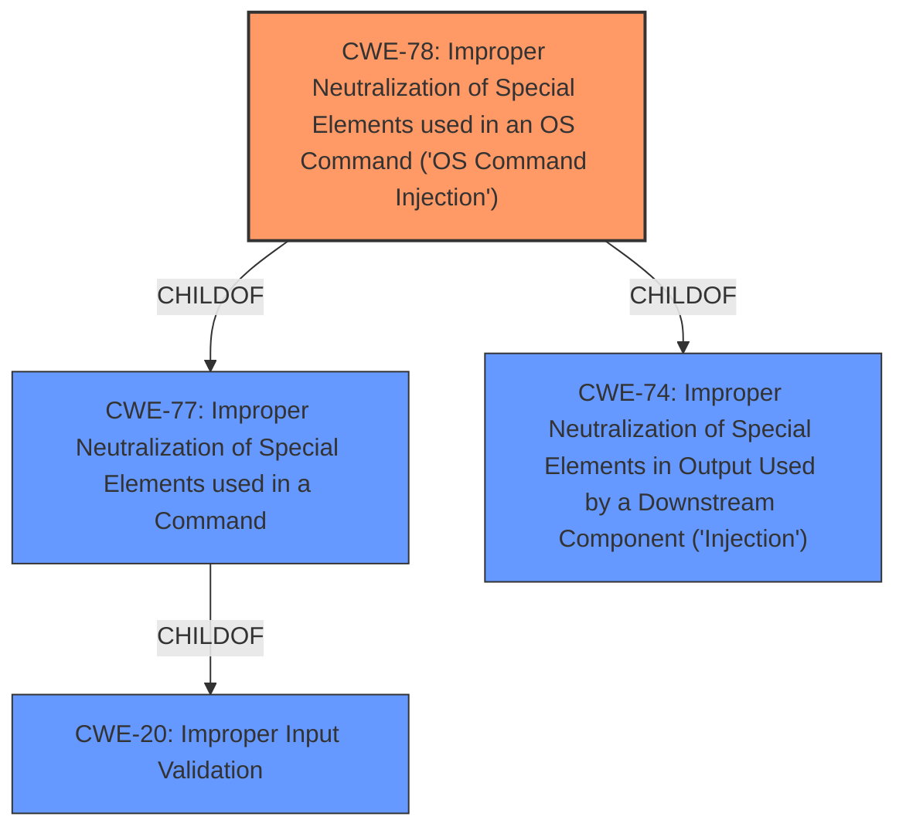

# Analysis Report for CVE-2021-21809

# Vulnerability Analysis Report: CVE-2021-21809

## Description


## Analysis (with Relationship Data)

# Summary
| CWE ID | CWE Name | Confidence | CWE Abstraction Level | CWE Vulnerability Mapping Label | CWE-Vulnerability Mapping Notes |
|---|---|---|---|---|---|
| CWE-78 | Improper Neutralization of Special Elements used in an OS Command ('OS Command Injection') | 1.0 | Base | Allowed | Primary CWE |
| CWE-20 | Improper Input Validation | 0.5 | Class | Discouraged | Secondary Candidate |

## Evidence and Confidence

*   **Confidence Score:** 0.75
*   **Evidence Strength:** HIGH

## Relationship Analysis
The primary relationship influencing the decision is the ChildOf relationship between CWE-78 and CWE-77 (Improper Neutralization of Special Elements used in a Command). While CWE-77 is a parent class, CWE-78 provides a more specific description of the vulnerability related to OS commands. CWE-20 is a high level parent that could be considered in the relationship as well.



## Vulnerability Chain
The vulnerability chain starts with the **improper input validation** which leads to **OS Command Injection** and results in **command execution.**

## Summary of Analysis
The initial analysis identified CWE-78 as the primary candidate due to the presence of **OS Command Injection**. The vulnerability description clearly states that the `aspellpath` variable, which is user-controlled, is directly incorporated into a shell command without proper sanitization, leading to command injection. This aligns perfectly with the description of CWE-78.

The evidence supporting this decision is strong. The "CVE Reference Links Content Summary" explicitly mentions: "The vulnerability stems from the insecure use of the `shell_exec` function within the `PSpellShell.php` file. The `aspellpath` variable, which is user-controlled via the Moodle admin interface, is directly incorporated into a shell command without proper sanitization, leading to command injection." It also highlights that "The primary vulnerability is the injection of arbitrary commands into the shell via the `aspellpath` setting."

The graph relationships further solidify this decision, as CWE-78 is a child of CWE-77, which represents a more general case of command injection.

CWE-20 was considered as a secondary weakness because **improper input validation** often precedes command injection vulnerabilities. However, the description focuses more on the direct injection of commands without proper sanitization, making CWE-78 the more appropriate primary classification. The weakness is the insecure use of the `shell_exec` function without proper sanitization.

The selected CWE is at the optimal level of specificity. While CWE-77 (Improper Neutralization of Special Elements used in a Command) is a parent class, CWE-78 provides a more precise description of the vulnerability related to OS commands.

Relevant CWE Information:

# Enhanced Context (25 CWEs)
The following CWEs were identified as potentially relevant to this vulnerability:

## CWE-1289: Improper Validation of Unsafe Equivalence in Input
**Abstraction Level**: Base
**Similarity Score**: 0.79

## CWE-74: Improper Neutralization of Special Elements in Output Used by a Downstream Component ('Injection')
**Abstraction Level**: Class
**Similarity Score**: 0.77

## CWE-184: Incomplete List of Disallowed Inputs
**Abstraction Level**: Base
**Similarity Score**: 0.77

## CWE-138: Improper Neutralization of Special Elements
**Abstraction Level**: Class
**Similarity Score**: 0.76

## CWE-807: Reliance on Untrusted Inputs in a Security Decision
**Abstraction Level**: Base
**Similarity Score**: 0.75

## CWE-653: Improper Isolation or Compartmentalization
**Abstraction Level**: Class
**Similarity Score**: 0.75

## CWE-1286: Improper Validation of Syntactic Correctness of Input
**Abstraction Level**: Base
**Similarity Score**: 0.75

## CWE-41: Improper Resolution of Path Equivalence
**Abstraction Level**: Base
**Similarity Score**: 0.75

## CWE-183: Permissive List of Allowed Inputs
**Abstraction Level**: Base
**Similarity Score**: 0.75

## CWE-274: Improper Handling of Insufficient Privileges
**Abstraction Level**: Base
**Similarity Score**: 0.75

## CWE-116: Improper Encoding or Escaping of Output
**Abstraction Level**: Class
**Similarity Score**: 7685.76

## CWE-22: Improper Limitation of a Pathname to a Restricted Directory ('Path Traversal')
**Abstraction Level**: Base
**Similarity Score**: 7619.82

## CWE-138: Improper Neutralization of Special Elements
**Abstraction Level**: Class
**Similarity Score**: 7610.68

## CWE-190: Integer Overflow or Wraparound
**Abstraction Level**: Base
**Similarity Score**: 7557.41

## CWE-88: Improper Neutralization of Argument Delimiters in a Command ('Argument Injection')
**Abstraction Level**: Base
**Similarity Score**: 7539.74

## CWE-78: Improper Neutralization of Special Elements used in an OS Command ('OS Command Injection')
**Abstraction Level**: base
**Similarity Score**: 5.03

## CWE-843: Access of Resource Using Incompatible Type ('Type Confusion')
**Abstraction Level**: base
**Similarity Score**: 5.03

## CWE-79: Improper Neutralization of Input During Web Page Generation ('Cross-site Scripting')
**Abstraction Level**: base
**Similarity Score**: 4.33

## CWE-22: Improper Limitation of a Pathname to a Restricted Directory ('Path Traversal')
**Abstraction Level**: base
**Similarity Score**: 4.33

## CWE-770: Allocation of Resources Without Limits or Throttling
**Abstraction Level**: base
**Similarity Score**: 4.33

## CWE-190: Integer Overflow or Wraparound
**Abstraction Level**: base
**Similarity Score**: 4.33

## CWE-120: Buffer Copy without Checking Size of Input ('Classic Buffer Overflow')
**Abstraction Level**: base
**Similarity Score**: 4.33

## CWE-123: Write-what-where Condition
**Abstraction Level**: base
**Similarity Score**: 4.33

## CWE-94: Improper Control of Generation of Code ('Code Injection')
**Abstraction Level**: base
**Similarity Score**: 3.89

## CWE-126: Buffer Over-read
**Abstraction Level**: variant
**Similarity Score**: 3.88


## CWE Relationship Analysis

Current CWEs represent these abstraction levels: .


### Vulnerability Chain Analysis

**Chain starting from CWE-123:**
- 123 (Write-what-where Condition) - ROOT


**Chain starting from CWE-116:**
- 116 (Improper Encoding or Escaping of Output) - ROOT


### CWE Relationship Diagram

```mermaid
graph TD
    classDef primary fill:#f96,stroke:#333,stroke-width:2px
    classDef secondary fill:#69f,stroke:#333
    classDef tertiary fill:#9e9,stroke:#333
```


*Report generated on 2025-04-02 07:36:48*
