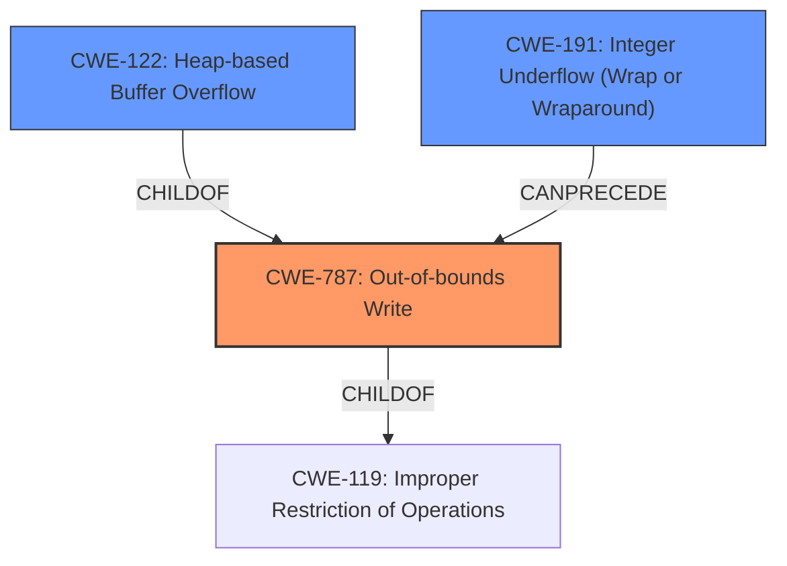

# Enhanced Analysis for CVE-2021-21811

# Summary
| CWE ID | CWE Name | Confidence | CWE Abstraction Level | CWE Vulnerability Mapping Label | CWE-Vulnerability Mapping Notes |
|---|---|---|---|---|---|
| CWE-787 | Out-of-bounds Write | 1.0 | Base | Allowed | Primary CWE |
| CWE-191 | Integer Underflow (Wrap or Wraparound) | 0.8 | Base | Allowed | Secondary CWE |
| CWE-122 | Heap-based Buffer Overflow | 0.7 | Variant | Allowed | Secondary CWE |

## Evidence and Confidence

*   **Confidence Score:** 0.9
*   **Evidence Strength:** HIGH

## Relationship Analysis
The primary CWE is CWE-787 **Out-of-bounds Write** which is a base CWE and a child of CWE-119 **Improper Restriction of Operations**. The integer underflow (CWE-191) can precede the out-of-bounds write. CWE-122 **Heap-based Buffer Overflow** is a variant of CWE-787. The relationships suggest a chain where an integer underflow leads to a buffer overflow, ultimately resulting in an out-of-bounds write on the heap. The abstraction levels are appropriate, with the base CWE capturing the fundamental flaw and the variant providing a more specific context.



## Vulnerability Chain
The vulnerability chain starts with an integer underflow (CWE-191) in the custom heap management code, which leads to a heap-based buffer overflow (CWE-122), and finally results in an out-of-bounds write (CWE-787) on the heap. This **memory corruption** can lead to a crash or potentially arbitrary code execution.

## Summary of Analysis
The initial analysis correctly identified CWE-787 as the primary weakness based on the vulnerability description and similar CVEs. The detailed analysis of the CVE reference links content summary confirms this assessment, highlighting the heap buffer overflow in `LabelDict::CreateLabelOrAttrib`. The root cause is an integer underflow vulnerability within the `MemStreamer::GetByteBlock` function, which leads to the overflow. Therefore, I am adding CWE-191 as a secondary CWE. The heap buffer overflow (CWE-122) is a more specific instance of the out-of-bounds write and is also added as a secondary CWE. The graph relationships and retriever results support this chain of weaknesses. The selected CWEs are at the optimal level of specificity, accurately representing the vulnerability's root cause and impact. The evidence from the CVE reference links content summary clearly supports the identified CWEs:

*   "The vulnerability stems from an integer underflow within the custom heap management code of AT&T Labs' Xmill during XML parsing."
*   "The primary weakness is a heap buffer overflow in the `LabelDict::CreateLabelOrAttrib` function."
*   "Exploitation leads to arbitrary heap write, resulting in **memory corruption**."

These excerpts directly support the classification of CWE-787, CWE-191, and CWE-122.

Relevant CWE Information:

# Enhanced Context (25 CWEs)
The following CWEs were identified as potentially relevant to this vulnerability:

## CWE-191: Integer Underflow (Wrap or Wraparound)
**Abstraction Level**: Base
**Similarity Score**: 0.79
**Source**: dense

**Description**:
The product subtracts one value from another, such that the result is less than the minimum allowable integer value, which produces a value that is not equal to the correct result.

**Mapping Guidance**:
- Usage: Allowed
- Rationale: This CWE entry is at the Base level of abstraction, which is a preferred level of abstraction for mapping to the root causes of vulnerabilities.

**Technical Explanation:**
CWE-787: Out-of-bounds Write
*   The vulnerability description indicates that a specially crafted XML file can lead to a heap buffer overflow due to a flaw in the XML-parsing `CreateLabelOrAttrib` functionality. This aligns with the CWE-787 description, which states that the product writes data past the end, or before the beginning, of the intended buffer.
*   The security implication is that an attacker can cause **memory corruption**, potentially leading to arbitrary code execution.
*   CWE-787 is a base CWE and is a child of CWE-119 (Improper Restriction of Operations Within the Bounds of a Memory Buffer).
*   The official MITRE mapping guidance allows the usage of CWE-787 at the Base level of abstraction.

CWE-191: Integer Underflow (Wrap or Wraparound)
*   The root cause of the heap buffer overflow is an integer underflow, which occurs during the calculation of available space within a heap block. This aligns with the CWE-191 description, which states that the product subtracts one value from another, such that the result is less than the minimum allowable integer value.
*   The security implication is that the integer underflow leads to an incorrect calculation of the buffer size, which in turn results in the heap buffer overflow.
*   CWE-191 is a base CWE and can precede CWE-119.
*   The official MITRE mapping guidance allows the usage of CWE-191 at the Base level of abstraction.

CWE-122: Heap-based Buffer Overflow
*   The vulnerability description explicitly mentions a heap buffer overflow, which aligns with the CWE-122 description.
*   The security implication is that an attacker can overwrite data in the heap, potentially leading to arbitrary code execution.
*   CWE-122 is a variant CWE and is a child of CWE-787.
*   The official MITRE mapping guidance allows the usage of CWE-122 at the Variant level of abstraction.

CWE-131: Incorrect Calculation of Buffer Size
*   This CWE was considered because the root cause involves an incorrect calculation of available space within a heap block. However, the integer underflow is a more precise description of the flaw than simply stating that the buffer size calculation is incorrect.

CWE-190: Integer Overflow or Wraparound
*   This CWE was considered because integer overflows and underflows are closely related. However, the specific flaw in this case is an integer underflow, making CWE-191 a more appropriate choice.

CWE-125: Out-of-bounds Read
*   This CWE was considered because out-of-bounds reads and writes are related. However, the vulnerability description specifically mentions a heap buffer overflow, indicating an out-of-bounds write.

CWE-129: Improper Validation of Array Index
*   This CWE was considered because it relates to improper validation of array indices, which can lead to out-of-bounds access. However, the vulnerability description does not mention array indices, making this CWE less relevant.

CWE-776: Improper Restriction of Recursive Entity References in DTDs ('XML Entity Expansion')
*   This CWE was considered because the vulnerability involves parsing an XML file. However, the root cause is not related to recursive entity references, making this CWE less relevant.

CWE-134: Use of Externally-Controlled Format String
*   This CWE was considered because it relates to vulnerabilities in parsing input. However, the vulnerability description does not mention format strings, making this CWE less relevant.

CWE-1284: Improper Validation of Specified Quantity in Input
*   This CWE was considered as the integer underflow can be seen as an improper validation of the size. However, CWE-191 more accurately describes the root cause.


## CWE Relationship Analysis

Current CWEs represent these abstraction levels: .


### Vulnerability Chain Analysis

**Chain starting from CWE-1284:**
- 1284 (Improper Validation of Specified Quantity in Input) - ROOT


**Chain starting from CWE-787:**
- 787 (Out-of-bounds Write) - ROOT


### CWE Relationship Diagram

```mermaid
graph TD
    classDef primary fill:#f96,stroke:#333,stroke-width:2px
    classDef secondary fill:#69f,stroke:#333
    classDef tertiary fill:#9e9,stroke:#333
```