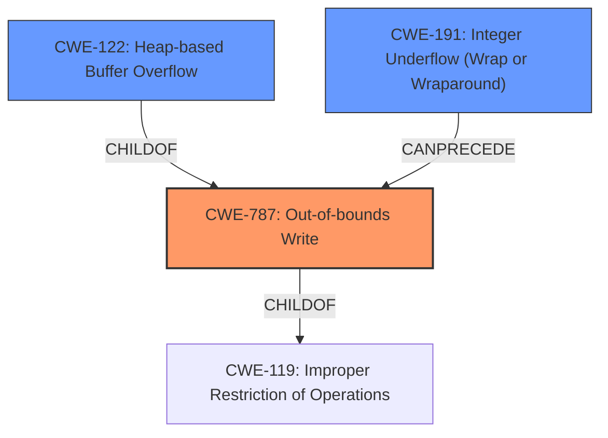

# Analysis for CVE-2021-21811

# Summary
| CWE ID | CWE Name | Confidence | CWE Abstraction Level | CWE Vulnerability Mapping Label | CWE-Vulnerability Mapping Notes |
|---|---|---|---|---|---|
| CWE-787 | Out-of-bounds Write | 1.0 | Base | Allowed | Primary CWE |
| CWE-191 | Integer Underflow (Wrap or Wraparound) | 0.8 | Base | Allowed | Secondary CWE |
| CWE-122 | Heap-based Buffer Overflow | 0.7 | Variant | Allowed | Secondary CWE |

## Evidence and Confidence

*   **Confidence Score:** 0.9
*   **Evidence Strength:** HIGH

## Relationship Analysis
The primary CWE is CWE-787 **Out-of-bounds Write** which is a base CWE and a child of CWE-119 **Improper Restriction of Operations**. The integer underflow (CWE-191) can precede the out-of-bounds write. CWE-122 **Heap-based Buffer Overflow** is a variant of CWE-787. The relationships suggest a chain where an integer underflow leads to a buffer overflow, ultimately resulting in an out-of-bounds write on the heap. The abstraction levels are appropriate, with the base CWE capturing the fundamental flaw and the variant providing a more specific context.

## Vulnerability Chain
The vulnerability chain starts with an integer underflow (CWE-191) in the custom heap management code, which leads to a heap-based buffer overflow (CWE-122), and finally results in an out-of-bounds write (CWE-787) on the heap. This **memory corruption** can lead to a crash or potentially arbitrary code execution.

## Summary of Analysis
The initial analysis correctly identified CWE-787 as the primary weakness based on the vulnerability description and similar CVEs. The detailed analysis of the CVE reference links content summary confirms this assessment, highlighting the heap buffer overflow in `LabelDict::CreateLabelOrAttrib`. The root cause is an integer underflow vulnerability within the `MemStreamer::GetByteBlock` function, which leads to the overflow. Therefore, I am adding CWE-191 as a secondary CWE. The heap buffer overflow (CWE-122) is a more specific instance of the out-of-bounds write and is also added as a secondary CWE. The graph relationships and retriever results support this chain of weaknesses. The selected CWEs are at the optimal level of specificity, accurately representing the vulnerability's root cause and impact. The evidence from the CVE reference links content summary clearly supports the identified CWEs:

*   "The vulnerability stems from an integer underflow within the custom heap management code of AT&T Labs' Xmill during XML parsing."
*   "The primary weakness is a heap buffer overflow in the `LabelDict::CreateLabelOrAttrib` function."
*   "Exploitation leads to arbitrary heap write, resulting in **memory corruption**."

These excerpts directly support the classification of CWE-787, CWE-191, and CWE-122.

Relevant CWE Information:

# Enhanced Context (25 CWEs)
The following CWEs were identified as potentially relevant to this vulnerability:

## CWE-191: Integer Underflow (Wrap or Wraparound)
**Abstraction Level**: Base
**Similarity Score**: 0.79
**Source**: dense

**Description**:
The product subtracts one value from another, such that the result is less than the minimum allowable integer value, which produces a value that is not equal to the correct result.

**Mapping Guidance**:
- Usage: Allowed
- Rationale: This CWE entry is at the Base level of abstraction, which is a preferred level of abstraction for mapping to the root causes of vulnerabilities.

**Technical Explanation:**
CWE-787: Out-of-bounds Write
*   The vulnerability description indicates that a specially crafted XML file can lead to a heap buffer overflow due to a flaw in the XML-parsing `CreateLabelOrAttrib` functionality. This aligns with the CWE-787 description, which states that the product writes data past the end, or before the beginning, of the intended buffer.
*   The security implication is that an attacker can cause **memory corruption**, potentially leading to arbitrary code execution.
*   CWE-787 is a base CWE and is a child of CWE-119 (Improper Restriction of Operations Within the Bounds of a Memory Buffer).
*   The official MITRE mapping guidance allows the usage of CWE-787 at the Base level of abstraction.

CWE-191: Integer Underflow (Wrap or Wraparound)
*   The root cause of the heap buffer overflow is an integer underflow, which occurs during the calculation of available space within a heap block. This aligns with the CWE-191 description, which states that the product subtracts one value from another, such that the result is less than the minimum allowable integer value.
*   The security implication is that the integer underflow leads to an incorrect calculation of the buffer size, which in turn results in the heap buffer overflow.
*   CWE-191 is a base CWE and can precede CWE-119.
*   The official MITRE mapping guidance allows the usage of CWE-191 at the Base level of abstraction.

CWE-122: Heap-based Buffer Overflow
*   The vulnerability description explicitly mentions a heap buffer overflow, which aligns with the CWE-122 description.
*   The security implication is that an attacker can overwrite data in the heap, potentially leading to arbitrary code execution.
*   CWE-122 is a variant CWE and is a child of CWE-787.
*   The official MITRE mapping guidance allows the usage of CWE-122 at the Variant level of abstraction.

CWE-131: Incorrect Calculation of Buffer Size
*   This CWE was considered because the root cause involves an incorrect calculation of available space within a heap block. However, the integer underflow is a more precise description of the flaw than simply stating that the buffer size calculation is incorrect.

CWE-190: Integer Overflow or Wraparound
*   This CWE was considered because integer overflows and underflows are closely related. However, the specific flaw in this case is an integer underflow, making CWE-191 a more appropriate choice.

CWE-125: Out-of-bounds Read
*   This CWE was considered because out-of-bounds reads and writes are related. However, the vulnerability description specifically mentions a heap buffer overflow, indicating an out-of-bounds write.

CWE-129: Improper Validation of Array Index
*   This CWE was considered because it relates to improper validation of array indices, which can lead to out-of-bounds access. However, the vulnerability description does not mention array indices, making this CWE less relevant.

CWE-776: Improper Restriction of Recursive Entity References in DTDs ('XML Entity Expansion')
*   This CWE was considered because the vulnerability involves parsing an XML file. However, the root cause is not related to recursive entity references, making this CWE less relevant.

CWE-134: Use of Externally-Controlled Format String
*   This CWE was considered because it relates to vulnerabilities in parsing input. However, the vulnerability description does not mention format strings, making this CWE less relevant.

CWE-1284: Improper Validation of Specified Quantity in Input
*   This CWE was considered as the integer underflow can be seen as an improper validation of the size. However, CWE-191 more accurately describes the root cause.

# Enhanced Query for CVE-2021-21811

## Vulnerability Description
A **memory corruption** vulnerability exists in the XML-parsing CreateLabelOrAttrib functionality of AT&T Labs Xmill 0.7. A specially crafted XML file can lead to a heap buffer overflow. An attacker can provide a malicious file to trigger this vulnerability.

### Vulnerability Description Key Phrases
- **weakness:** **memory corruption**
- **impact:** heap buffer overflow
- **vector:** specially crafted XML file
- **attacker:** attacker
- **product:** AT&T Labs Xmill
- **version:** 0.7
- **component:** XML-parsing CreateLabelOrAttrib functionality

### CWE for similar CVE Descriptions
### Primary CWE Match
CWE-787

#### Top CWEs
- CWE-787 (Count: 9)
- CWE-131 (Count: 3)
- CWE-119 (Count: 3)

## CVE Reference Links Content Summary
Based on the provided content, here's a breakdown of the vulnerability:

**Root Cause:**
- The vulnerability stems from an integer underflow within the custom heap management code of AT&T Labs' Xmill during XML parsing. Specifically, the `GetByteBlock` function incorrectly calculates available space within a heap block due to the `WordAlign` function, leading to an integer underflow during an unsigned comparison. This allows `CreateLabelOrAttrib` to write past the allocated buffer.

**Weaknesses/Vulnerabilities:**
- **Heap buffer overflow:** The primary weakness is a heap buffer overflow in the `LabelDict::CreateLabelOrAttrib` function.
- **Integer underflow:**  The root cause of the overflow is an integer underflow vulnerability within the `MemStreamer::GetByteBlock` function when comparing the available space in a custom heap block against the required size after aligning the current block size via `WordAlign`.
- **Custom heap management:** The custom heap management within Xmill is flawed and does not properly account for edge cases with block alignment.

**Impact of Exploitation:**
- **Memory corruption:** Exploitation leads to arbitrary heap write, resulting in memory corruption. This can have various impacts, including:
  - **Crash:** The provided crash information shows a heap-buffer-overflow leading to program termination.
  - **Arbitrary code execution:** While not explicitly stated, the potential exists for arbitrary code execution if the overflow is carefully crafted to overwrite key memory locations.
- **Loss of confidentiality, integrity, and availability:** A successful exploit can lead to complete compromise of affected systems.

**Attack Vectors:**
- **Malicious XML file:** The attack vector is providing a specially crafted XML file to the vulnerable Xmill application. The attacker must be able to cause the application to parse the malicious file.

**Required Attacker Capabilities/Position:**
- The attacker needs the ability to supply an XML file to the Xmill application which is vulnerable. No specific privileges are required to trigger the vulnerability beyond normal file read permissions.

**Additional Information:**
- The vulnerable code is present in AT&T Labs' Xmill 0.7, which is an older utility but can still be found in modern software suites like Schneider Electric’s EcoStruxure Control Expert.
- The vulnerability is triggered when creating labels or attributes of a certain size within the XML file being parsed.
- The `WordAlign` function, intended to align the memory to a 4 byte boundary, is involved in creating the condition that triggers the underflow.
- The provided crash information pinpoints `__asan_memcpy` as the source of the overflow during the copy operation of the label.

## Retriever Results

### Top Combined Results

| Rank | CWE ID | Name | Abstraction | Usage  | Retrievers | Individual Scores |
|------|--------|------|-------------|-------|------------|-------------------|
| 1 | 787 | Out-of-bounds Write | Base | Allowed | alternate_terms | 1.000 |
| 2 | 122 | Heap-based Buffer Overflow | Variant | Allowed | sparse | 0.338 |
| 3 | 190 | Integer Overflow or Wraparound | Base | Allowed | sparse | 0.309 |
| 4 | 125 | Out-of-bounds Read | Base | Allowed | sparse | 0.284 |
| 5 | 129 | Improper Validation of Array Index | Variant | Allowed | sparse | 0.271 |
| 6 | 776 | Improper Restriction of Recursive Entity References in DTDs ('XML Entity Expansion') | Base | Allowed | dense | 0.540 |
| 7 | 128 | Wrap-around Error | Base | Allowed | graph | 0.002 |
| 8 | 134 | Use of Externally-Controlled Format String | Base | Allowed | sparse | 0.271 |
| 9 | 1284 | Improper Validation of Specified Quantity in Input | Base | Allowed | sparse | 0.267 |
| 10 | 193 | Off-by-one Error | Base | Allowed | sparse | 0.267 |

# Complete CWE Specifications

## CWE-787: Out-of-bounds Write
**Abstraction:** Base
**Status:** Draft

### Description
The product writes data past the end, or before the beginning, of the intended buffer.

### Extended Description
Not provided

### Alternative Terms
Memory Corruption: Often used to describe the consequences of writing to memory outside the bounds of a buffer, or to memory that is otherwise invalid.

### Relationships
ChildOf -> CWE-119
ChildOf -> CWE-119
ChildOf -> CWE-119
ChildOf -> CWE-119

### Mapping Guidance
**Usage:** Allowed
**Rationale:** This CWE entry is at the Base level of abstraction, which is a preferred level of abstraction for mapping to the root causes of vulnerabilities.
**Comments:** Carefully read both the name and description to ensure that this mapping is an appropriate fit. Do not try to 'force' a mapping to a lower-level Base/Variant simply to comply with this preferred level of abstraction.
**Reasons:**
- Acceptable-Use

### Observed Examples
- **CVE-2023-1017:** The reference implementation code for a Trusted Platform Module does not implement length checks on data, allowing for an attacker to write 2 bytes past the end of a buffer.
- **CVE-2021-21220:** Chain: insufficient input validation (CWE-20) in browser allows heap corruption (CWE-787), as exploited in the wild per CISA KEV.
- **CVE-2021-28664:** GPU kernel driver allows memory corruption because a user can obtain read/write access to read-only pages, as exploited in the wild per CISA KEV.

## CWE-122: Heap-based Buffer Overflow
**Abstraction:** Variant
**Status:** Draft

### Description
A heap overflow condition is a buffer overflow, where the buffer that can be overwritten is allocated in the heap portion of memory, generally meaning that the buffer was allocated using a routine such as malloc().

### Extended Description
Not provided

### Alternative Terms
None

### Relationships
ChildOf -> CWE-788
ChildOf -> CWE-787

### Mapping Guidance
**Usage:** Allowed
**Rationale:** This CWE entry is at the Variant level of abstraction, which is a preferred level of abstraction for mapping to the root causes of vulnerabilities.
**Comments:** Carefully read both the name and description to ensure that this mapping is an appropriate fit. Do not try to 'force' a mapping to a lower-level Base/Variant simply to comply with this preferred level of abstraction.
**Reasons:**
- Acceptable-Use

### Additional Notes
**[Relationship]** Heap-based buffer overflows are usually just as dangerous as stack-based buffer overflows.

### Observed Examples
- **CVE-2021-43537:** Chain: in a web browser, an unsigned 64-bit integer is forcibly cast to a 32-bit integer (CWE-681) and potentially leading to an integer overflow (CWE-190). If an integer overflow occurs, this can cause heap memory corruption (CWE-122)
- **CVE-2007-4268:** Chain: integer signedness error (CWE-195) passes signed comparison, leading to heap overflow (CWE-122)
- **CVE-2009-2523:** Chain: product does not handle when an input string is not NULL terminated (CWE-170), leading to buffer over-read (CWE-125) or heap-based buffer overflow (CWE-122).

## CWE-190: Integer Overflow or Wraparound
**Abstraction:** Base
**Status:** Stable

### Description
The product performs a calculation that can
         produce an integer overflow or wraparound when the logic
         assumes that the resulting value will always be larger than
         the original value. This occurs when an integer value is
         incremented to a value that is too large to store in the
         associated representation. When this occurs, the value may
         become a very small or negative number.

### Extended Description
Not provided

### Alternative Terms
Overflow: The terms "overflow" and "wraparound" are used interchangeably by some people, but they can have more precise distinctions by others. See Terminology Notes.
Wraparound: The terms "overflow" and "wraparound" are used interchangeably by some people, but they can have more precise distinctions by others. See Terminology Notes.
wrap, wrap-around, wrap around: Alternate spellings of "wraparound"

### Relationships
ChildOf -> CWE-682
ChildOf -> CWE-682
ChildOf -> CWE-20
CanPrecede -> CWE-119

### Mapping Guidance
**Usage:** Allowed
**Rationale:** This CWE entry is at the Base level of abstraction, which is a preferred level of abstraction for mapping to the root causes of vulnerabilities.
**Comments:** Be careful of terminology problems with "overflow," "underflow," and "wraparound" - see Terminology Notes. Carefully read both the name and description to ensure that this mapping is an appropriate fit. Do not try to 'force' a mapping to a lower-level Base/Variant simply to comply with this preferred level of abstraction.
**Reasons:**
- Acceptable-Use
**Suggested Alternatives:**
- CWE-191: Integer Underflow (Wrap or Wraparound). Consider CWE-191 when the result is less than the minimum value that can be represented (sometimes called "underflows").

### Additional Notes
**[Relationship]** Integer overflows can be primary to buffer overflows when they cause less memory to be allocated than expected.

**[Terminology]** 

"Integer overflow" is sometimes used to cover several types of errors, including signedness errors, or buffer overflows that involve manipulation of integer data types instead of characters. Part of the confusion results from the fact that 0xffffffff is -1 in a signed context. Other confusion also arises because of the role that integer overflows have in chains.

A "wraparound" is a well-defined, standard behavior that follows specific rules for how to handle situations when the intended numeric value is too large or too small to be represented, as specified in standards such as C11.

"Overflow" is sometimes conflated with "wraparound" but typically indicates a non-standard or undefined behavior.

The "overflow" term is sometimes used to indicate cases where either the maximum or the minimum is exceeded, but others might only use "overflow" to indicate exceeding the maximum while using "underflow" for exceeding the minimum.

Some people use "overflow" to mean any value outside the representable range - whether greater than the maximum, or less than the minimum - but CWE uses "underflow" for cases in which the intended result is less than the minimum.

See [REF-1440] for additional explanation of the ambiguity of terminology.

**[Other]** While there may be circumstances in which the logic intentionally relies on wrapping - such as with modular arithmetic in timers or counters - it can have security consequences if the wrap is unexpected. This is especially the case if the integer overflow can be triggered using user-supplied inputs.

### Observed Examples
- **CVE-2021-43537:** Chain: in a web browser, an unsigned 64-bit integer is forcibly cast to a 32-bit integer (CWE-681) and potentially leading to an integer overflow (CWE-190). If an integer overflow occurs, this can cause heap memory corruption (CWE-122)
- **CVE-2022-21668:** Chain: Python library does not limit the resources used to process images that specify a very large number of bands (CWE-1284), leading to excessive memory consumption (CWE-789) or an integer overflow (CWE-190).
- **CVE-2022-0545:** Chain: 3D renderer has an integer overflow (CWE-190) leading to write-what-where condition (CWE-123) using a crafted image.

## CWE-125: Out-of-bounds Read
**Abstraction:** Base
**Status:** Draft

### Description
The product reads data past the end, or before the beginning, of the intended buffer.

### Extended Description
Not provided

### Alternative Terms
OOB read: Shorthand for "Out of bounds" read

### Relationships
ChildOf -> CWE-119
ChildOf -> CWE-119
ChildOf -> CWE-119
ChildOf -> CWE-119

### Mapping Guidance
**Usage:** Allowed
**Rationale:** This CWE entry is at the Base level of abstraction, which is a preferred level of abstraction for mapping to the root causes of vulnerabilities.
**Comments:** Carefully read both the name and description to ensure that this mapping is an appropriate fit. Do not try to 'force' a mapping to a lower-level Base/Variant simply to comply with this preferred level of abstraction.
**Reasons:**
- Acceptable-Use

### Observed Examples
- **CVE-2023-1018:** The reference implementation code for a Trusted Platform Module does not implement length checks on data, allowing for an attacker to read 2 bytes past the end of a buffer.
- **CVE-2020-11899:** Out-of-bounds read in IP stack used in embedded systems, as exploited in the wild per CISA KEV.
- **CVE-2014-0160:** Chain: "Heartbleed" bug receives an inconsistent length parameter (CWE-130) enabling an out-of-bounds read (CWE-126), returning memory that could include private cryptographic keys and other sensitive data.

## CWE-129: Improper Validation of Array Index
**Abstraction:** Variant
**Status:** Draft

### Description
The product uses untrusted input when calculating or using an array index, but the product does not validate or incorrectly validates the index to ensure the index references a valid position within the array.

### Extended Description
Not provided

### Alternative Terms
out-of-bounds array index
index-out-of-range
array index underflow

### Relationships
ChildOf -> CWE-1285
ChildOf -> CWE-20
CanPrecede -> CWE-119
CanPrecede -> CWE-823
CanPrecede -> CWE-789

### Mapping Guidance
**Usage:** Allowed
**Rationale:** This CWE entry is at the Variant level of abstraction, which is a preferred level of abstraction for mapping to the root causes of vulnerabilities.
**Comments:** Carefully read both the name and description to ensure that this mapping is an appropriate fit. Do not try to 'force' a mapping to a lower-level Base/Variant simply to comply with this preferred level of abstraction.
**Reasons:**
- Acceptable-Use

### Additional Notes
**[Relationship]** This weakness can precede uncontrolled memory allocation (CWE-789) in languages that automatically expand an array when an index is used that is larger than the size of the array, such as JavaScript.

**[Theoretical]** An improperly validated array index might lead directly to the always-incorrect behavior of "access of array using out-of-bounds index."

### Observed Examples
- **CVE-2005-0369:** large ID in packet used as array index
- **CVE-2001-1009:** negative array index as argument to POP LIST command
- **CVE-2003-0721:** Integer signedness error leads to negative array index

## CWE-776: Improper Restriction of Recursive Entity References in DTDs ('XML Entity Expansion')
**Abstraction:** Base
**Status:** Draft

### Description
The product uses XML documents and allows their structure to be defined with a Document Type Definition (DTD), but it does not properly control the number of recursive definitions of entities.

### Extended Description
If the DTD contains a large number of nested or recursive entities, this can lead to explosive growth of data when parsed, causing a denial of service.

### Alternative Terms
XEE: XEE is the acronym commonly used for XML Entity Expansion.
Billion Laughs Attack
XML Bomb: While the "XML Bomb" term was used in the early years of knowledge of this issue, the XEE term seems to be more commonly used.

### Relationships
ChildOf -> CWE-674
ChildOf -> CWE-674
ChildOf -> CWE-405

### Mapping Guidance
**Usage:** Allowed
**Rationale:** This CWE entry is at the Base level of abstraction, which is a preferred level of abstraction for mapping to the root causes of vulnerabilities.
**Comments:** Carefully read both the name and description to ensure that this mapping is an appropriate fit. Do not try to 'force' a mapping to a lower-level Base/Variant simply to comply with this preferred level of abstraction.
**Reasons:**
- Acceptable-Use

### Observed Examples
- **CVE-2008-3281:** XEE in XML-parsing library.
- **CVE-2011-3288:** XML bomb / XEE in enterprise communication product.
- **CVE-2011-1755:** "Billion laughs" attack in XMPP server daemon.

## CWE-128: Wrap-around Error
**Abstraction:** Base
**Status:** Incomplete

### Description
Wrap around errors occur whenever a value is incremented past the maximum value for its type and therefore "wraps around" to a very small, negative, or undefined value.

### Extended Description
Not provided

### Alternative Terms
None

### Relationships
ChildOf -> CWE-682
CanPrecede -> CWE-119
PeerOf -> CWE-190

### Mapping Guidance
**Usage:** Allowed
**Rationale:** This CWE entry is at the Base level of abstraction, which is a preferred level of abstraction for mapping to the root causes of vulnerabilities.
**Comments:** Carefully read both the name and description to ensure that this mapping is an appropriate fit. Do not try to 'force' a mapping to a lower-level Base/Variant simply to comply with this preferred level of abstraction.
**Reasons:**
- Acceptable-Use

### Additional Notes
**[Relationship]** The relationship between overflow and wrap-around needs to be examined more closely, since several entries (including CWE-190) are closely related.

## CWE-134: Use of Externally-Controlled Format String
**Abstraction:** Base
**Status:** Draft

### Description
The product uses a function that accepts a format string as an argument, but the format string originates from an external source.

### Extended Description

When an attacker can modify an externally-controlled format string, this can lead to buffer overflows, denial of service, or data representation problems.

It should be noted that in some circumstances, such as internationalization, the set of format strings is externally controlled by design. If the source of these format strings is trusted (e.g. only contained in library files that are only modifiable by the system administrator), then the external control might not itself pose a vulnerability.

### Alternative Terms
None

### Relationships
ChildOf -> CWE-668
ChildOf -> CWE-668
CanPrecede -> CWE-123
ChildOf -> CWE-20

### Mapping Guidance
**Usage:** Allowed
**Rationale:** This CWE entry is at the Base level of abstraction, which is a preferred level of abstraction for mapping to the root causes of vulnerabilities.
**Comments:** Carefully read both the name and description to ensure that this mapping is an appropriate fit. Do not try to 'force' a mapping to a lower-level Base/Variant simply to comply with this preferred level of abstraction.
**Reasons:**
- Acceptable-Use

### Additional Notes
**[Applicable Platform]** 

This weakness is possible in any programming language that support format strings.

**[Other]** 

While Format String vulnerabilities typically fall under the Buffer Overflow category, technically they are not overflowed buffers. The Format String vulnerability is fairly new (circa 1999) and stems from the fact that there is no realistic way for a function that takes a variable number of arguments to determine just how many arguments were passed in. The most common functions that take a variable number of arguments, including C-runtime functions, are the printf() family of calls. The Format String problem appears in a number of ways. A *printf() call without a format specifier is dangerous and can be exploited. For example, printf(input); is exploitable, while printf(y, input); is not exploitable in that context. The result of the first call, used incorrectly, allows for an attacker to be able to peek at stack memory since the input string will be used as the format specifier. The attacker can stuff the input string with format specifiers and begin reading stack values, since the remaining parameters will be pulled from the stack. Worst case, this improper use may give away enough control to allow an arbitrary value (or values in the case of an exploit program) to be written into the memory of the running program.

Frequently targeted entities are file names, process names, identifiers.

Format string problems are a classic C/C++ issue that are now rare due to the ease of discovery. One main reason format string vulnerabilities can be exploited is due to the %n operator. The %n operator will write the number of characters, which have been printed by the format string therefore far, to the memory pointed to by its argument. Through skilled creation of a format string, a malicious user may use values on the stack to create a write-what-where condition. Once this is achieved, they can execute arbitrary code. Other operators can be used as well; for example, a %9999s operator could also trigger a buffer overflow, or when used in file-formatting functions like fprintf, it can generate a much larger output than intended.

**[Research Gap]** Format string issues are under-studied for languages other than C. Memory or disk consumption, control flow or variable alteration, and data corruption may result from format string exploitation in applications written in other languages such as Perl, PHP, Python, etc.

### Observed Examples
- **CVE-2002-1825:** format string in Perl program
- **CVE-2001-0717:** format string in bad call to syslog function
- **CVE-2002-0573:** format string in bad call to syslog function

## CWE-1284: Improper Validation of Specified Quantity in Input
**Abstraction:** Base
**Status:** Incomplete

### Description
The product receives input that is expected to specify a quantity (such as size or length), but it does not validate or incorrectly validates that the quantity has the required properties.

### Extended Description

Specified quantities include size, length, frequency, price, rate, number of operations, time, and others. Code may rely on specified quantities to allocate resources, perform calculations, control iteration, etc. When the quantity is not properly validated, then attackers can specify malicious quantities to cause excessive resource allocation, trigger unexpected failures, enable buffer overflows, etc.

### Alternative Terms
None

### Relationships
ChildOf -> CWE-20
ChildOf -> CWE-20
CanPrecede -> CWE-789

### Mapping Guidance
**Usage:** Allowed
**Rationale:** This CWE entry is at the Base level of abstraction, which is a preferred level of abstraction for mapping to the root causes of vulnerabilities.
**Comments:** Carefully read both the name and description to ensure that this mapping is an appropriate fit. Do not try to 'force' a mapping to a lower-level Base/Variant simply to comply with this preferred level of abstraction.
**Reasons:**
- Acceptable-Use

### Additional Notes
**[Maintenance]** This entry is still under development and will continue to see updates and content improvements.

### Observed Examples
- **CVE-2022-21668:** Chain: Python library does not limit the resources used to process images that specify a very large number of bands (CWE-1284), leading to excessive memory consumption (CWE-789) or an integer overflow (CWE-190).
- **CVE-2008-1440:** lack of validation of length field leads to infinite loop
- **CVE-2008-2374:** lack of validation of string length fields allows memory consumption or buffer over-read

## CWE-193: Off-by-one Error
**Abstraction:** Base
**Status:** Draft

### Description
A product calculates or uses an incorrect maximum or minimum value that is 1 more, or 1 less, than the correct value.

### Extended Description
Not provided

### Alternative Terms
off-by-five: An "off-by-five" error was reported for sudo in 2002 (CVE-2002-0184), but that is more like a "length calculation" error.

### Relationships
ChildOf -> CWE-682
ChildOf -> CWE-682
CanPrecede -> CWE-617
CanPrecede -> CWE-170
CanPrecede -> CWE-119

### Mapping Guidance
**Usage:** Allowed
**Rationale:** This CWE entry is at the Base level of abstraction, which is a preferred level of abstraction for mapping to the root causes of vulnerabilities.
**Comments:** Carefully read both the name and description to ensure that this mapping is an appropriate fit. Do not try to 'force' a mapping to a lower-level Base/Variant simply to comply with this preferred level of abstraction.
**Reasons:**
- Acceptable-Use

### Additional Notes
**[Relationship]** This is not always a buffer overflow. For example, an off-by-one error could be a factor in a partial comparison, a read from the wrong memory location, an incorrect conditional, etc.

### Observed Examples
- **CVE-2003-0252:** Off-by-one error allows remote attackers to cause a denial of service and possibly execute arbitrary code via requests that do not contain newlines.
- **CVE-2001-1391:** Off-by-one vulnerability in driver allows users to modify kernel memory.
- **CVE-2002-0083:** Off-by-one error allows local users or remote malicious servers to gain privileges.

