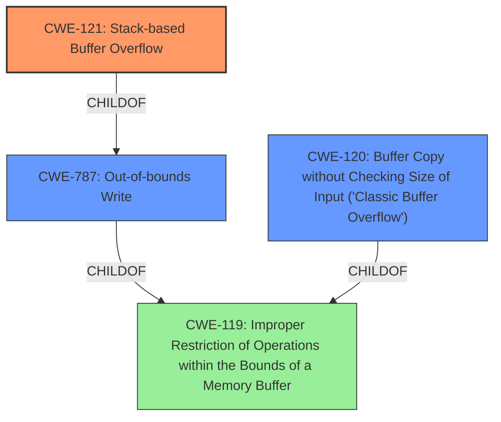

# Raw Analyzer Response for CVE-2021-21812

# Summary
| CWE ID  | CWE Name  | Confidence | CWE Abstraction Level | CWE Vulnerability Mapping Label | CWE-Vulnerability Mapping Notes |
|---|---|---|---|---|---|
| CWE-121 | Stack-based Buffer Overflow | 1.0 | Variant | Allowed | Primary CWE |
| CWE-120 | Buffer Copy without Checking Size of Input ('Classic Buffer Overflow') | 0.7 | Base | Allowed-with-Review | Secondary Candidate |
| CWE-787 | Out-of-bounds Write | 0.6 | Base | Allowed | Secondary Candidate |

## Evidence and Confidence

*   **Confidence Score:** 0.9
*   **Evidence Strength:** HIGH

## Relationship Analysis
The primary CWE selected is CWE-121, Stack-based Buffer Overflow, which is a variant of CWE-787, Out-of-bounds Write. CWE-787 is a child of CWE-119, Improper Restriction of Operations within the Bounds of a Memory Buffer. CWE-120, Buffer Copy without Checking Size of Input ('Classic Buffer Overflow'), is also a child of CWE-119. The relationships guide the selection of the most specific CWE, which is CWE-121.

## Vulnerability Chain
The vulnerability chain starts with the **improper use of `strcpy` without size checking**, leading to a **stack-based buffer overflow** when a user-supplied filename exceeds the buffer's capacity.

## Summary of Analysis
The initial assessment focused on the **stack-based buffer overflow** vulnerability. The evidence provided in the vulnerability description and CVE Reference Links Content Summary clearly indicates that the `strcpy` function is used to copy user-controlled input into a fixed-size buffer without any bounds checking, leading to a stack-based buffer overflow.

The selection of CWE-121 is based on the following evidence:
- The **weakness** is explicitly described as a "**stack-based buffer overflow**" in the "Vulnerability Description Key Phrases".
- The "CVE Reference Links Content Summary" states that the root cause is a "**stack-based buffer overflow** in the `HandleFileArg` function of AT&T Labs' Xmill 0.7 when processing command-line arguments. Specifically, the `strcpy` function is used to copy user-supplied file path data into a fixed-size buffer (`fullpath`) without any bounds checking."

CWE-121 is the most specific CWE that accurately describes this vulnerability. The other CWEs considered were less specific or did not fully capture the nature of the **weakness**.
CWE-120 was considered since it describes the classic buffer overflow due to missing input size checking. However, it is less specific than CWE-121.
CWE-787, Out-of-bounds Write, is a more general case of writing outside the bounds of a buffer. Since the vulnerability description specifies a stack-based buffer, CWE-121 is more appropriate.

Relevant CWE Information:

# Enhanced Context (25 CWEs)
The following CWEs were identified as potentially relevant to this vulnerability:

## CWE-191: Integer Underflow (Wrap or Wraparound)
**Abstraction Level**: Base
**Similarity Score**: 0.77

## CWE-805: Buffer Access with Incorrect Length Value
**Abstraction Level**: Base
**Similarity Score**: 0.75

## CWE-131: Incorrect Calculation of Buffer Size
**Abstraction Level**: Base
**Similarity Score**: 0.75

## CWE-606: Unchecked Input for Loop Condition
**Abstraction Level**: Base
**Similarity Score**: 0.75

## CWE-193: Off-by-one Error
**Abstraction Level**: Base
**Similarity Score**: 0.74

## CWE-124: Buffer Underwrite ('Buffer Underflow')
**Abstraction Level**: Base
**Similarity Score**: 0.74

## CWE-197: Numeric Truncation Error
**Abstraction Level**: Base
**Similarity Score**: 0.74

## CWE-1325: Improperly Controlled Sequential Memory Allocation
**Abstraction Level**: Base
**Similarity Score**: 0.74

## CWE-125: Out-of-bounds Read
**Abstraction Level**: Base
**Similarity Score**: 0.74

## CWE-190: Integer Overflow or Wraparound
**Abstraction Level**: Base
**Similarity Score**: 0.73

## CWE-190: Integer Overflow or Wraparound
**Abstraction Level**: Base
**Similarity Score**: 6724.52

## CWE-125: Out-of-bounds Read
**Abstraction Level**: Base
**Similarity Score**: 6313.53

## CWE-193: Off-by-one Error
**Abstraction Level**: Base
**Similarity Score**: 6271.70

## CWE-1284: Improper Validation of Specified Quantity in Input
**Abstraction Level**: Base
**Similarity Score**: 6142.10

## CWE-119: Improper Restriction of Operations within the Bounds of a Memory Buffer
**Abstraction Level**: Class
**Similarity Score**: 6036.55

## CWE-128: Wrap-around Error
**Abstraction Level**: base
**Similarity Score**: 5.03

## CWE-123: Write-what-where Condition
**Abstraction Level**: base
**Similarity Score**: 4.33

## CWE-120: Buffer Copy without Checking Size of Input ('Classic Buffer Overflow')
**Abstraction Level**: base
**Similarity Score**: 4.33

## CWE-681: Incorrect Conversion between Numeric Types
**Abstraction Level**: base
**Similarity Score**: 4.33

## CWE-170: Improper Null Termination
**Abstraction Level**: base
**Similarity Score**: 4.33

## CWE-1284: Improper Validation of Specified Quantity in Input
**Abstraction Level**: base
**Similarity Score**: 4.33

## CWE-617: Reachable Assertion
**Abstraction Level**: base
**Similarity Score**: 4.33

## CWE-195: Signed to Unsigned Conversion Error
**Abstraction Level**: variant
**Similarity Score**: 3.88

## CWE-1339: Insufficient Precision or Accuracy of a Real Number
**Abstraction Level**: base
**Similarity Score**: 3.57

## CWE-190: Integer Overflow or Wraparound
**Abstraction Level**: Base
**Similarity Score**: 3.31