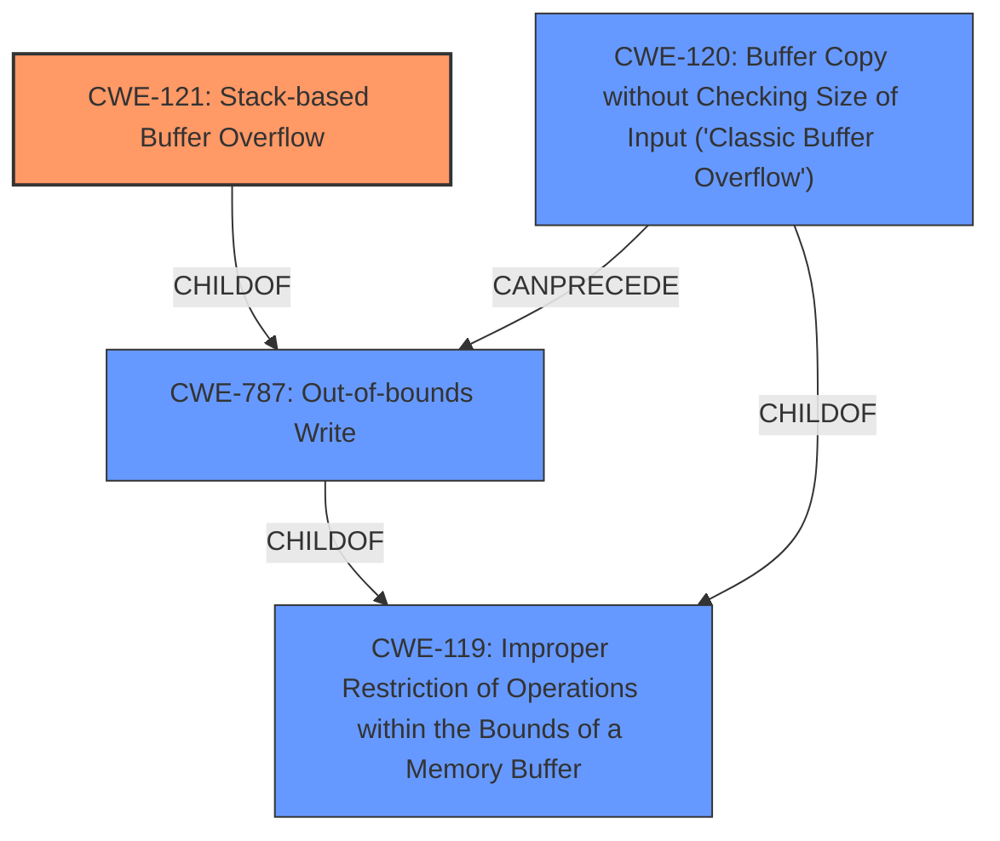

# Enhanced Analysis for CVE-2021-21815

# Summary
| CWE ID  | CWE Name                                                        | Confidence | CWE Abstraction Level | CWE Vulnerability Mapping Label | CWE-Vulnerability Mapping Notes |
| :-------- | :-------------------------------------------------------------- | :--------- | :-------------------- | :------------------------------ | :------------------------------ |
| CWE-121   | Stack-based Buffer Overflow                                     | 1.0        | Variant               | Primary                         | Allowed                         |
| CWE-787   | Out-of-bounds Write                                             | 0.7        | Base                  | Secondary                       | Allowed                         |
| CWE-119   | Improper Restriction of Operations within the Bounds of a Memory Buffer | 0.6        | Class                 | Secondary                       | Discouraged                      |
| CWE-120   | Buffer Copy without Checking Size of Input ('Classic Buffer Overflow') | 0.5        | Base                  | Secondary                       | Allowed-with-Review             |

## Evidence and Confidence

*   **Confidence Score:** 0.8
*   **Evidence Strength:** HIGH

## Relationship Analysis
The primary weakness is a stack-based buffer overflow (CWE-121), a variant of out-of-bounds write (CWE-787) which is a more general case of improper restriction of operations within the bounds of a memory buffer (CWE-119). The vulnerability involves copying a user-controlled string into a fixed-size buffer on the stack without proper bounds checking, characteristic of CWE-120.



## Vulnerability Chain
The vulnerability chain starts with the user providing a long file path via the command line. The `HandleFileArg` function then uses `strcpy` to copy this path into a statically sized buffer on the stack without any length checks, leading to a stack-based buffer overflow. The overflow can overwrite parts of the stack, potentially leading to arbitrary code execution.

## Summary of Analysis
The initial analysis identified CWE-121, CWE-787, CWE-119, and CWE-120 as potential candidates. The vulnerability description explicitly mentions a "**stack-based buffer overflow**" and states that the `strcpy` function copies a user-controlled string into a fixed-size buffer without length checks.

The primary CWE is CWE-121 (Stack-based Buffer Overflow). This is a **Variant** level CWE and accurately describes the vulnerability. The evidence is the "**weakness:** **stack-based buffer overflow**" phrase.

CWE-787 (Out-of-bounds Write) is a **Base** level CWE and a parent of CWE-121. It describes the broader class of vulnerabilities where data is written outside the intended buffer. While accurate, CWE-121 is more specific.

CWE-119 (Improper Restriction of Operations within the Bounds of a Memory Buffer) is a **Class** level CWE and a parent of CWE-787. It's a more general description of the problem, but less specific than CWE-121 or CWE-787. The mapping guidance discourages using CWE-119 when more specific CWEs are available.

CWE-120 (Buffer Copy without Checking Size of Input ('Classic Buffer Overflow')) is a **Base** level CWE that describes the specific scenario where `strcpy` is used without checking input size. This is relevant because the vulnerability description mentions the use of `strcpy` without length checks. The mapping guidance suggests reviewing this choice, but it's a valid contributing factor to the vulnerability.

I considered but did not use CWE-190 (Integer Overflow or Wraparound), CWE-125 (Out-of-bounds Read), CWE-193 (Off-by-one Error), CWE-1284 (Improper Validation of Specified Quantity in Input), CWE-122 (Heap-based Buffer Overflow), and CWE-835 (Loop with Unreachable Exit Condition ('Infinite Loop')). These CWEs did not directly relate to the root cause, which is the unchecked copy operation leading to the stack-based buffer overflow.

The selected CWEs (CWE-121, CWE-787, CWE-119, CWE-120) are at the optimal level of specificity given the available information. CWE-121 accurately describes the vulnerability, while CWE-787, CWE-119, and CWE-120 provide additional context about the nature of the weakness.


## CWE Relationship Analysis

Current CWEs represent these abstraction levels: .


### Vulnerability Chain Analysis

**Chain starting from CWE-121:**
- 121 (Stack-based Buffer Overflow) - ROOT


**Chain starting from CWE-787:**
- 787 (Out-of-bounds Write) - ROOT


### CWE Relationship Diagram

```mermaid
graph TD
    classDef primary fill:#f96,stroke:#333,stroke-width:2px
    classDef secondary fill:#69f,stroke:#333
    classDef tertiary fill:#9e9,stroke:#333
```