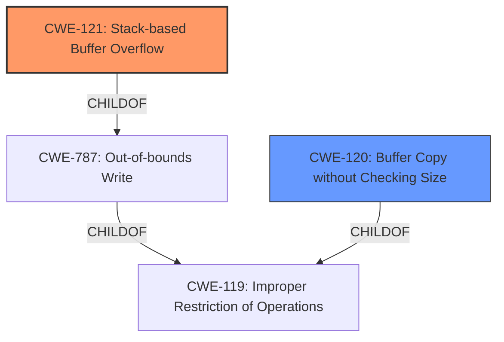

# Analysis for CVE-2021-21821

# Summary
| CWE ID | CWE Name | Confidence | CWE Abstraction Level | CWE Vulnerability Mapping Label | CWE-Vulnerability Mapping Notes |
|---|---|---|---|---|---|
| CWE-121 | Stack-based Buffer Overflow | 1.0 | Variant | Primary | Allowed |
| CWE-120 | Buffer Copy without Checking Size of Input ('Classic Buffer Overflow') | 0.7 | Base | Secondary | Allowed-with-Review |

## Evidence and Confidence

*   **Confidence Score:** 0.9
*   **Evidence Strength:** HIGH

## Relationship Analysis
The primary CWE is CWE-121, a **Variant** of CWE-787 (Out-of-bounds Write) and CWE-119 (Improper Restriction of Operations within the Bounds of a Memory Buffer). CWE-121 is more specific than its parents because the overflow occurs on the stack. CWE-120 is also a child of CWE-119, but it is more general as it doesn't specify the location of the buffer, but it does describe the root cause of copying without checking size.

## Vulnerability Chain
The chain of events starts with a crafted PDF file containing a `fontname` string larger than 256 bytes. The `process_fontname` function uses an unbounded `sprintf` call to copy this string into a fixed-size buffer on the stack. Because there is no check to ensure that the string is not larger than the buffer, this leads to a **stack-based buffer overflow** (CWE-121) and ultimately code execution.

## Summary of Analysis
The analysis is based on clear evidence from the vulnerability description and CVE reference links.

The vulnerability description explicitly states: "A **stack-based buffer overflow** vulnerability exists in the PDF process_fontname functionality of Accusoft ImageGear 19.9. A specially crafted malformed file can lead to code execution."

The CVE Reference Links Content Summary further clarifies:
- "**Root cause of vulnerability**: A stack-based buffer overflow in the `process_fontname` function due to an unbounded `sprintf` call."
- "**Weaknesses/vulnerabilities present**: The `process_fontname` function uses a fixed-size buffer (`b_ovf` of 256 bytes) and an unbounded `sprintf` call to copy a string from the PDF file, without checking if the length of the copied string exceeds the size of the buffer, leading to a stack buffer overflow."

The selection of CWE-121 is based on the explicit mention of "stack-based buffer overflow". The use of `sprintf` without bounds checking strongly suggests CWE-120, which is related to buffer copies without checking size.

CWE-121 is the more specific **Variant** and thus the more appropriate choice as the primary CWE.

CWE-119 is too general and is **Discouraged** when more specific CWEs are available. CWE-190 relates to Integer Overflow which is not the case here.

Relevant CWE Information:

# Enhanced Context (25 CWEs)
The following CWEs were identified as potentially relevant to this vulnerability:

## CWE-131: Incorrect Calculation of Buffer Size
**Abstraction Level**: Base
**Similarity Score**: 0.77

## CWE-124: Buffer Underwrite ('Buffer Underflow')
**Abstraction Level**: Base
**Similarity Score**: 0.77

## CWE-805: Buffer Access with Incorrect Length Value
**Abstraction Level**: Base
**Similarity Score**: 0.76

## CWE-191: Integer Underflow (Wrap or Wraparound)
**Abstraction Level**: Base
**Similarity Score**: 0.76

## CWE-680: Integer Overflow to Buffer Overflow
**Abstraction Level**: Compound
**Similarity Score**: 0.74

## CWE-681: Incorrect Conversion between Numeric Types
**Abstraction Level**: Base
**Similarity Score**: 0.74

## CWE-193: Off-by-one Error
**Abstraction Level**: Base
**Similarity Score**: 0.74

## CWE-126: Buffer Over-read
**Abstraction Level**: Variant
**Similarity Score**: 0.74

## CWE-125: Out-of-bounds Read
**Abstraction Level**: Base
**Similarity Score**: 0.74

## CWE-197: Numeric Truncation Error
**Abstraction Level**: Base
**Similarity Score**: 0.73

## CWE-190: Integer Overflow or Wraparound
**Abstraction Level**: Base
**Similarity Score**: 6898.22

## CWE-193: Off-by-one Error
**Abstraction Level**: Base
**Similarity Score**: 6415.49

## CWE-125: Out-of-bounds Read
**Abstraction Level**: Base
**Similarity Score**: 6340.46

## CWE-839: Numeric Range Comparison Without Minimum Check
**Abstraction Level**: Base
**Similarity Score**: 6244.06

## CWE-1284: Improper Validation of Specified Quantity in Input
**Abstraction Level**: Base
**Similarity Score**: 6231.25

## CWE-128: Wrap-around Error
**Abstraction Level**: base
**Similarity Score**: 5.03

## CWE-120: Buffer Copy without Checking Size of Input ('Classic Buffer Overflow')
**Abstraction Level**: base
**Similarity Score**: 4.82

## CWE-195: Signed to Unsigned Conversion Error
**Abstraction Level**: variant
**Similarity Score**: 4.53

## CWE-123: Write-what-where Condition
**Abstraction Level**: base
**Similarity Score**: 4.33

## CWE-787: Out-of-bounds Write
**Abstraction Level**: base
**Similarity Score**: 4.33

## CWE-823: Use of Out-of-range Pointer Offset
**Abstraction Level**: base
**Similarity Score**: 4.33

## CWE-839: Numeric Range Comparison Without Minimum Check
**Abstraction Level**: base
**Similarity Score**: 4.33

## CWE-170: Improper Null Termination
**Abstraction Level**: base
**Similarity Score**: 4.33

## CWE-1284: Improper Validation of Specified Quantity in Input
**Abstraction Level**: base
**Similarity Score**: 4.33

## CWE-617: Reachable Assertion
**Abstraction Level**: base
**Similarity Score**: 4.33