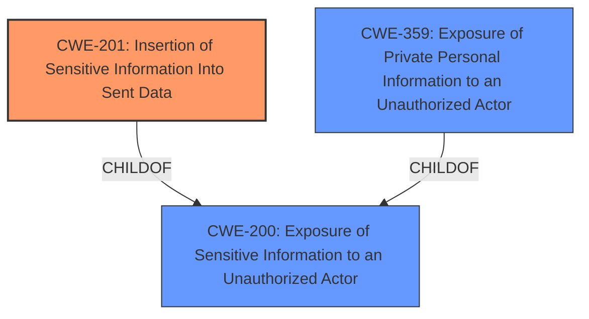

# Raw Analyzer Response for CVE-2021-21823

# Summary
| CWE ID | CWE Name | Confidence | CWE Abstraction Level | CWE Vulnerability Mapping Label | CWE-Vulnerability Mapping Notes |
|---|---|---|---|---|---|
| CWE-201 | Insertion of Sensitive Information Into Sent Data | 0.9 | Base | Allowed | Primary CWE |
| CWE-359 | Exposure of Private Personal Information to an Unauthorized Actor | 0.7 | Base | Allowed | Secondary Candidate |
| CWE-200 | Exposure of Sensitive Information to an Unauthorized Actor | 0.6 | Class | Discouraged | Secondary Candidate |

## Evidence and Confidence

*   **Confidence Score:** 0.8
*   **Evidence Strength:** HIGH

## Relationship Analysis
The primary CWE, CWE-201, is a child of CWE-200, indicating a more specific type of information exposure. CWE-359 is also a child of CWE-200 and could be considered a peer of CWE-201. The selection of CWE-201 as primary is influenced by the explicit mention of sensitive information being *inserted* into data that is sent, aligning directly with CWE-201's description. While CWE-359 is also relevant, the vulnerability description focuses more on the insertion of sensitive information than a general exposure of private personal information, making CWE-201 a slightly better fit.

## Vulnerability Chain
The vulnerability chain starts with the design of the "Friend finder" functionality that uses substring matching. This leads to the **information disclosure** of user email addresses and profile IDs. The chain can be mapped as follows:

1.  Flawed Design (substring matching in friend finder)
2.  CWE-201 Insertion of Sensitive Information Into Sent Data (email addresses, profile IDs)
3.  Impact: Enumeration of email addresses and profile IDs, privacy violation

## Summary of Analysis
The analysis is primarily based on the provided vulnerability description and the "CVE Reference Links Content Summary". The key evidence is the **information disclosure** of email addresses and profile IDs through the "Friend finder" functionality using substring matching.

The vulnerability stems from the "Friend finder" functionality within the Komoot application that allows substring matching when searching for users. This substring matching leads to unintended disclosure of email addresses and profile IDs.

CWE-201 (Insertion of Sensitive Information Into Sent Data) is the most appropriate because it directly addresses the scenario where sensitive information (email addresses and profile IDs) is being included in the data sent as a result of the friend finder's substring matching functionality.

CWE-359 (Exposure of Private Personal Information to an Unauthorized Actor) is a relevant secondary consideration because the disclosed email addresses and profile IDs constitute private personal information. However, the mechanism of *insertion* makes CWE-201 a slightly better fit.

CWE-200 (Exposure of Sensitive Information to an Unauthorized Actor) is a more general class and is discouraged as a primary mapping when more specific CWEs like CWE-201 and CWE-359 are applicable. It's included as a secondary consideration to acknowledge the overall nature of the vulnerability as an information exposure.

The selection of CWE-201 is at the optimal level of specificity because it accurately captures the root cause of the vulnerability: the insertion of sensitive information into sent data due to the substring matching functionality. This is more specific than the general exposure described by CWE-200 and focuses on the mechanism rather than just the impact.