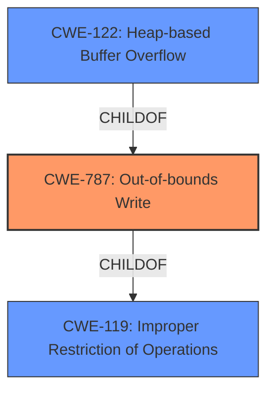

# Raw Analyzer Response for CVE-2021-21825

# Summary
| CWE ID  | CWE Name  | Confidence | CWE Abstraction Level | CWE Vulnerability Mapping Label | CWE-Vulnerability Mapping Notes |
|---|---|---|---|---|---|
| CWE-787 | Out-of-bounds Write | 1.0 | Base | Allowed | Primary CWE. The vulnerability is a heap-based buffer overflow, which means the program writes data past the end of the allocated buffer. |
| CWE-122 | Heap-based Buffer Overflow | 0.7 | Variant | Allowed | Secondary CWE. This specifies the location of the buffer, on the heap, and that the error is a buffer overflow. |
| CWE-119 | Improper Restriction of Operations within the Bounds of a Memory Buffer | 0.5 | Class | Discouraged | Secondary CWE. CWE-119 is a general class of buffer issues, and is less descriptive than CWE-787 or CWE-122. |

## Evidence and Confidence

*   **Confidence Score:** 0.9
*   **Evidence Strength:** HIGH

## Relationship Analysis
The primary relationship that influenced my decision was the child-parent relationship between CWE-787 (Out-of-bounds Write) and CWE-119 (Improper Restriction of Operations within the Bounds of a Memory Buffer), and also between CWE-787 (Out-of-bounds Write) and CWE-122 (Heap-based Buffer Overflow). CWE-787 is a more specific type of CWE-119, and it accurately describes the vulnerability. CWE-122 specifies that the buffer is on the heap.

## Vulnerability Chain
The vulnerability chain starts with the **lack of input validation** on the length parameter read from the compressed file. This leads to a **heap-based buffer overflow** (CWE-787) in the `PlainTextUncompressor::UncompressItem` function because the `memcpy` writes past the allocated buffer. The impact of this is potential **remote code execution**.

## Summary of Analysis
The initial analysis identified CWE-787 as the primary candidate due to the explicit mention of a **heap-based buffer overflow**. The "CVE Reference Links Content Summary" confirms that the **root cause** is a lack of input validation allowing a `memcpy` to write past the allocated buffer.

The retriever results also list CWE-787 and CWE-122 as possibilities. Further analysis of the vulnerability description and the nature of heap-based buffer overflows solidifies CWE-787 as the most accurate and specific classification.

The selection of CWE-787 is at the optimal level of specificity because it directly addresses the **root cause** (**out-of-bounds write**). While CWE-119 is related, it is a more general class. CWE-122 specifies that the buffer is on the heap, and can be a secondary issue.

Relevant CWE Information:

# Enhanced Context (25 CWEs)

## CWE-191: Integer Underflow (Wrap or Wraparound)
**Abstraction Level**: Base
**Similarity Score**: 0.80
**Source**: dense

**Description**:
The product subtracts one value from another, such that the result is less than the minimum allowable integer value, which produces a value that is not equal to the correct result.

**Mapping Guidance**:
- Usage: Allowed
- Rationale: This CWE entry is at the Base level of abstraction, which is a preferred level of abstraction for mapping to the root causes of vulnerabilities.

*Not used: The description doesn't have any evidence of integer underflow issues, so this is not the right match.*

## CWE-131: Incorrect Calculation of Buffer Size
**Abstraction Level**: Base
**Similarity Score**: 0.80
**Source**: dense

**Description**:
The product does not correctly calculate the size to be used when allocating a buffer, which could lead to a buffer overflow.

**Mapping Guidance**:
- Usage: Allowed
- Rationale: This CWE entry is at the Base level of abstraction, which is a preferred level of abstraction for mapping to the root causes of vulnerabilities.

*Not used: The vulnerability description states that the length parameter read from the compressed file is not validated against the destination buffer size during decompression, leading to a memcpy that can write past the allocated buffer. This is closer to lack of input validation combined with out-of-bounds write instead of a calculation issue.*

## CWE-805: Buffer Access with Incorrect Length Value
**Abstraction Level**: Base
**Similarity Score**: 0.78
**Source**: dense

**Description**:
The product uses a sequential operation to read or write a buffer, but it uses an incorrect length value that causes it to access memory that is outside of the bounds of the buffer.

**Mapping Guidance**:
- Usage: Allowed
- Rationale: This CWE entry is at the Base level of abstraction, which is a preferred level of abstraction for mapping to the root causes of vulnerabilities.

*Not used: This is closer, but still not the most precise. The **root cause** is that the length is not validated, leading to out-of-bounds write.*

## CWE-197: Numeric Truncation Error
**Abstraction Level**: Base
**Similarity Score**: 0.78
**Source**: dense

**Description**:
Truncation errors occur when a primitive is cast to a primitive of a smaller size and data is lost in the conversion.

**Mapping Guidance**:
- Usage: Allowed
- Rationale: This CWE entry is at the Base level of abstraction, which is a preferred level of abstraction for mapping to the root causes of vulnerabilities.

*Not used: There's no evidence of data type conversion or truncation in the description.*

## CWE-681: Incorrect Conversion between Numeric Types
**Abstraction Level**: Base
**Similarity Score**: 0.77
**Source**: dense

**Description**:
When converting from one data type to another, such as long to integer, data can be omitted or translated in a way that produces unexpected values. If the resulting values are used in a sensitive context, then dangerous behaviors may occur.

**Mapping Guidance**:
- Usage: Allowed
- Rationale: This CWE entry is at the Base level of abstraction, which is a preferred level of abstraction for mapping to the root causes of vulnerabilities.

*Not used: There's no evidence of data type conversion issues.*

## CWE-130: Improper Handling of Length Parameter Inconsistency
**Abstraction Level**: Base
**Similarity Score**: 0.77
**Source**: dense

**Description**:
The product parses a formatted message or structure, but it does not handle or incorrectly handles a length field that is inconsistent with the actual length of the associated data.

**Mapping Guidance**:
- Usage: Allowed
- Rationale: This CWE entry is at the Base level of abstraction, which is a preferred level of abstraction for mapping to the root causes of vulnerabilities.

*Not used: Although this CWE is related, it is not as precise as CWE-787, and it doesn't quite describe the **root cause** which is lack of input validation.*

## CWE-682: Incorrect Calculation
**Abstraction Level**: Pillar
**Similarity Score**: 0.76
**Source**: dense

**Description**:
The product performs a calculation that generates incorrect or unintended results that are later used in security-critical decisions or resource management.

**Mapping Guidance**:
- Usage: Discouraged
- Rationale: This CWE entry is extremely high-level, a Pillar. In many cases, lower-level children or descendants are more appropriate. However, sometimes this weakness is forced to be used due to the lack of in-depth weakness research. See Research Gaps.

*Not used: Too generic.*

## CWE-125: Out-of-bounds Read
**Abstraction Level**: Base
**Similarity Score**: 0.76
**Source**: dense

**Description**:
The product reads data past the end, or before the beginning, of the intended buffer.

**Mapping Guidance**:
- Usage: Allowed
- Rationale: This CWE entry is at the Base level of abstraction, which is a preferred level of abstraction for mapping to the root causes of vulnerabilities.

*Not used: The vulnerability is related to writing, not reading.*

## CWE-124: Buffer Underwrite ('Buffer Underflow')
**Abstraction Level**: Base
**Similarity Score**: 0.76
**Source**: dense

**Description**:
The product writes to a buffer using an index or pointer that references a memory location prior to the beginning of the buffer.

**Mapping Guidance**:
- Usage: Allowed
- Rationale: This CWE entry is at the Base level of abstraction, which is