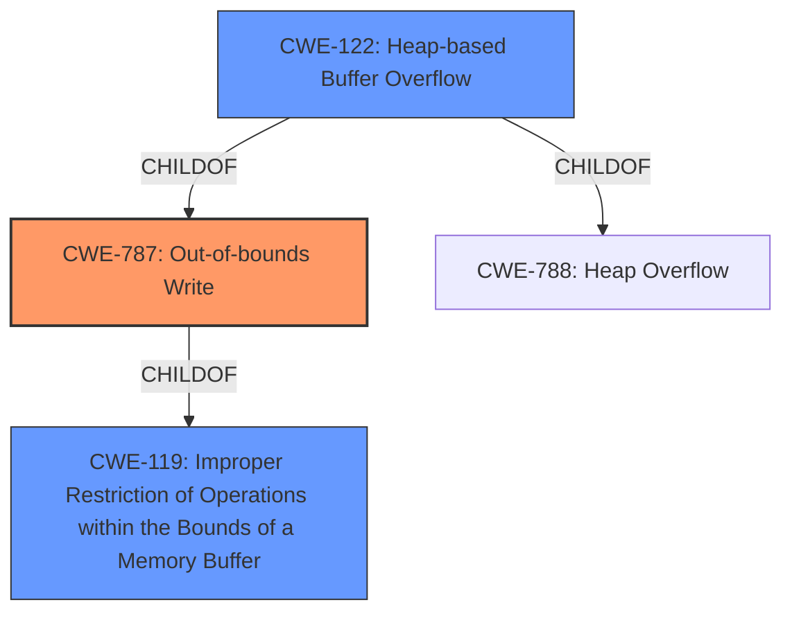

# Enhanced Analysis for CVE-2021-21826

# Summary
| CWE ID  | CWE Name  | Confidence | CWE Abstraction Level | CWE Vulnerability Mapping Label | CWE-Vulnerability Mapping Notes |
|---|---|---|---|---|---|
| CWE-787 | Out-of-bounds Write | 1.0 | Base | Allowed | Primary CWE |
| CWE-122 | Heap-based Buffer Overflow | 0.9 | Variant | Allowed | Secondary Candidate |
| CWE-119 | Improper Restriction of Operations within the Bounds of a Memory Buffer | 0.7 | Class | Discouraged | Secondary Candidate |

## Evidence and Confidence

*   **Confidence Score:** 0.9
*   **Evidence Strength:** HIGH

## Relationship Analysis
The primary relationship influencing the selection is the hierarchical relationship. CWE-787 **Out-of-bounds Write** is a base CWE. The vulnerability description states "**heap-based buffer overflow** vulnerability". CWE-122 **Heap-based Buffer Overflow** is a variant of both CWE-787 **Out-of-bounds Write** and CWE-788 **Heap Overflow**. While CWE-122 seems more specific, the description of the vulnerability is writing to a buffer outside of it's intended boundary. CWE-119 **Improper Restriction of Operations within the Bounds of a Memory Buffer** is a class CWE and the parent of CWE-787 **Out-of-bounds Write**, making it less specific.



## Vulnerability Chain
The vulnerability chain starts with the **improper handling of a UINT32 value loaded from the file** which is then used as the size of a buffer. This **lack of proper bounds checking** then leads to a **heap-based buffer overflow**. The ability to control the size of the buffer allows an attacker to perform an **out-of-bounds write**, potentially leading to remote code execution.

## Summary of Analysis
The initial assessment, guided by the vulnerability description and retriever results, pointed towards CWE-787 **Out-of-bounds Write** as the primary candidate. The description clearly states that a `UINT32` is loaded from a file and used as a trusted length of a buffer. The root cause is a **heap-based buffer overflow** vulnerability, but more specifically, this is due to writing outside the intended buffer, therefore the best mapping is to CWE-787 **Out-of-bounds Write**.

The evidence supporting this decision is strong, as the description explicitly mentions the **heap-based buffer overflow** and the **lack of bounds checking** on the size parameter, leading to memory corruption. The CVE Reference Links Content Summary also clearly states the root cause as a **heap buffer overflow** in the `DecodeTreeBlock` function due to the missing bounds checking.

CWE-122 **Heap-based Buffer Overflow** was considered due to the explicit mention of a heap-based buffer overflow. However, it is a variant of CWE-787 **Out-of-bounds Write** and less descriptive of the root cause than CWE-787. Therefore, CWE-787 is more precise.

CWE-119 **Improper Restriction of Operations within the Bounds of a Memory Buffer** was also considered. However, it is a more general class of vulnerability, and CWE-787 provides a more specific description of the vulnerability. The MITRE mapping guidance discourages the use of CWE-119 when more specific CWEs are available.

The selected CWEs are at the optimal level of specificity, as they accurately reflect the root cause of the vulnerability, which is the **out-of-bounds write** due to the **lack of bounds checking**.

Relevant CWE Information:

# Enhanced Context (25 CWEs)

## CWE-197: Numeric Truncation Error
**Abstraction Level**: Base
**Similarity Score**: 0.81
**Source**: dense

**Description**:
Truncation errors occur when a primitive is cast to a primitive of a smaller size and data is lost in the conversion.

**Mapping Guidance**:
- Usage: Allowed
- Rationale: This CWE entry is at the Base level of abstraction, which is a preferred level of abstraction for mapping to the root causes of vulnerabilities.

## CWE-191: Integer Underflow (Wrap or Wraparound)
**Abstraction Level**: Base
**Similarity Score**: 0.80
**Source**: dense

**Description**:
The product subtracts one value from another, such that the result is less than the minimum allowable integer value, which produces a value that is not equal to the correct result.

**Mapping Guidance**:
- Usage: Allowed
- Rationale: This CWE entry is at the Base level of abstraction, which is a preferred level of abstraction for mapping to the root causes of vulnerabilities.

## CWE-131: Incorrect Calculation of Buffer Size
**Abstraction Level**: Base
**Similarity Score**: 0.78
**Source**: dense

**Description**:
The product does not correctly calculate the size to be used when allocating a buffer, which could lead to a buffer overflow.

**Mapping Guidance**:
- Usage: Allowed
- Rationale: This CWE entry is at the Base level of abstraction, which is a preferred level of abstraction for mapping to the root causes of vulnerabilities.

## CWE-681: Incorrect Conversion between Numeric Types
**Abstraction Level**: Base
**Similarity Score**: 0.77
**Source**: dense

**Description**:
When converting from one data type to another, such as long to integer, data can be omitted or translated in a way that produces unexpected values. If the resulting values are used in a sensitive context, then dangerous behaviors may occur.

**Mapping Guidance**:
- Usage: Allowed
- Rationale: This CWE entry is at the Base level of abstraction, which is a preferred level of abstraction for mapping to the root causes of vulnerabilities.

## CWE-805: Buffer Access with Incorrect Length Value
**Abstraction Level**: Base
**Similarity Score**: 0.77
**Source**: dense

**Description**:
The product uses a sequential operation to read or write a buffer, but it uses an incorrect length value that causes it to access memory that is outside of the bounds of the buffer.

**Mapping Guidance**:
- Usage: Allowed
- Rationale: This CWE entry is at the Base level of abstraction, which is a preferred level of abstraction for mapping to the root causes of vulnerabilities.

## CWE-125: Out-of-bounds Read
**Abstraction Level**: Base
**Similarity Score**: 0.76
**Source**: dense

**Description**:
The product reads data past the end, or before the beginning, of the intended buffer.

**Mapping Guidance**:
- Usage: Allowed
- Rationale: This CWE entry is at the Base level of abstraction, which is a preferred level of abstraction for mapping to the root causes of vulnerabilities.

## CWE-126: Buffer Over-read
**Abstraction Level**: Variant
**Similarity Score**: 0.76
**Source**: dense

**Description**:
The product reads from a buffer using buffer access mechanisms such as indexes or pointers that reference memory locations after the targeted buffer.

**Mapping Guidance**:
- Usage: Allowed
- Rationale: This CWE entry is at the Variant level of abstraction, which is a preferred level of abstraction for mapping to the root causes of vulnerabilities.

## CWE-124: Buffer Underwrite ('Buffer Underflow')
**Abstraction Level**: Base
**Similarity Score**: 0.76
**Source**: dense

**Description**:
The product writes to a buffer using an index or pointer that references a memory location prior to the beginning of the buffer.

**Mapping Guidance**:
- Usage: Allowed
- Rationale: This CWE entry is at the Base level of abstraction, which is a preferred level of abstraction for mapping to the root causes of vulnerabilities.

## CWE-190: Integer Overflow or Wraparound
**Abstraction Level**: Base
**Similarity Score**: 0.76
**Source**: dense

**Description**:
The product performs a calculation that can
         produce an integer overflow or wraparound when the logic
         assumes that the resulting value will always be larger than
         the original value. This occurs when an integer value is
         incremented to a value that is too large to store in the
         associated representation. When this occurs, the value may
         become a very small or negative number.

**Mapping Guidance**:
- Usage: Allowed
- Rationale: This


## CWE Relationship Analysis

Current CWEs represent these abstraction levels: .


### Vulnerability Chain Analysis

**Chain starting from CWE-787:**
- 787 (Out-of-bounds Write) - ROOT


**Chain starting from CWE-805:**
- 805 (Buffer Access with Incorrect Length Value) - ROOT


### CWE Relationship Diagram

```mermaid
graph TD
    classDef primary fill:#f96,stroke:#333,stroke-width:2px
    classDef secondary fill:#69f,stroke:#333
    classDef tertiary fill:#9e9,stroke:#333
```