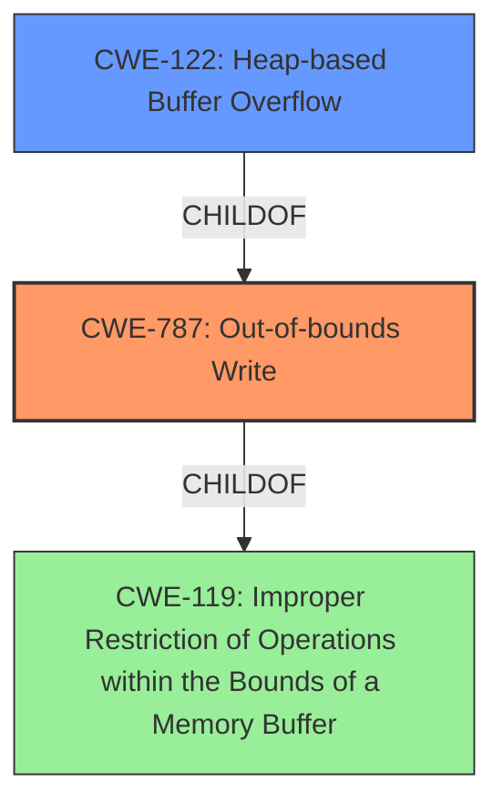

# Raw Analyzer Response for CVE-2021-21829

# Summary
| CWE ID | CWE Name | Confidence | CWE Abstraction Level | CWE Vulnerability Mapping Label | CWE-Vulnerability Mapping Notes |
|---|---|---|---|---|---|
| CWE-787 | Out-of-bounds Write | 1.0 | Base | Allowed | Primary CWE |
| CWE-122 | Heap-based Buffer Overflow | 0.8 | Variant | Allowed | Secondary Candidate |
| CWE-119 | Improper Restriction of Operations within the Bounds of a Memory Buffer | 0.6 | Class | Discouraged | Secondary Candidate |

## Evidence and Confidence

*   **Confidence Score:** 0.9
*   **Evidence Strength:** HIGH

## Relationship Analysis
The primary CWE, CWE-787 (Out-of-bounds Write), is a base-level CWE, offering a specific description of the **weakness**. CWE-122 (Heap-based Buffer Overflow) is a variant of CWE-787, providing more specific information about the location of the buffer. CWE-119 (Improper Restriction of Operations within the Bounds of a Memory Buffer) is a class-level CWE that is a parent of CWE-787 and CWE-122, but it's discouraged because it's too general.

## Vulnerability Chain
The vulnerability chain starts with the lack of input validation, leading to an out-of-bounds write on the heap, and finally resulting in remote code execution.

## Summary of Analysis
The initial assessment strongly pointed towards CWE-787 (Out-of-bounds Write) due to the description of a **heap-based buffer overflow** and the lack of input length validation before the `memcpy` operation, as stated in the "CVE Reference Links Content Summary".
The "Vulnerability Description Key Phrases" section further confirms the **heap-based buffer overflow** **weakness**. The "CWE for similar CVE Descriptions" section lists CWE-787 as the primary match.

The selection of CWE-787 is justified because it directly addresses the root cause of the vulnerability: an **out-of-bounds write** occurring due to a missing input length validation. This leads to a buffer overflow on the heap.

CWE-122 (Heap-based Buffer Overflow) was considered as a more specific variant of CWE-787, and while it's relevant, CWE-787 better captures the actual **weakness** which is writing outside the intended buffer. CWE-119 (Improper Restriction of Operations within the Bounds of a Memory Buffer) is too general and discouraged by MITRE when more specific CWEs are available.

Relevant CWE Information:

# Enhanced Context (25 CWEs)

## CWE-131: Incorrect Calculation of Buffer Size
**Abstraction Level**: Base
**Similarity Score**: 0.80
**Source**: dense

**Description**:
The product does not correctly calculate the size to be used when allocating a buffer, which could lead to a buffer overflow.

**Mapping Guidance**:
- Usage: Allowed
- Rationale: This CWE entry is at the Base level of abstraction, which is a preferred level of abstraction for mapping to the root causes of vulnerabilities.

**Why Not Selected:** While an incorrect buffer size calculation *could* be a factor, the provided information points more directly to a missing validation of the input length.

## CWE-190: Integer Overflow or Wraparound
**Abstraction Level**: Base
**Similarity Score**: 0.79
**Source**: dense

**Description**:
The product subtracts one value from another, such that the result is less than the minimum allowable integer value, which produces a value that is not equal to the correct result.

**Mapping Guidance**:
- Usage: Allowed
- Rationale: This CWE entry is at the Base level of abstraction, which is a preferred level of abstraction for mapping to the root causes of vulnerabilities.

**Why Not Selected:** No evidence of an integer overflow or wraparound is present in the vulnerability description.

## CWE-805: Buffer Access with Incorrect Length Value
**Abstraction Level**: Base
**Similarity Score**: 0.78
**Source**: dense

**Description**:
The product uses a sequential operation to read or write a buffer, but it uses an incorrect length value that causes it to access memory that is outside of the bounds of the buffer.

**Mapping Guidance**:
- Usage: Allowed
- Rationale: This CWE entry is at the Base level of abstraction, which is a preferred level of abstraction for mapping to the root causes of vulnerabilities.

**Why Not Selected:** Similar to CWE-131, this describes an incorrect length value which is close, but the vulnerability details focus on the *missing validation* of the input length, making CWE-787 more accurate.

## CWE-787: Out-of-bounds Write
**Abstraction Level**: base
**Similarity Score**: 4.33
**Source**: graph

**Description**:
CWE-787: Out-of-bounds Write

**Mapping Guidance**:
- Usage: Allowed
- Rationale: This CWE entry is at the Base level of abstraction, which is a preferred level of abstraction for mapping to the root causes of vulnerabilities.

**Relationships**:
- CANFOLLOW -> CWE-825
- CANFOLLOW -> CWE-824
- CANFOLLOW -> CWE-823
- CANFOLLOW -> CWE-822
- PARENTOF -> CWE-124

**Explanation**:
The vulnerability involves writing data beyond the intended boundaries of a buffer. This aligns perfectly with the description of CWE-787: Out-of-bounds Write. The "CVE Reference Links Content Summary" explicitly mentions the **lack of input length validation** before a `memcpy` operation, directly causing the **out-of-bounds write**. The impact of remote code execution further emphasizes the severity of this **weakness**.