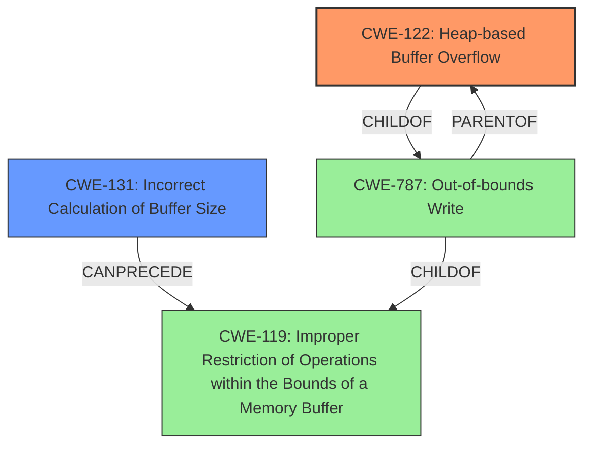

# Analysis Report for CVE-2021-21830

# Vulnerability Analysis Report: CVE-2021-21830

## Description


## Analysis (with Relationship Data)

# Summary
| CWE ID | CWE Name | Confidence | CWE Abstraction Level | CWE Vulnerability Mapping Label | CWE-Vulnerability Mapping Notes |
|---|---|---|---|---|---|
| CWE-122 | Heap-based Buffer Overflow | 1.0 | Variant | Allowed | Primary CWE |
| CWE-131 | Incorrect Calculation of Buffer Size | 0.7 | Base | Allowed | Secondary CWE |

## Evidence and Confidence

*   **Confidence Score:** 0.9
*   **Evidence Strength:** HIGH

## Relationship Analysis
The primary CWE is CWE-122, a variant of CWE-787 (Out-of-bounds Write). CWE-122 is specifically a heap-based buffer overflow. The vulnerability also involves an incorrect buffer size calculation (CWE-131), which can lead to the heap overflow. CWE-131 can precede CWE-119 (Improper Restriction of Operations within the Bounds of a Memory Buffer). CWE-119 is the class that covers out-of-bounds read or write.



## Vulnerability Chain
The vulnerability chain starts with an **incorrect calculation of the buffer size** (CWE-131). This leads to memory being allocated without accounting for the additional bytes added by `MemStreamer::WordAlign`. Since the allocated buffer is too small, the subsequent write operation overflows the heap buffer, resulting in a **heap-based buffer overflow** (CWE-122). This can then lead to remote code execution.

## Summary of Analysis
The initial assessment, as well as the retriever results, pointed towards CWE-122 (Heap-based Buffer Overflow) as a primary candidate, which aligns with the vulnerability description's key phrase "**heap-based buffer overflow**". The root cause analysis from the CVE Reference Links Content Summary confirms the heap-based buffer overflow due to incorrect memory management, specifically the `MemStreamer::WordAlign` function. The `MemStreamer::GetByteBlock` function allocates memory, but this allocation does not account for the additional size required by `MemStreamer::WordAlign`, leading to an out-of-bounds write.

CWE-122 is a variant of CWE-787 (Out-of-bounds Write), and it is more specific, so it is preferred. The evidence clearly indicates a heap-based buffer overflow, making CWE-122 the most appropriate choice.
The vulnerability also involves an **incorrect calculation of the buffer size** (CWE-131) because the memory allocation in `MemStreamer::GetByteBlock` does not account for the bytes added by `MemStreamer::WordAlign`.

I considered CWE-119 (Improper Restriction of Operations within the Bounds of a Memory Buffer) but chose CWE-122 because the description clearly indicates a heap-based buffer overflow. CWE-119 is too general.

I considered CWE-190 (Integer Overflow or Wraparound), CWE-193 (Off-by-one Error), and CWE-129 (Improper Validation of Array Index) from the retriever results. However, there is no explicit evidence to support these.
CWE-776 (Improper Restriction of Recursive Entity References in DTDs ('XML Entity Expansion')) is not relevant because the issue is related to a buffer overflow.
CWE-128 (Wrap-around Error) is not relevant because the root cause is not related to the wraparound.
CWE-125 (Out-of-bounds Read) is not the root cause, since this is a write, not a read.
CWE-1284 (Improper Validation of Specified Quantity in Input) is not the primary issue, but the **incorrect calculation of buffer size** could be considered as **improper validation of quantity in input**.

Relevant CWE Information:

# Enhanced Context (25 CWEs)
The following CWEs were identified as potentially relevant to this vulnerability:

## CWE-191: Integer Underflow (Wrap or Wraparound)
**Abstraction Level**: Base
**Similarity Score**: 0.80
**Source**: dense

**Description**:
The product subtracts one value from another, such that the result is less than the minimum allowable integer value, which produces a value that is not equal to the correct result.

**Mapping Guidance**:
- Usage: Allowed
- Rationale: This CWE entry is at the Base level of abstraction, which is a preferred level of abstraction for mapping to the root causes of vulnerabilities.

## CWE-131: Incorrect Calculation of Buffer Size
**Abstraction Level**: Base
**Similarity Score**: 0.80
**Source**: dense

**Description**:
The product does not correctly calculate the size to be used when allocating a buffer, which could lead to a buffer overflow.

**Mapping Guidance**:
- Usage: Allowed
- Rationale: This CWE entry is at the Base level of abstraction, which is a preferred level of abstraction for mapping to the root causes of vulnerabilities.

## CWE-805: Buffer Access with Incorrect Length Value
**Abstraction Level**: Base
**Similarity Score**: 0.78
**Source**: dense

**Description**:
The product uses a sequential operation to read or write a buffer, but it uses an incorrect length value that causes it to access memory that is outside of the bounds of the buffer.

**Mapping Guidance**:
- Usage: Allowed
- Rationale: This CWE entry is at the Base level of abstraction, which is a preferred level of abstraction for mapping to the root causes of vulnerabilities.

## CWE-197: Numeric Truncation Error
**Abstraction Level**: Base
**Similarity Score**: 0.78
**Source**: dense

**Description**:
Truncation errors occur when a primitive is cast to a primitive of a smaller size and data is lost in the conversion.

**Mapping Guidance**:
- Usage: Allowed
- Rationale: This CWE entry is at the Base level of abstraction, which is a preferred level of abstraction for mapping to the root causes of vulnerabilities.

## CWE-681: Incorrect Conversion between Numeric Types
**Abstraction Level**: Base
**Similarity Score**: 0.77
**Source**: dense

**Description**:
When converting from one data type to another, such as long to integer, data can be omitted or translated in a way that produces unexpected values. If the resulting values are used in a sensitive context, then dangerous behaviors may occur.

**Mapping Guidance**:
- Usage: Allowed
- Rationale: This CWE entry is at the Base level of abstraction, which is a preferred level of abstraction for mapping to the root causes of vulnerabilities.

## CWE-125: Out-of-bounds Read
**Abstraction Level**: Base
**Similarity Score**: 0.76
**Source**: dense

**Description**:
The product reads data past the end, or before the beginning, of the intended buffer.

**Mapping Guidance**:
- Usage: Allowed
- Rationale: This CWE entry is at the Base level of abstraction, which is a preferred level of abstraction for mapping to the root causes of vulnerabilities.

## CWE-130: Improper Handling of Length Parameter Inconsistency
**Abstraction Level**: Base
**Similarity Score**: 0.76
**Source**: dense

**Description**:
The product parses a formatted message or structure, but it does not handle or incorrectly handles a length field that is inconsistent with the actual length of the associated data.

**Mapping Guidance**:
- Usage: Allowed
- Rationale: This CWE entry is at the Base level of abstraction, which is a preferred level of abstraction for mapping to the root causes of vulnerabilities.

## CWE-124: Buffer Underwrite ('Buffer Underflow')
**Abstraction Level**: Base
**Similarity Score**: 0.76
**Source**: dense

**Description**:
The product writes to a buffer using an index or pointer that references a memory location prior to the beginning of the buffer.

**Mapping Guidance**:
- Usage: Allowed
- Rationale: This CWE entry is at the Base level of abstraction, which is a preferred level of abstraction for mapping to the root causes of vulnerabilities.

## CWE-682: Incorrect Calculation
**Abstraction Level**: Pillar
**Similarity Score**: 0.76
**Source**: dense

**Description**:
The product performs a calculation that


## CWE Relationship Analysis

Current CWEs represent these abstraction levels: .


### Vulnerability Chain Analysis

**Chain starting from CWE-1284:**
- 1284 (Improper Validation of Specified Quantity in Input) - ROOT


**Chain starting from CWE-787:**
- 787 (Out-of-bounds Write) - ROOT


### CWE Relationship Diagram

```mermaid
graph TD
    classDef primary fill:#f96,stroke:#333,stroke-width:2px
    classDef secondary fill:#69f,stroke:#333
    classDef tertiary fill:#9e9,stroke:#333
```


*Report generated on 2025-04-01 17:00:14*
