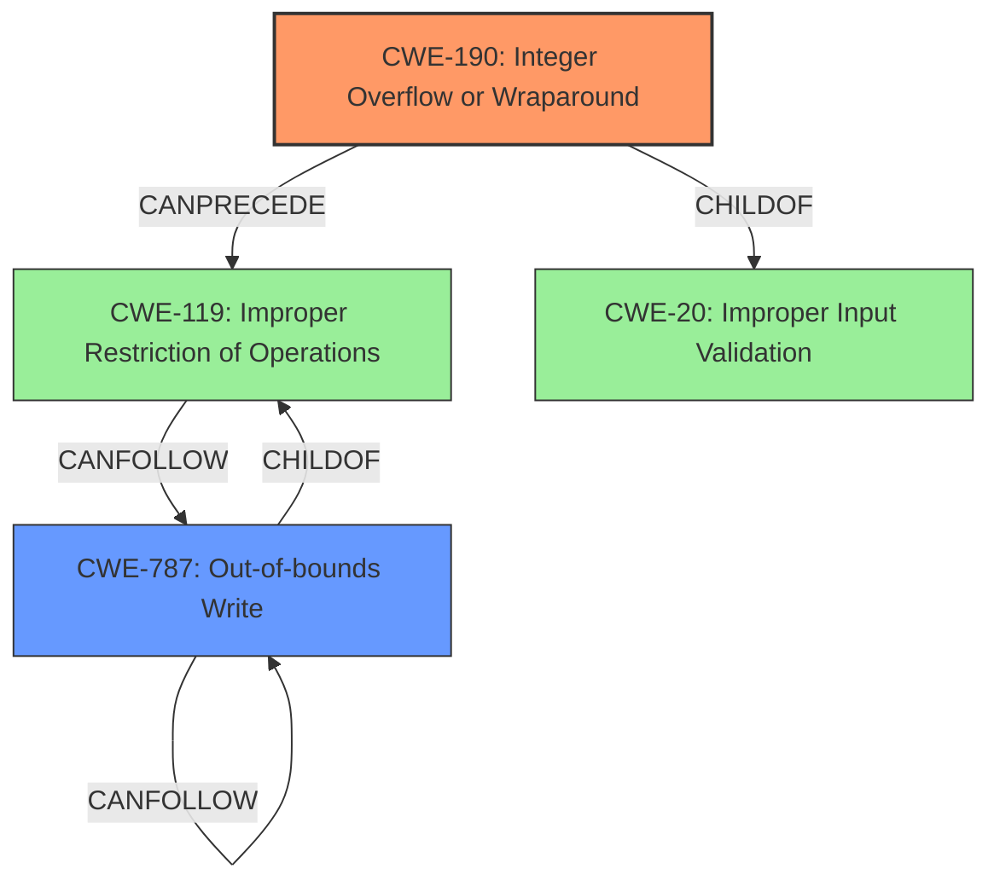

# Analysis for CVE-2021-21834

# Summary
| CWE ID | CWE Name | Confidence | CWE Abstraction Level | CWE Vulnerability Mapping Label | CWE-Vulnerability Mapping Notes |
|---|---|---|---|---|---|
| CWE-190 | Integer Overflow or Wraparound | 1.0 | Base | Primary | Allowed |
| CWE-787 | Out-of-bounds Write | 0.9 | Base | Secondary | Allowed |

## Evidence and Confidence

*   **Confidence Score:** 0.95
*   **Evidence Strength:** HIGH

## Relationship Analysis
The primary weakness is an integer overflow (CWE-190) that directly leads to a heap-based buffer overflow, which is represented by CWE-787 (Out-of-bounds Write). CWE-190 is a ChildOf CWE-20 (Improper Input Validation), and can precede CWE-119 (Improper Restriction of Operations within the Bounds of a Memory Buffer). CWE-787 is also a ChildOf CWE-119. Selecting CWE-190 and CWE-787 provides a clear representation of the root cause and its direct consequence.

## Vulnerability Chain
The vulnerability chain starts with a specially crafted MPEG-4 input containing a large value for `nb_entries`. This value is used in an **unchecked arithmetic** operation when decoding the atom for the co64 FOURCC, leading to an **integer overflow** (CWE-190). This overflow results in an undersized buffer being allocated. When the program attempts to write data into this undersized buffer, it leads to a heap-based buffer overflow (CWE-787), causing memory corruption.

## Summary of Analysis
The initial assessment, supported by the provided evidence, indicates that the primary vulnerability is an **integer overflow** (CWE-190) due to **unchecked arithmetic**, which then causes a heap-based buffer overflow (CWE-787).

The vulnerability description states: "An exploitable **integer overflow** vulnerability exists within the MPEG-4 decoding functionality... A specially crafted MPEG-4 input when decoding the atom for the co64 FOURCC can cause an **integer overflow** due to **unchecked arithmetic** resulting in a heap-based buffer overflow that causes memory corruption."

The CVE Reference Links Content Summary confirms the integer overflow as the root cause: "Integer overflow in the "co64" atom decoder within the GPAC library... multiplying `nb_entries` by `sizeof(u64)` can lead to an integer overflow... The library allocates memory using the potentially overflowed result, creating an undersized buffer."

The retriever results also support this, with CWE-190 having the highest score. CWE-787 is also supported by the evidence.

CWE-119 (Improper Restriction of Operations within the Bounds of a Memory Buffer) was considered due to the **heap-based buffer overflow** impact, and it is the primary CWE match for similar CVE Descriptions. However, it is a Class-level CWE and discouraged by MITRE when more specific CWEs are available. Since the root cause is clearly an integer overflow leading to an out-of-bounds write, mapping to CWE-190 and CWE-787 provides a more accurate and detailed classification.

CWE-680 (Integer Overflow to Buffer Overflow) was also considered, but this is a Compound CWE and is discouraged as mapping to each separate weakness in the chain is more precise.

CWE-190 and CWE-787 are at the Base level of abstraction, providing the optimal level of specificity for this vulnerability.

Relevant CWE Information:

# Enhanced Context (25 CWEs)
The following CWEs were identified as potentially relevant to this vulnerability:

## CWE-191: Integer Underflow (Wrap or Wraparound)
**Abstraction Level**: Base
**Similarity Score**: 0.79
**Source**: dense

**Description**:
The product subtracts one value from another, such that the result is less than the minimum allowable integer value, which produces a value that is not equal to the correct result.

**Mapping Guidance**:
- Usage: Allowed
- Rationale: This CWE entry is at the Base level of abstraction, which is a preferred level of abstraction for mapping to the root causes of vulnerabilities.

## CWE-197: Numeric Truncation Error
**Abstraction Level**: Base
**Similarity Score**: 0.78
**Source**: dense

**Description**:
Truncation errors occur when a primitive is cast to a primitive of a smaller size and data is lost in the conversion.

**Mapping Guidance**:
- Usage: Allowed
- Rationale: This CWE entry is at the Base level of abstraction, which is a preferred level of abstraction for mapping to the root causes of vulnerabilities.

## CWE-680: Integer Overflow to Buffer Overflow
**Abstraction Level**: Compound
**Similarity Score**: 0.77
**Source**: dense

**Description**:
The product performs a calculation to determine how much memory to allocate, but an integer overflow can occur that causes less memory to be allocated than expected, leading to a buffer overflow.

**Mapping Guidance**:
- Usage: Discouraged
- Rationale: This CWE entry is a named chain, which combines multiple weaknesses.

## CWE-805: Buffer Access with Incorrect Length Value
**Abstraction Level**: Base
**Similarity Score**: 0.77
**Source**: dense

**Description**:
The product uses a sequential operation to read or write a buffer, but it uses an incorrect length value that causes it to access memory that is outside of the bounds of the buffer.

**Mapping Guidance**:
- Usage: Allowed
- Rationale: This CWE entry is at the Base level of abstraction, which is a preferred level of abstraction for mapping to the root causes of vulnerabilities.

## CWE-131: Incorrect Calculation of Buffer Size
**Abstraction Level**: Base
**Similarity Score**: 0.77
**Source**: dense

**Description**:
The product does not correctly calculate the size to be used when allocating a buffer, which could lead to a buffer overflow.

**Mapping Guidance**:
- Usage: Allowed
- Rationale: This CWE entry is at the Base level of abstraction, which is a preferred level of abstraction for mapping to the root causes of vulnerabilities.

## CWE-190: Integer Overflow or Wraparound
**Abstraction Level**: Base
**Similarity Score**: 0.77
**Source**: dense

**Description**:
The product performs a calculation that can
         produce an integer overflow or wraparound when the logic
         assumes that the resulting value will always be larger than
         the original value. This occurs when an integer value is
         incremented to a value that is too large to store in the
         associated representation. When this occurs, the value may
         become a very small or negative number.

**Mapping Guidance**:
- Usage: Allowed
- Rationale: This CWE entry is at the Base level of abstraction, which is a preferred level of abstraction for mapping to the root causes of vulnerabilities.

## CWE-124: Buffer Underwrite ('Buffer Underflow')
**Abstraction Level**: Base
**Similarity Score**: 0.77
**Source**: dense

**Description**:
The product writes to a buffer using an index or pointer that references a memory location prior to the beginning of the buffer.

**Mapping Guidance**:
- Usage: Allowed
- Rationale: This CWE entry is at the Base level of abstraction, which is a preferred level of abstraction for mapping to the root causes of vulnerabilities.

## CWE-125: Out-of-bounds Read
**Abstraction Level**: Base
**Similarity Score**: 0.76
**Source**: dense

**Description**:
The product reads data past the end, or before the beginning, of the intended buffer.

**Mapping Guidance**:
- Usage: Allowed
- Rationale: This CWE entry is at the Base level of abstraction, which is a preferred level of abstraction for mapping to the root causes of vulnerabilities.

## CWE-681: Incorrect Conversion between Numeric Types
**Abstraction Level**: Base
**Similarity Score**: 0.76
**Source**: dense

**Description**:
When converting from one data type to another, such as long to integer, data can be omitted or translated in a way that produces unexpected values. If the