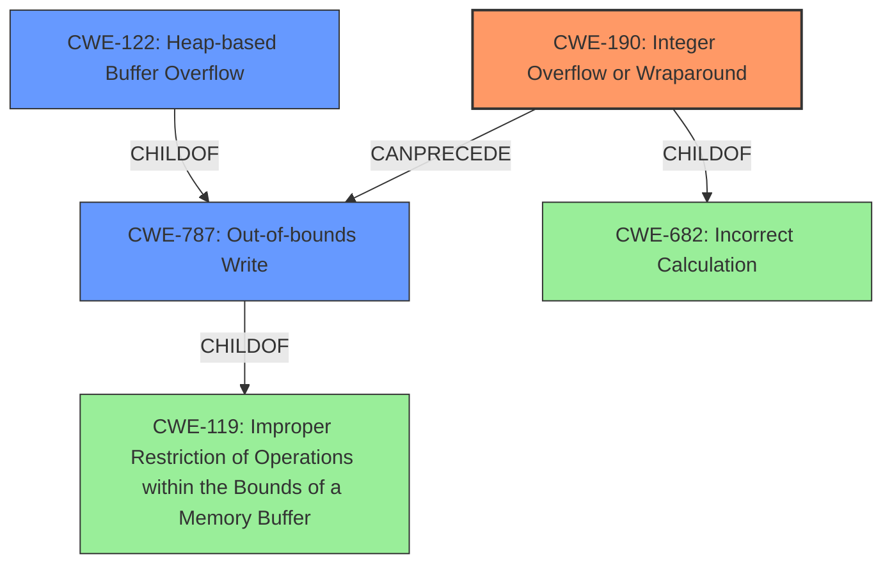

# Analysis for CVE-2021-21840

# Summary
| CWE ID  | CWE Name                                                                      | Confidence | CWE Abstraction Level | CWE Vulnerability Mapping Label | CWE-Vulnerability Mapping Notes |
| :-------- | :----------------------------------------------------------------------------- | :---------- | :----------------------- | :-------------------------------- | :------------------------------ |
| CWE-190   | Integer Overflow or Wraparound                                                   | 0.9        | Base                     | Primary CWE                       | Allowed                         |
| CWE-787   | Out-of-bounds Write                                                          | 0.8        | Base                     | Secondary Candidate               | Allowed                         |
| CWE-122   | Heap-based Buffer Overflow                                                     | 0.7        | Variant                  | Secondary Candidate               | Allowed                         |

## Evidence and Confidence

*   **Confidence Score:** 0.8
*   **Evidence Strength:** HIGH

## Relationship Analysis
The primary weakness is an **integer overflow** (CWE-190) due to **unchecked arithmetic**, which leads to a heap-based buffer overflow (CWE-122) and ultimately results in an out-of-bounds write (CWE-787). CWE-190 is a base-level CWE and is a child of CWE-682 (Incorrect Calculation). CWE-122 is a variant of CWE-787 (Out-of-bounds Write), which is a child of CWE-119 (Improper Restriction of Operations within the Bounds of a Memory Buffer). CWE-119 is a class-level CWE, and mapping directly to CWE-119 is discouraged, as it is too general. Therefore, it's better to map to its child, CWE-787, or a variant like CWE-122.

## Vulnerability Chain
The vulnerability chain starts with:
1.  **Unchecked Arithmetic:** Leading to
2.  **Integer Overflow** (CWE-190): Which causes
3.  **Heap-based Buffer Overflow** (CWE-122): Resulting in
4.  **Out-of-bounds Write** (CWE-787): Which causes memory corruption.

## Summary of Analysis
The vulnerability is triggered by a specially crafted MPEG-4 input that leads to an **integer overflow** (CWE-190) due to **unchecked arithmetic**. This **integer overflow** results in a heap-based buffer overflow (CWE-122), leading to memory corruption via an out-of-bounds write (CWE-787).

The evidence is strong, as the vulnerability description explicitly mentions the **integer overflow** and its direct consequence, the heap-based buffer overflow. The CVE Reference Links Content Summary confirms the root cause as an **integer overflow** when decoding the "saio" atom, resulting in a heap-based buffer overflow.

The Retriever Results also support this assessment, with CWE-190 having the highest score. While CWE-119 is listed in the Top CWEs for similar CVE Descriptions, the MITRE mapping guidance discourages direct mapping to CWE-119 due to its generality. Therefore, I chose CWE-787 and CWE-122 as secondary CWEs as they provide a more specific description of the resulting out-of-bounds write and heap-based overflow.

The selection of CWE-190, CWE-787, and CWE-122 provides an optimal level of specificity, capturing the root cause and its immediate consequences.

Relevant CWE Information:

# Enhanced Context (25 CWEs)
The following CWEs were identified as potentially relevant to this vulnerability:

## CWE-191: Integer Underflow (Wrap or Wraparound)
**Abstraction Level**: Base
**Similarity Score**: 0.79

## CWE-124: Buffer Underwrite ('Buffer Underflow')
**Abstraction Level**: Base
**Similarity Score**: 0.78

## CWE-805: Buffer Access with Incorrect Length Value
**Abstraction Level**: Base
**Similarity Score**: 0.78

## CWE-131: Incorrect Calculation of Buffer Size
**Abstraction Level**: Base
**Similarity Score**: 0.78

## CWE-680: Integer Overflow to Buffer Overflow
**Abstraction Level**: Compound
**Similarity Score**: 0.77

## CWE-197: Numeric Truncation Error
**Abstraction Level**: Base
**Similarity Score**: 0.77

## CWE-126: Buffer Over-read
**Abstraction Level**: Variant
**Similarity Score**: 0.77

## CWE-190: Integer Overflow or Wraparound
**Abstraction Level**: Base
**Similarity Score**: 0.77

## CWE-125: Out-of-bounds Read
**Abstraction Level**: Base
**Similarity Score**: 0.76

## CWE-193: Off-by-one Error
**Abstraction Level**: Base
**Similarity Score**: 0.76

## CWE-190: Integer Overflow or Wraparound
**Abstraction Level**: Base
**Similarity Score**: 6832.11

## CWE-197: Numeric Truncation Error
**Abstraction Level**: Base
**Similarity Score**: 6558.52

## CWE-125: Out-of-bounds Read
**Abstraction Level**: Base
**Similarity Score**: 6203.75

## CWE-193: Off-by-one Error
**Abstraction Level**: Base
**Similarity Score**: 5999.80

## CWE-681: Incorrect Conversion between Numeric Types
**Abstraction Level**: Base
**Similarity Score**: 5965.00

## CWE-128: Wrap-around Error
**Abstraction Level**: base
**Similarity Score**: 5.03

## CWE-170: Improper Null Termination
**Abstraction Level**: base
**Similarity Score**: 5.03

## CWE-195: Signed to Unsigned Conversion Error
**Abstraction Level**: variant
**Similarity Score**: 4.53

## CWE-1284: Improper Validation of Specified Quantity in Input
**Abstraction Level**: base
**Similarity Score**: 4.33

## CWE-617: Reachable Assertion
**Abstraction Level**: base
**Similarity Score**: 4.33

## CWE-123: Write-what-where Condition
**Abstraction Level**: base
**Similarity Score**: 3.89

## CWE-463: Deletion of Data Structure Sentinel
**Abstraction Level**: base
**Similarity Score**: 3.64

## CWE-120: Buffer Copy without Checking Size of Input ('Classic Buffer Overflow')
**Abstraction Level**: base
**Similarity Score**: 3.57

## CWE-1339: Insufficient Precision or Accuracy of a Real Number
**Abstraction Level**: base
**Similarity Score**: 3.57

## CWE-190: Integer Overflow or Wraparound
**Abstraction Level**: Base
**Similarity Score**: 3.32

CWE-120 (Buffer Copy without Checking Size of Input) was considered due to the "buffer overflow" impact, but the description indicates that this CWE is most appropriate for "Buffer Copy" operations, which isn't explicitly stated in the vulnerability description. Therefore, I chose the more specific CWE-122 and CWE-787.

CWE-197 (Numeric Truncation Error) was considered due to its presence in Retriever Results. However, the vulnerability description focuses on arithmetic overflow rather than truncation, making CWE-190 a more accurate fit.

CWE-125 (Out-of-bounds Read) was considered, but the vulnerability explicitly mentions a heap-based buffer overflow leading to memory corruption, implying an out-of-bounds write (CWE-787) rather than a read.