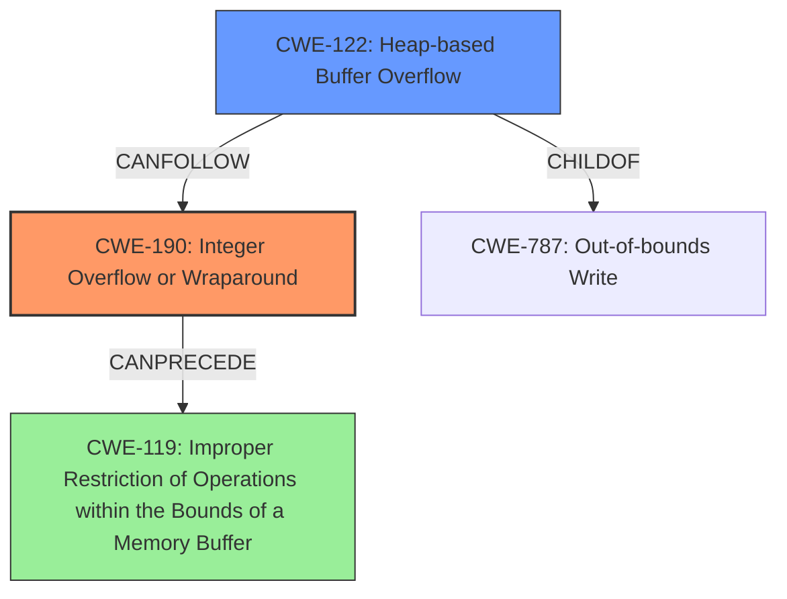

# Analysis for CVE-2021-21841

# Summary
| CWE ID | CWE Name | Confidence | CWE Abstraction Level | CWE Vulnerability Mapping Label | CWE-Vulnerability Mapping Notes |
|---|---|---|---|---|---|
| CWE-190 | Integer Overflow or Wraparound | 0.9 | Base | Primary | Allowed |
| CWE-122 | Heap-based Buffer Overflow | 0.8 | Variant | Secondary | Allowed |

## Evidence and Confidence

*   **Confidence Score:** 0.85
*   **Evidence Strength:** HIGH

## Relationship Analysis
The primary weakness is **CWE-190 (Integer Overflow or Wraparound)**, which is a base-level CWE. It can lead to **CWE-122 (Heap-based Buffer Overflow)**. The integer overflow results in an undersized buffer allocation, which is then exploited by writing more data than the buffer can hold. There is a CanPrecede relationship between CWE-190 and **CWE-119 (Improper Restriction of Operations within the Bounds of a Memory Buffer)** but since it is more specific, CWE-122 is preferred.

## Vulnerability Chain
The vulnerability chain starts with an **unchecked arithmetic** operation leading to an **integer overflow** (CWE-190). This integer overflow results in the allocation of a smaller than expected buffer. Subsequently, writing data into this undersized buffer leads to a heap-based buffer overflow (CWE-122), causing memory corruption.

## Summary of Analysis
The analysis is based on the provided evidence, which includes the vulnerability description, key phrases, and CVE reference links content summary. The key evidence lies in the **unchecked arithmetic** leading to an **integer overflow**, which directly corresponds to **CWE-190 (Integer Overflow or Wraparound)**. The subsequent heap-based buffer overflow is a direct consequence of this integer overflow, making **CWE-122 (Heap-based Buffer Overflow)** a relevant secondary CWE. The relationship analysis shows that CWE-190 can precede CWE-119, but given the explicit heap-based overflow, CWE-122 is more specific and appropriate.

The vulnerability description states: "A specially crafted MPEG-4 input when reading an atom using the sbgp FOURCC code can cause an **integer overflow** due to **unchecked arithmetic** resulting in a heap-based buffer overflow that causes memory corruption." This statement clearly identifies the integer overflow as the root cause and the heap-based buffer overflow as a consequence.

The chosen CWEs are at the optimal level of specificity. CWE-190 accurately represents the integer overflow, and CWE-122 captures the heap-based nature of the buffer overflow. While CWE-119 could be a more general classification, the evidence points to the specific types (integer and heap) of the weaknesses.

CWE-119, **CWE-125 (Out-of-bounds Read)**, **CWE-126 (Buffer Over-read)**, **CWE-193 (Off-by-one Error)**, **CWE-197 (Numeric Truncation Error)**, **CWE-787 (Out-of-bounds Write)**, and **CWE-1284 (Improper Validation of Specified Quantity in Input)** were considered but not chosen as primary CWEs. CWE-119 is too generic. CWE-125 and CWE-126 relate to reading out of bounds, while the vulnerability is a write out of bounds. CWE-193 is an off-by-one error and the provided description doesn't align with that. CWE-197 refers to truncation errors, which is not the root cause here. CWE-787 is more general and out-of-bounds write can happen because of other issues. The description provided does not describe improper validation of input.