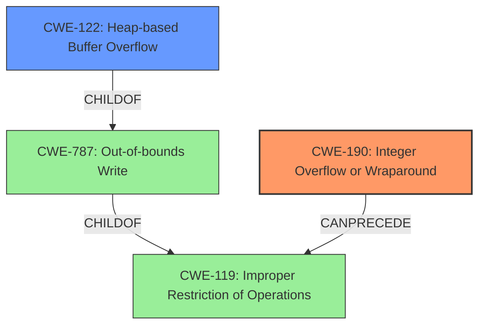

# Analysis Report for CVE-2021-21847

# Vulnerability Analysis Report: CVE-2021-21847

## Description


## Analysis (with Relationship Data)

# Summary
| CWE ID | CWE Name | Confidence | CWE Abstraction Level | CWE Vulnerability Mapping Label | CWE-Vulnerability Mapping Notes |
|---|---|---|---|---|---|
| CWE-190 | Integer Overflow or Wraparound | 1.0 | Base | Primary | Allowed |
| CWE-122 | Heap-based Buffer Overflow | 0.9 | Variant | Secondary | Allowed |

## Evidence and Confidence

*   **Confidence Score:** 0.95
*   **Evidence Strength:** HIGH

## Relationship Analysis
The primary weakness is CWE-190, Integer Overflow or Wraparound, which is a **Base** level CWE. The secondary weakness is CWE-122, Heap-based Buffer Overflow, which is a **Variant** of CWE-787 (Out-of-bounds Write). CWE-190 can precede CWE-119 (Improper Restriction of Operations within the Bounds of a Memory Buffer), which is a parent of CWE-787. Thus, the integer overflow leads to a heap-based buffer overflow.



## Vulnerability Chain
The vulnerability chain starts with **unchecked arithmetic** leading to an **integer overflow**, which results in a heap-based buffer overflow.

## Summary of Analysis
The initial analysis identified an **integer overflow** vulnerability within the MPEG-4 decoding functionality of the GPAC library. The **root cause** is **unchecked arithmetic** leading to a heap-based buffer overflow.

The evidence from the vulnerability description states: "Multiple exploitable **integer overflow** vulnerabilities exist within the MPEG-4 decoding functionality of the GPAC Project on Advanced Content library v1.0.1. A specially crafted MPEG-4 input in stts decoder can cause an **integer overflow** due to **unchecked arithmetic** resulting in a heap-based buffer overflow that causes memory corruption."

The CVE Reference Links Content Summary provides additional support: "The root cause is an integer overflow during the parsing of an MPEG-4 container. Specifically, this overflow occurs in the `stts_box_read` function when processing an atom using the "stts" FOURCC code... This value is then multiplied by the size of the `GF_SttsEntry` structure which can lead to an integer overflow on 32-bit platforms, which results in a heap buffer with a smaller size being allocated." and "Heap-based Buffer Overflow: When the library reads data into the undersized buffer, it writes outside the bounds of the allocated memory."

The primary CWE is CWE-190, Integer Overflow or Wraparound, which accurately represents the **root cause** of the vulnerability. The secondary CWE is CWE-122, Heap-based Buffer Overflow, which describes the impact of the integer overflow. Both CWEs are at appropriate levels of specificity (Base and Variant, respectively).

Other CWEs considered but not used:

*   CWE-119: Improper Restriction of Operations within the Bounds of a Memory Buffer - This is a Class-level CWE and is too general. The more specific CWE-122 and CWE-190 are more appropriate.
*   CWE-120: Buffer Copy without Checking Size of Input ('Classic Buffer Overflow') - While a buffer overflow occurs, it is a consequence of the integer overflow, making CWE-190 the more direct cause.
*   CWE-125: Out-of-bounds Read - Not applicable, as the vulnerability involves writing beyond the buffer boundary.
*   CWE-197: Numeric Truncation Error - While truncation could be involved, the primary issue is the overflow itself.
*   CWE-1284: Improper Validation of Specified Quantity in Input - This could be a contributing factor, but the integer overflow is the more direct **root cause**.


## CWE Relationship Analysis

Current CWEs represent these abstraction levels: .


### Vulnerability Chain Analysis

**Chain starting from CWE-787:**
- 787 (Out-of-bounds Write) - ROOT


**Chain starting from CWE-197:**
- 197 (Numeric Truncation Error) - ROOT


### CWE Relationship Diagram

```mermaid
graph TD
    classDef primary fill:#f96,stroke:#333,stroke-width:2px
    classDef secondary fill:#69f,stroke:#333
    classDef tertiary fill:#9e9,stroke:#333
```


*Report generated on 2025-04-02 14:56:29*
