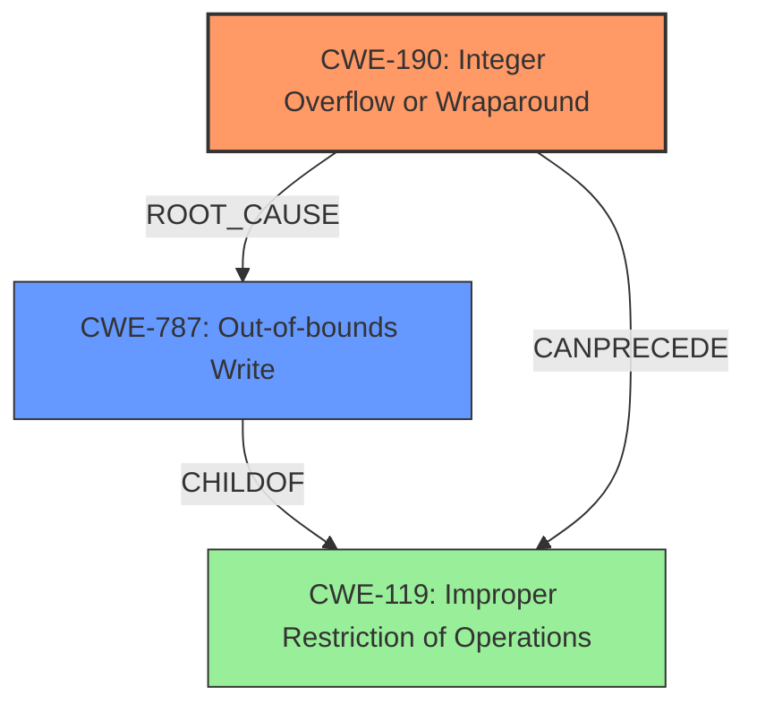

# Analysis for CVE-2021-21850

# Summary
INSERT the assigned CWEs in a table format with the following columns: CWE ID, CWE Name, Confidence, CWE Abstraction Level, CWE Vulnerability Mapping Label, CWE-Vulnerability Mapping Notes
  - The Primary CWE should be first and noted as the Primary CWEs
  - The secondary candidate CWEs should be next and noted as secondary candidates.
  - The confidence is a confidence score 0 to 1 to rate your confidence in your overall assessment for that CWE.
  - The CWE Abstraction Level as one of these values: Base, Variant, Pillar, Class, Compound
  - The Mapping Notes Usage as one of these values: Allowed, Allowed-with-Review, Prohibited, Discouraged

| CWE ID  | CWE Name                                                                    | Confidence | CWE Abstraction Level | CWE Vulnerability Mapping Label | CWE-Vulnerability Mapping Notes |
|---------|-----------------------------------------------------------------------------|------------|-----------------------|---------------------------------|---------------------------------|
| CWE-190 | Integer Overflow or Wraparound                                              | 0.9        | Base                  | Primary                           | Allowed                          |
| CWE-787 | Out-of-bounds Write                                                         | 0.8        | Base                  | Secondary                         | Allowed                          |

## Evidence and Confidence

*   **Confidence Score:** 0.85
*   **Evidence Strength:** HIGH

## Relationship Analysis
The primary weakness is an **integer overflow** (CWE-190) due to **unchecked arithmetic**. This leads to a heap-based buffer overflow, which is effectively an out-of-bounds write (CWE-787). CWE-190 can precede CWE-119 (Improper Restriction of Operations within the Bounds of a Memory Buffer), and CWE-787 is a child of CWE-119. The chain of events clearly indicates that the integer overflow is the root cause, leading to the out-of-bounds write as a consequence.

## Vulnerability Chain
The vulnerability chain starts with **unchecked arithmetic** leading to an **integer overflow** (CWE-190). This results in a smaller than expected memory allocation. When the code attempts to write data into this undersized buffer, it leads to a heap-based buffer overflow and memory corruption (CWE-787).

## Summary of Analysis
The initial analysis focused on the provided vulnerability description and the **CWE for similar CVE Descriptions**, which suggested CWE-119 as the primary match. However, a closer examination of the root cause reveals that the **integer overflow** (CWE-190) due to **unchecked arithmetic** is the underlying issue that triggers the subsequent buffer overflow (CWE-787).

The evidence supporting this conclusion is primarily found in the "CVE Reference Links Content Summary," which states: "Integer overflow in the calculation of memory allocation size, leading to a heap-based buffer overflow." This confirms the **integer overflow** as the root cause.

Therefore, while CWE-119 is a related consequence, it is more accurate to identify CWE-190 as the primary weakness, with CWE-787 as the secondary consequence. The graph relationships reinforce this understanding by highlighting that CWE-190 can precede CWE-119 and directly cause CWE-787.

The selection of CWE-190 and CWE-787 provides a more specific and accurate representation of the vulnerability, aligning with the principle of choosing the most detailed CWE supported by the evidence.

Relevant CWE Information:

# Enhanced Context (25 CWEs)
The following CWEs were identified as potentially relevant to this vulnerability:

## CWE-191: Integer Underflow (Wrap or Wraparound)
**Abstraction Level**: Base
**Similarity Score**: 0.79
**Source**: dense

**Description**:
The product subtracts one value from another, such that the result is less than the minimum allowable integer value, which produces a value that is not equal to the correct result.

**Mapping Guidance**:
- Usage: Allowed
- Rationale: This CWE entry is at the Base level of abstraction, which is a preferred level of abstraction for mapping to the root causes of vulnerabilities.

## CWE-197: Numeric Truncation Error
**Abstraction Level**: Base
**Similarity Score**: 0.79
**Source**: dense

**Description**:
Truncation errors occur when a primitive is cast to a primitive of a smaller size and data is lost in the conversion.

**Mapping Guidance**:
- Usage: Allowed
- Rationale: This CWE entry is at the Base level of abstraction, which is a preferred level of abstraction for mapping to the root causes of vulnerabilities.

## CWE-131: Incorrect Calculation of Buffer Size
**Abstraction Level**: Base
**Similarity Score**: 0.78
**Source**: dense

**Description**:
The product does not correctly calculate the size to be used when allocating a buffer, which could lead to a buffer overflow.

**Mapping Guidance**:
- Usage: Allowed
- Rationale: This CWE entry is at the Base level of abstraction, which is a preferred level of abstraction for mapping to the root causes of vulnerabilities.

## CWE-805: Buffer Access with Incorrect Length Value
**Abstraction Level**: Base
**Similarity Score**: 0.78
**Source**: dense

**Description**:
The product uses a sequential operation to read or write a buffer, but it uses an incorrect length value that causes it to access memory that is outside of the bounds of the buffer.

**Mapping Guidance**:
- Usage: Allowed
- Rationale: This CWE entry is at the Base level of abstraction, which is a preferred level of abstraction for mapping to the root causes of vulnerabilities.

## CWE-124: Buffer Underwrite ('Buffer Underflow')
**Abstraction Level**: Base
**Similarity Score**: 0.77
**Source**: dense

**Description**:
The product writes to a buffer using an index or pointer that references a memory location prior to the beginning of the buffer.

**Mapping Guidance**:
- Usage: Allowed
- Rationale: This CWE entry is at the Base level of abstraction, which is a preferred level of abstraction for mapping to the root causes of vulnerabilities.

## CWE-680: Integer Overflow to Buffer Overflow
**Abstraction Level**: Compound
**Similarity Score**: 0.77
**Source**: dense

**Description**:
The product performs a calculation to determine how much memory to allocate, but an integer overflow can occur that causes less memory to be allocated than expected, leading to a buffer overflow.

**Mapping Guidance**:
- Usage: Discouraged
- Rationale: This CWE entry is a named chain, which combines multiple weaknesses.

## CWE-190: Integer Overflow or Wraparound
**Abstraction Level**: Base
**Similarity Score**: 0.77
**Source**: dense

**Description**:
The product performs a calculation that can
         produce an integer overflow or wraparound when the logic
         assumes that the resulting value will always be larger than
         the original value. This occurs when an integer value is
         incremented to a value that is too large to store in the
         associated representation. When this occurs, the value may
         become a very small or negative number.

**Mapping Guidance**:
- Usage: Allowed
- Rationale: This CWE entry is at the Base level of abstraction, which is a preferred level of abstraction for mapping to the root causes of vulnerabilities.

## CWE-125: Out-of-bounds Read
**Abstraction Level**: Base
**Similarity Score**: 0.77
**Source**: dense

**Description**:
The product reads data past the end, or before the beginning, of the intended buffer.

**Mapping Guidance**:
- Usage: Allowed
- Rationale: This CWE entry is at the Base level of abstraction, which is a preferred level of abstraction for mapping to the root causes of vulnerabilities.

## CWE-126: Buffer Over-read
**Abstraction Level**: Variant
**Similarity Score**: 0.77
**Source**: dense

**Description**:
The product reads from a buffer using buffer access mechanisms such as indexes or pointers that reference memory locations after the targeted buffer.

**Mapping Guidance**:
- Usage: Allowed
- Rationale: This CWE entry is at the Variant level of abstraction, which is a preferred level of abstraction for mapping to the root causes of vulnerabilities.

## CWE-681: Incorrect Conversion between Numeric Types
**Abstraction Level**: Base
**Similarity Score**: 0.76
**Source**: dense

**Description**:
When