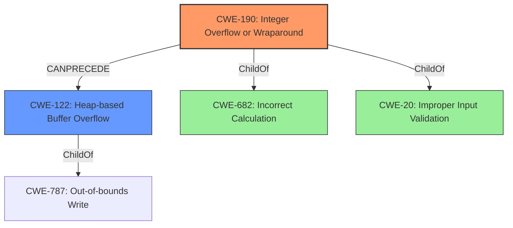

# Raw Analyzer Response for CVE-2021-21852

# Summary
| CWE ID | CWE Name | Confidence | CWE Abstraction Level | CWE Vulnerability Mapping Label | CWE-Vulnerability Mapping Notes |
|---|---|---|---|---|---|
| CWE-190 | Integer Overflow or Wraparound | 0.9 | Base | Allowed | Primary CWE |
| CWE-122 | Heap-based Buffer Overflow | 0.8 | Variant | Allowed | Secondary CWE |

## Evidence and Confidence

*   **Confidence Score:** 0.85
*   **Evidence Strength:** HIGH

## Relationship Analysis
The primary weakness identified is CWE-190 (**Integer Overflow or Wraparound**), which can lead to CWE-122 (**Heap-based Buffer Overflow**). CWE-190 is a child of CWE-682 (**Incorrect Calculation**) and CWE-20 (**Improper Input Validation**). The integer overflow results in a smaller than expected memory allocation, and subsequent writes to this undersized allocation causes a heap-based buffer overflow (CWE-122).

## Vulnerability Chain
The vulnerability chain begins with **unchecked arithmetic** leading to an **integer overflow** (CWE-190). This results in a smaller memory allocation than expected. Subsequent writes to this undersized allocation leads to a heap-based buffer overflow (CWE-122) and ultimately to memory corruption.

## Summary of Analysis
The initial analysis focused on identifying the root cause and the resulting impact. The vulnerability description clearly indicates an **integer overflow** due to **unchecked arithmetic**. The "CVE Reference Links Content Summary" confirms that **integer overflows** during memory allocation lead to heap-based buffer overflows due to insufficient size checks.

The analysis is strongly based on the provided evidence, as highlighted in the vulnerability description key phrases:
- **rootcause:** **unchecked arithmetic**
- **weakness:** **integer overflow**
- **impact:** heap-based buffer overflow

The graph relationships show how CWE-190 can lead to CWE-122. CWE-190 is chosen as the primary CWE because it represents the root cause of the vulnerability, while CWE-122 represents the impact.

CWE-190 and CWE-122 are at the optimal level of specificity because they accurately represent the **integer overflow** and its direct consequence (heap-based buffer overflow) respectively.

# Relevant CWE Information:

## Enhanced Context (25 CWEs)
The following CWEs were identified as potentially relevant to this vulnerability:

## CWE-124: Buffer Underwrite ('Buffer Underflow')
**Abstraction Level**: Base
**Similarity Score**: 0.78

## CWE-191: Integer Underflow (Wrap or Wraparound)
**Abstraction Level**: Base
**Similarity Score**: 0.78

## CWE-805: Buffer Access with Incorrect Length Value
**Abstraction Level**: Base
**Similarity Score**: 0.78

## CWE-680: Integer Overflow to Buffer Overflow
**Abstraction Level**: Compound
**Similarity Score**: 0.77

## CWE-131: Incorrect Calculation of Buffer Size
**Abstraction Level**: Base
**Similarity Score**: 0.77

## CWE-126: Buffer Over-read
**Abstraction Level**: Variant
**Similarity Score**: 0.77

## CWE-190: Integer Overflow or Wraparound
**Abstraction Level**: Base
**Similarity Score**: 0.76

## CWE-197: Numeric Truncation Error
**Abstraction Level**: Base
**Similarity Score**: 0.76

## CWE-125: Out-of-bounds Read
**Abstraction Level**: Base
**Similarity Score**: 0.75

## CWE-127: Buffer Under-read
**Abstraction Level**: Variant
**Similarity Score**: 0.75

## CWE-190: Integer Overflow or Wraparound
**Abstraction Level**: Base
**Similarity Score**: 7355.29

## CWE-197: Numeric Truncation Error
**Abstraction Level**: Base
**Similarity Score**: 7026.19

## CWE-125: Out-of-bounds Read
**Abstraction Level**: Base
**Similarity Score**: 6719.46

## CWE-193: Off-by-one Error
**Abstraction Level**: Base
**Similarity Score**: 6600.08

## CWE-681: Incorrect Conversion between Numeric Types
**Abstraction Level**: Base
**Similarity Score**: 6449.89

## CWE-120: Buffer Copy without Checking Size of Input ('Classic Buffer Overflow')
**Abstraction Level**: base
**Similarity Score**: 5.03

## CWE-170: Improper Null Termination
**Abstraction Level**: base
**Similarity Score**: 5.03

## CWE-195: Signed to Unsigned Conversion Error
**Abstraction Level**: variant
**Similarity Score**: 4.53

## CWE-123: Write-what-where Condition
**Abstraction Level**: base
**Similarity Score**: 4.33

## CWE-1284: Improper Validation of Specified Quantity in Input
**Abstraction Level**: base
**Similarity Score**: 4.33

## CWE-617: Reachable Assertion
**Abstraction Level**: base
**Similarity Score**: 4.33

## CWE-463: Deletion of Data Structure Sentinel
**Abstraction Level**: base
**Similarity Score**: 3.64

## CWE-128: Wrap-around Error
**Abstraction Level**: base
**Similarity Score**: 3.57

## CWE-1339: Insufficient Precision or Accuracy of a Real Number
**Abstraction Level**: base
**Similarity Score**: 3.57

## CWE-787: Out-of-bounds Write
**Abstraction Level**: base
**Similarity Score**: 3.30

**CWE-190: Integer Overflow or Wraparound**
The product performs a calculation that can produce an **integer overflow** or wraparound when the logic assumes that the resulting value will always be larger than the original value. The vulnerability description explicitly states that there is an **integer overflow** due to **unchecked arithmetic**, making this a direct match.
*   **Technical Indicators**: **Unchecked arithmetic** resulting in a value exceeding the maximum representable integer value.
*   **Security Implications**: Can lead to unexpected behavior, including incorrect memory allocation sizes.

**CWE-122: Heap-based Buffer Overflow**
A heap overflow condition is a buffer overflow, where the buffer that can be overwritten is allocated in the heap portion of memory. The vulnerability description mentions a heap-based buffer overflow, which aligns perfectly with this CWE.
*   **Technical Indicators**: Memory corruption due to writing beyond the allocated buffer in the heap.
*   **Security Implications**: Can lead to code execution.

**CWE-119: Improper Restriction of Operations within the Bounds of a Memory Buffer**
CWE-119 was considered because it is a general class for buffer-related issues. However, it was rejected because it is too high-level. The more specific CWE-190 and CWE-122 provide a better representation of the **root cause** and impact.

**CWE-197: Numeric Truncation Error**
CWE-197 was considered because truncation errors can also lead to unexpected values. However, the vulnerability description specifically mentions an **integer overflow**, not a truncation error.

**CWE-125: Out-of-bounds Read**
CWE-125 was considered because it is a common consequence of buffer overflows. However, the provided description and summary emphasize that the vulnerability is related to memory corruption due to a heap-based buffer overflow caused by an integer overflow during allocation, not an out-of-bounds read.

**CWE-120: Buffer Copy without Checking Size of Input ('Classic Buffer Overflow')**
This was considered because the description mentioned buffer overflow, but the root cause is an integer overflow that leads to a buffer overflow. Therefore, focusing on the copy without checking the size of the input does not accurately represent the root cause.

**CWE-680: Integer Overflow to Buffer Overflow**