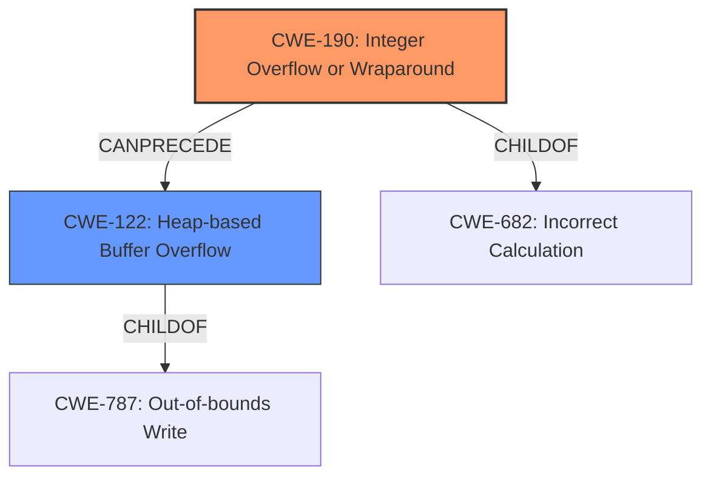

# Analysis for CVE-2021-21855

# Summary
| CWE ID | CWE Name | Confidence | CWE Abstraction Level | CWE Vulnerability Mapping Label | CWE-Vulnerability Mapping Notes |
|---|---|---|---|---|---|
| CWE-190 | Integer Overflow or Wraparound | 0.9 | Base | Primary | Allowed |
| CWE-122 | Heap-based Buffer Overflow | 0.8 | Variant | Secondary | Allowed |

## Evidence and Confidence

*   **Confidence Score:** 0.85
*   **Evidence Strength:** HIGH

## Relationship Analysis
The primary weakness is **CWE-190 (Integer Overflow or Wraparound)**, which is a base-level CWE. It can lead to **CWE-122 (Heap-based Buffer Overflow)**. The integer overflow results in a smaller than expected buffer being allocated. Then the code proceeds to write to the buffer using the original, larger size which results in writing data beyond the allocated buffer, causing a heap-based buffer overflow. CWE-190 is a ChildOf CWE-682 (Numeric Errors). CWE-122 is a ChildOf CWE-787 (Out-of-bounds Write).

## Vulnerability Chain
The vulnerability chain begins with an **unchecked addition arithmetic**, resulting in an **integer overflow** (CWE-190). This leads to a heap-based buffer overflow (CWE-122), ultimately causing memory corruption.

## Summary of Analysis
The vulnerability description clearly states an **integer overflow** due to **unchecked addition arithmetic**, which leads to a heap-based buffer overflow.

The evidence for CWE-190 is the vulnerability description and the CVE Reference Links Content Summary, which mentions:
*   "Multiple exploitable **integer overflow** vulnerabilities exist within the MPEG-4 decoding functionality"
*   "A specially crafted MPEG-4 input can cause an **integer overflow** due to **unchecked addition arithmetic** resulting in a heap-based buffer overflow that causes memory corruption."
*   "Integer overflow in the `sdp_box_read` function when handling the size of the "sdp " atom. The 64-bit size is truncated to 32 bits and used for allocation, while the original 64-bit size is used for reading data, leading to heap buffer overflows."
*   "The 64-bit size of the "sdp " atom is cast to a 32-bit integer, and 1 is added to it before being used as the size for memory allocation using `gf_malloc`. If the original 64-bit size is close to the maximum value of a 32-bit integer (UINT_MAX), adding 1 will cause an overflow, resulting in a small or zero-sized buffer being allocated."

The evidence for CWE-122 is:
*   "resulting in a heap-based buffer overflow that causes memory corruption"
*   "Heap-Based Buffer Overflow: After allocating the undersized buffer, the code proceeds to read data from the input into the buffer using the original, larger size. This results in writing data beyond the allocated buffer, causing a heap-based buffer overflow."

CWE-190 is chosen as the primary CWE because the **integer overflow** is the root cause. CWE-122 is a secondary CWE as it describes the resulting **heap-based buffer overflow**.

The Retriever Results listed CWE-190 as the top match and CWE-122 as the 3rd highest.

CWE-119 was considered, because the CWE for similar CVE Descriptions section listed this as the primary CWE match. However, based on the vulnerability description and the CVE Reference Links Content Summary, the integer overflow is the root cause and the buffer overflow is a consequence. Therefore, it is more accurate to assign CWE-190 as the primary CWE.

Relevant CWE Information:

# Enhanced Context (25 CWEs)

## CWE-191: Integer Underflow (Wrap or Wraparound)
**Abstraction Level**: Base
**Similarity Score**: 0.78
**Source**: dense

**Description**:
The product subtracts one value from another, such that the result is less than the minimum allowable integer value, which produces a value that is not equal to the correct result.

**Mapping Guidance**:
- Usage: Allowed
- Rationale: This CWE entry is at the Base level of abstraction, which is a preferred level of abstraction for mapping to the root causes of vulnerabilities.

## CWE-680: Integer Overflow to Buffer Overflow
**Abstraction Level**: Compound
**Similarity Score**: 0.78
**Source**: dense

**Description**:
The product performs a calculation to determine how much memory to allocate, but an integer overflow can occur that causes less memory to be allocated than expected, leading to a buffer overflow.

**Mapping Guidance**:
- Usage: Discouraged
- Rationale: This CWE entry is a named chain, which combines multiple weaknesses.

## CWE-124: Buffer Underwrite ('Buffer Underflow')
**Abstraction Level**: Base
**Similarity Score**: 0.78
**Source**: dense

**Description**:
The product writes to a buffer using an index or pointer that references a memory location prior to the beginning of the buffer.

**Mapping Guidance**:
- Usage: Allowed
- Rationale: This CWE entry is at the Base level of abstraction, which is a preferred level of abstraction for mapping to the root causes of vulnerabilities.

## CWE-805: Buffer Access with Incorrect Length Value
**Abstraction Level**: Base
**Similarity Score**: 0.77
**Source**: dense

**Description**:
The product uses a sequential operation to read or write a buffer, but it uses an incorrect length value that causes it to access memory that is outside of the bounds of the buffer.

**Mapping Guidance**:
- Usage: Allowed
- Rationale: This CWE entry is at the Base level of abstraction, which is a preferred level of abstraction for mapping to the root causes of vulnerabilities.

## CWE-131: Incorrect Calculation of Buffer Size
**Abstraction Level**: Base
**Similarity Score**: 0.77
**Source**: dense

**Description**:
The product does not correctly calculate the size to be used when allocating a buffer, which could lead to a buffer overflow.

**Mapping Guidance**:
- Usage: Allowed
- Rationale: This CWE entry is at the Base level of abstraction, which is a preferred level of abstraction for mapping to the root causes of vulnerabilities.

## CWE-126: Buffer Over-read
**Abstraction Level**: Variant
**Similarity Score**: 0.77
**Source**: dense

**Description**:
The product reads from a buffer using buffer access mechanisms such as indexes or pointers that reference memory locations after the targeted buffer.

**Mapping Guidance**:
- Usage: Allowed
- Rationale: This CWE entry is at the Variant level of abstraction, which is a preferred level of abstraction for mapping to the root causes of vulnerabilities.

## CWE-190: Integer Overflow or Wraparound
**Abstraction Level**: Base
**Similarity Score**: 0.77
**Source**: dense

**Description**:
The product performs a calculation that can
         produce an integer overflow or wraparound when the logic
         assumes that the resulting value will always be larger than
         the original value. This occurs when an integer value is
         incremented to a value that is too large to store in the
         associated representation. When this occurs, the value may
         become a very small or negative number.

**Mapping Guidance**:
- Usage: Allowed
- Rationale: This CWE entry is at the Base level of abstraction, which is a preferred level of abstraction for mapping to the root causes of vulnerabilities.

## CWE-197: Numeric Truncation Error
**Abstraction Level**: Base
**Similarity Score**: 0.76
**Source**: dense

**Description**:
Truncation errors occur when a primitive is cast to a primitive of a smaller size and data is lost in the conversion.

**Mapping Guidance**:
- Usage: Allowed
- Rationale: This CWE entry is at the Base level of abstraction, which is a preferred level of abstraction for mapping to the root causes of vulnerabilities.

## CWE-125: Out-of-bounds Read
**Abstraction Level**: Base
**Similarity Score**: 0.75
**Source**: dense

**Description**:
The product reads data past the end, or before the beginning, of the intended buffer.

**Mapping Guidance**:
- Usage: Allowed
- Rationale: This CWE entry is at the Base level of abstraction, which is a preferred level