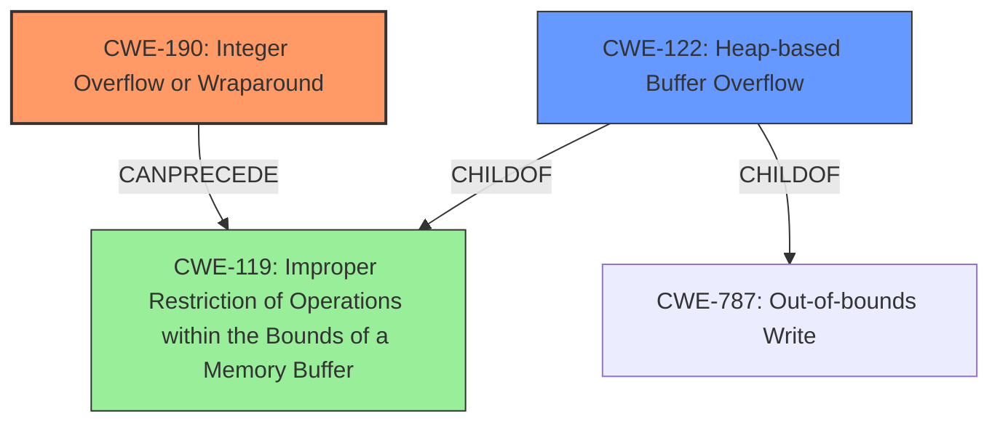

# Analysis for CVE-2021-21857

# Summary
| CWE ID  | CWE Name                                                                              | Confidence | CWE Abstraction Level | CWE Vulnerability Mapping Label | CWE-Vulnerability Mapping Notes |
| :-------- | :------------------------------------------------------------------------------------ | :--------- | :---------------------- | :------------------------------ | :------------------------------ |
| CWE-190 | Integer Overflow or Wraparound | 0.95      | Base                    | Allowed                       | Allowed                                  |
| CWE-122 | Heap-based Buffer Overflow                                                              | 0.85      | Variant                   | Allowed                       | Allowed                                  |
| CWE-119 | Improper Restriction of Operations within the Bounds of a Memory Buffer               | 0.70      | Class                     | Discouraged                     | Discouraged                                |

## Evidence and Confidence

*   **Confidence Score:** 0.90
*   **Evidence Strength:** HIGH

## Relationship Analysis
The primary weakness is an **integer overflow** (CWE-190) that leads to a heap-based buffer overflow (CWE-122). CWE-190 can precede CWE-119 (Improper Restriction of Operations within the Bounds of a Memory Buffer), and CWE-122 is a child of CWE-787 (Out-of-bounds Write) and CWE-119, representing a specific type of out-of-bounds write in the heap. CWE-119 is a more general class of vulnerability, and while applicable, CWE-122 provides greater specificity to the overflow's location.

## Vulnerability Chain
The vulnerability chain starts with a specially crafted MPEG-4 input that triggers an **integer overflow** (CWE-190) during buffer size calculation. This results in a smaller-than-expected buffer being allocated on the heap. Subsequently, when data is written into this undersized buffer using the original, larger size, a heap-based buffer overflow (CWE-122) occurs, leading to memory corruption and potential code execution.

## Summary of Analysis
The initial assessment identified CWE-119 as a top candidate based on similar CVE descriptions. However, a more detailed analysis of the vulnerability description and CVE reference links content summary revealed that the root cause is an **integer overflow** (CWE-190) that leads to a heap-based buffer overflow (CWE-122). The evidence for this is that the "Root Cause" section in "CVE Reference Links Content Summary" states "The root cause is an integer overflow vulnerability due to unchecked addition when calculating buffer size for heap allocation." Also, the "Weaknesses/Vulnerabilities" section states "Integer Overflow: The code adds 1 to the 64-bit size of the atom, truncates the result to 32-bits, and uses it for memory allocation." and "Heap-Based Buffer Overflow: After the undersized memory allocation, the function uses the original, non-truncated size (which is much larger) to read data from the input stream into the undersized buffer. This results in a heap-based buffer overflow."

The graph relationships and detailed analysis of the vulnerability chain confirm that CWE-190 and CWE-122 are the most appropriate CWEs. CWE-190 represents the root cause, while CWE-122 describes the specific type of buffer overflow. CWE-119 is too general, though technically applicable as a parent.

CWE-190 and CWE-122 are at the optimal level of specificity, representing the **integer overflow** and resulting heap-based buffer overflow, respectively.

Relevant CWE Information:

# Enhanced Context (25 CWEs)
The following CWEs were identified as potentially relevant to this vulnerability:

## CWE-191: Integer Underflow (Wrap or Wraparound)
**Abstraction Level**: Base
**Similarity Score**: 0.78
**Source**: dense

**Description**:
The product subtracts one value from another, such that the result is less than the minimum allowable integer value, which produces a value that is not equal to the correct result.

**Mapping Guidance**:
- Usage: Allowed
- Rationale: This CWE entry is at the Base level of abstraction, which is a preferred level of abstraction for mapping to the root causes of vulnerabilities.

## CWE-680: Integer Overflow to Buffer Overflow
**Abstraction Level**: Compound
**Similarity Score**: 0.78
**Source**: dense

**Description**:
The product performs a calculation to determine how much memory to allocate, but an integer overflow can occur that causes less memory to be allocated than expected, leading to a buffer overflow.

**Mapping Guidance**:
- Usage: Discouraged
- Rationale: This CWE entry is a named chain, which combines multiple weaknesses.

## CWE-124: Buffer Underwrite ('Buffer Underflow')
**Abstraction Level**: Base
**Similarity Score**: 0.78
**Source**: dense

**Description**:
The product writes to a buffer using an index or pointer that references a memory location prior to the beginning of the buffer.

**Mapping Guidance**:
- Usage: Allowed
- Rationale: This CWE entry is at the Base level of abstraction, which is a preferred level of abstraction for mapping to the root causes of vulnerabilities.

## CWE-805: Buffer Access with Incorrect Length Value
**Abstraction Level**: Base
**Similarity Score**: 0.77
**Source**: dense

**Description**:
The product uses a sequential operation to read or write a buffer, but it uses an incorrect length value that causes it to access memory that is outside of the bounds of the buffer.

**Mapping Guidance**:
- Usage: Allowed
- Rationale: This CWE entry is at the Base level of abstraction, which is a preferred level of abstraction for mapping to the root causes of vulnerabilities.

## CWE-131: Incorrect Calculation of Buffer Size
**Abstraction Level**: Base
**Similarity Score**: 0.77
**Source**: dense

**Description**:
The product does not correctly calculate the size to be used when allocating a buffer, which could lead to a buffer overflow.

**Mapping Guidance**:
- Usage: Allowed
- Rationale: This CWE entry is at the Base level of abstraction, which is a preferred level of abstraction for mapping to the root causes of vulnerabilities.

## CWE-126: Buffer Over-read
**Abstraction Level**: Variant
**Similarity Score**: 0.77
**Source**: dense

**Description**:
The product reads from a buffer using buffer access mechanisms such as indexes or pointers that reference memory locations after the targeted buffer.

**Mapping Guidance**:
- Usage: Allowed
- Rationale: This CWE entry is at the Variant level of abstraction, which is a preferred level of abstraction for mapping to the root causes of vulnerabilities.

## CWE-190: Integer Overflow or Wraparound
**Abstraction Level**: Base
**Similarity Score**: 0.76
**Source**: dense

**Description**:
The product performs a calculation that can
         produce an integer overflow or wraparound when the logic
         assumes that the resulting value will always be larger than
         the original value. This occurs when an integer value is
         incremented to a value that is too large to store in the
         associated representation. When this occurs, the value may
         become a very small or negative number.

**Mapping Guidance**:
- Usage: Allowed
- Rationale: This CWE entry is at the Base level of abstraction, which is a preferred level of abstraction for mapping to the root causes of vulnerabilities.

## CWE-197: Numeric Truncation Error
**Abstraction Level**: Base
**Similarity Score**: 0.76
**Source**: dense

**Description**:
Truncation errors occur when a primitive is cast to a primitive of a smaller size and data is lost in the conversion.

**Mapping Guidance**:
- Usage: Allowed
- Rationale: This CWE entry is at the Base level of abstraction, which is a preferred level of abstraction for mapping to the root causes of vulnerabilities.

## CWE-125: Out-of-bounds Read
**Abstraction Level**: Base
**Similarity Score**: 0.75
**Source**: dense

**Description**:
The product reads data past the end, or before the beginning, of the intended buffer.

**Mapping Guidance**:
- Usage: Allowed
- Rationale: This CWE entry is at the Base level of abstraction, which is a preferred level