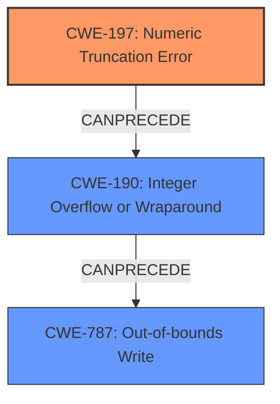

# Raw Analyzer Response for CVE-2021-21859

# Summary
| CWE ID  | CWE Name                                                        | Confidence | CWE Abstraction Level | CWE Vulnerability Mapping Label | CWE-Vulnerability Mapping Notes |
| :-------- | :-------------------------------------------------------------- | :--------- | :---------------------- | :------------------------------ | :------------------------------ |
| CWE-197   | Numeric Truncation Error                                      | 1.0        | Base                    | Primary                       | Allowed                       |
| CWE-190   | Integer Overflow or Wraparound                                | 0.7        | Base                    | Secondary                       | Allowed                       |
| CWE-787   | Out-of-bounds Write                                           | 0.6        | Base                    | Secondary                       | Allowed                       |

## Evidence and Confidence

*   **Confidence Score:** 0.8
*   **Evidence Strength:** HIGH

## Relationship Analysis
The primary weakness is CWE-197 **Numeric Truncation Error**, a **Base** level CWE. This can lead to other issues such as CWE-190 **Integer Overflow or Wraparound**, which in turn can lead to CWE-787 **Out-of-bounds Write**. The relationship between these CWEs is that truncation can cause unexpected values, leading to overflow and ultimately a write outside the intended buffer.

## Vulnerability Chain
The vulnerability chain starts with an **integer truncation** (CWE-197), which can lead to an integer overflow (CWE-190). This overflow can then result in a heap-based buffer overflow, leading to an out-of-bounds write (CWE-787).

## Summary of Analysis
The initial analysis identified the **integer truncation** as the primary root cause. The supporting evidence in the "Vulnerability Description Key Phrases" section clearly indicates "**rootcause: integer truncation**." The "CVE Reference Links Content Summary" further solidifies this by stating, "Integer truncation and subsequent integer overflow when calculating the buffer size...leading to a heap-based buffer overflow."

The relationship graph shows how CWE-197 can lead to CWE-190, which in turn can lead to CWE-787. This is a common vulnerability chain, where a truncation error causes an incorrect size calculation, leading to an overflow and ultimately an out-of-bounds write.

CWE-197 is at the **Base** level of abstraction, which is the preferred level for mapping root causes, as indicated in the mapping guidance. CWE-190 and CWE-787 were chosen as secondary CWEs because they represent the subsequent steps in the vulnerability chain.
The selection of CWE-197 is based directly on the provided evidence and aligns with the recommended mapping practices. The confidence level is high due to the explicit mention of "**integer truncation**" as the root cause.

Relevant CWE Information:

# Enhanced Context (25 CWEs)
The following CWEs were identified as potentially relevant to this vulnerability:

## CWE-197: Numeric Truncation Error
**Abstraction Level**: Base
**Similarity Score**: 0.79
**Source**: dense

**Description**:
Truncation errors occur when a primitive is cast to a primitive of a smaller size and data is lost in the conversion.

**Mapping Guidance**:
- Usage: Allowed
- Rationale: This CWE entry is at the Base level of abstraction, which is a preferred level of abstraction for mapping to the root causes of vulnerabilities.

## CWE-190: Integer Overflow or Wraparound
**Abstraction Level**: Base
**Similarity Score**: 0.74
**Source**: dense

**Description**:
The product performs a calculation that can produce an integer overflow or wraparound when the logic assumes that the resulting value will always be larger than the original value. This occurs when an integer value is incremented to a value that is too large to store in the associated representation. When this occurs, the value may become a very small or negative number.

**Mapping Guidance**:
- Usage: Allowed
- Rationale: This CWE entry is at the Base level of abstraction, which is a preferred level of abstraction for mapping to the root causes of vulnerabilities.

## CWE-787: Out-of-bounds Write
**Abstraction Level**: Base
**Similarity Score**: 3.30
**Source**: graph

**Description**:
CWE-787: Out-of-bounds Write

**Mapping Guidance**:
- Usage: Allowed
- Rationale: This CWE entry is at the Base level of abstraction, which is a preferred level of abstraction for mapping to the root causes of vulnerabilities.

## CWE-122: Heap-based Buffer Overflow
**Abstraction Level**: Variant
**Similarity Score**: 0.277
**Source**: sparse

**Description**:
A heap overflow condition is a buffer overflow, where the buffer that can be overwritten is allocated in the heap portion of memory, generally meaning that the buffer was allocated using a routine such as malloc().

**Mapping Guidance**:
- Usage: Allowed
- Rationale: This CWE entry is at the Variant level of abstraction, which is a preferred level of abstraction for mapping to the root causes of vulnerabilities.

### Not Used:

*   **CWE-119: Improper Restriction of Operations within the Bounds of a Memory Buffer**: This is a Class-level CWE and is too general. The more specific CWE-787 is preferred.
*   **CWE-125: Out-of-bounds Read**: The description focuses on a write, not a read.
*   **CWE-681: Incorrect Conversion between Numeric Types**: While an **integer truncation** is a conversion from one numeric type to another, CWE-197 is a more precise description of the actual error.
*   **CWE-451: User Interface (UI) Misrepresentation of Critical Information**: This is not relevant to the described vulnerability.
*   **CWE-126: Buffer Over-read**: The description focuses on a write, not a read.
*   **CWE-1284: Improper Validation of Specified Quantity in Input**: The **integer truncation** is the root cause and not the validation of quantity.