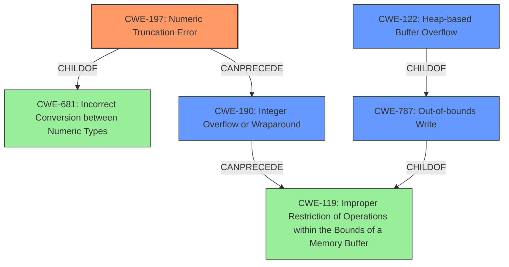

# Analysis for CVE-2021-21860

# Summary
| CWE ID | CWE Name | Confidence | CWE Abstraction Level | CWE Vulnerability Mapping Label | CWE-Vulnerability Mapping Notes |
|---|---|---|---|---|---|
| CWE-197 | Numeric Truncation Error | 1.0 | Base | Primary | Allowed |
| CWE-190 | Integer Overflow or Wraparound | 0.9 | Base | Secondary | Allowed |
| CWE-787 | Out-of-bounds Write | 0.8 | Base | Secondary | Allowed |
| CWE-122 | Heap-based Buffer Overflow | 0.7 | Variant | Secondary | Allowed |

## Evidence and Confidence

*   **Confidence Score:** 0.9
*   **Evidence Strength:** HIGH

## Relationship Analysis
The primary weakness is **CWE-197 Numeric Truncation Error** because a 64-bit value is truncated to 32-bits. **CWE-197** is a child of **CWE-681: Incorrect Conversion between Numeric Types** and has peer relationships with **CWE-195: Signed to Unsigned Conversion Error**, **CWE-196: Unsigned to Signed Conversion Error**, **CWE-192: Conversion Error**, and **CWE-194: Unexpected Sign Extension**.
The truncation is followed by an integer overflow, hence **CWE-190 Integer Overflow or Wraparound** is also included. **CWE-190** can lead to **CWE-119 Improper Restriction of Operations within the Bounds of a Memory Buffer**. The integer overflow leads to a heap-based buffer overflow (**CWE-122**) and ultimately, an out-of-bounds write (**CWE-787**). **CWE-787** is a child of **CWE-119**.

## Vulnerability Chain
The vulnerability chain starts with:
1.  **CWE-197 Numeric Truncation Error**: A 64-bit value is truncated to a 32-bit value.
2.  **CWE-190 Integer Overflow or Wraparound**: The truncated value is then multiplied, resulting in an integer overflow.
3.  **CWE-122 Heap-based Buffer Overflow**: The overflowed value is used to allocate a buffer, resulting in a smaller than expected buffer.
4.  **CWE-787 Out-of-bounds Write**: Data is written to the undersized buffer, causing a heap overflow.

## Summary of Analysis
The analysis is based on the provided vulnerability description and the CVE reference link content summary. The vulnerability is rooted in an **integer truncation** (CWE-197), which subsequently leads to an integer overflow during memory allocation. This results in a heap-based buffer overflow. The evidence for this chain is present in the "CVE Reference Links Content Summary" section, which states: "The vulnerability stems from a combination of **integer truncation** and a subsequent integer overflow when calculating the allocation size for a heap buffer."

The graph relationships influenced the selection by highlighting the hierarchical relationships and the chain of events. **CWE-197** is the root cause, leading to **CWE-190**, and ultimately resulting in **CWE-787** and **CWE-122**. The selected CWEs are at the optimal level of specificity, as they accurately represent the technical details of the vulnerability. **CWE-197** is a **Base** CWE and accurately describes the initial error. **CWE-122** is a **Variant** of buffer overflow that occurs on the heap.

CWE-119 was considered but not chosen as the primary CWE because while the vulnerability does involve improper restriction of operations within the bounds of a memory buffer, it is more accurately described by the more specific **CWE-787 Out-of-bounds Write**. Also, the mapping guidance for CWE-119 discourages its use when lower-level CWEs are available.

CWE-120 (Buffer Copy without Checking Size of Input) was considered but is not appropriate because the vulnerability is not a simple buffer copy without checking size, but rather a more complex issue involving integer truncation and overflow.