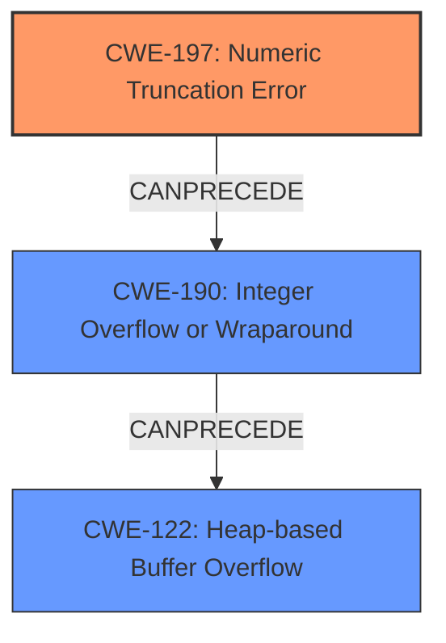

# Analysis Report for CVE-2021-21861

# Vulnerability Analysis Report: CVE-2021-21861

## Description


## Analysis (with Relationship Data)

# Summary
| CWE ID | CWE Name | Confidence | CWE Abstraction Level | CWE Vulnerability Mapping Label | CWE-Vulnerability Mapping Notes |
|---|---|---|---|---|---|
| CWE-197 | Numeric Truncation Error | 0.9 | Base | Allowed | Primary CWE |
| CWE-190 | Integer Overflow or Wraparound | 0.7 | Base | Allowed | Secondary Candidate |
| CWE-122 | Heap-based Buffer Overflow | 0.6 | Variant | Allowed | Secondary Candidate |

## Evidence and Confidence

*   **Confidence Score:** 0.8
*   **Evidence Strength:** HIGH

## Relationship Analysis
The primary weakness is **CWE-197 (Numeric Truncation Error)** which can lead to **CWE-190 (Integer Overflow or Wraparound)**. These integer issues often **CanPrecede** buffer overflows such as **CWE-122 (Heap-based Buffer Overflow)**.



## Vulnerability Chain
The vulnerability chain starts with a **CWE-197 (Numeric Truncation Error)**, which leads to an **improper memory allocation** that causes a **CWE-122 (Heap-based Buffer Overflow)**, resulting in memory corruption.

## Summary of Analysis
The vulnerability is primarily caused by an **integer truncation vulnerability**, as explicitly stated in the "Vulnerability Description Key Phrases":
- **rootcause:** **integer truncation vulnerability**

The "CVE Reference Links Content Summary" confirms the root cause:
- "Root cause of vulnerability": "Integer truncation and integer overflow during memory allocation for parsing MPEG-4 atoms leads to undersized heap buffer allocation."

Therefore, **CWE-197 (Numeric Truncation Error)** is the most accurate primary CWE. The integer truncation results in an **improper memory allocation**, which can be seen as a consequence of the truncation. The resulting **heap-based buffer overflow** is the impact. The analysis is based on explicit evidence from the provided vulnerability description and CVE reference links.

**CWE-190 (Integer Overflow or Wraparound)** is also relevant, since the CVE summary includes "integer overflow" as a root cause. However, the primary cause mentioned in the initial description is truncation, so CWE-197 is ranked higher.

**CWE-122 (Heap-based Buffer Overflow)** is a consequence of the **improper memory allocation** and integer truncation/overflow, not the root cause.

Other CWEs such as **CWE-125 (Out-of-bounds Read)**, **CWE-1284 (Improper Validation of Specified Quantity in Input)**, **CWE-126 (Buffer Over-read)**, **CWE-128 (Wrap-around Error)**, **CWE-681 (Incorrect Conversion between Numeric Types)**, **CWE-787 (Out-of-bounds Write)**, and **CWE-131 (Incorrect Calculation of Buffer Size)** were considered, but they are either impacts or less directly related to the root cause of the vulnerability.

The selected CWEs are at the optimal level of specificity as they represent the root cause (truncation error) and subsequent issues (integer overflow, heap-based buffer overflow).

Relevant CWE Information:

# Enhanced Context (25 CWEs)
The following CWEs were identified as potentially relevant to this vulnerability:

## CWE-197: Numeric Truncation Error
**Abstraction Level**: Base
**Similarity Score**: 0.81
**Source**: dense

**Description**:
Truncation errors occur when a primitive is cast to a primitive of a smaller size and data is lost in the conversion.

**Mapping Guidance**:
- Usage: Allowed
- Rationale: This CWE entry is at the Base level of abstraction, which is a preferred level of abstraction for mapping to the root causes of vulnerabilities.

## CWE-190: Integer Overflow or Wraparound
**Abstraction Level**: Base
**Similarity Score**: 0.77
**Source**: dense

### Description
The product performs a calculation that can
         produce an integer overflow or wraparound when the logic
         assumes that the resulting value will always be larger than
         the original value. This occurs when an integer value is
         incremented to a value that is too large to store in the
         associated representation. When this occurs, the value may
         become a very small or negative number.

**Mapping Guidance**:
- Usage: Allowed
- Rationale: This CWE entry is at the Base level of abstraction, which is a preferred level of abstraction for mapping to the root causes of vulnerabilities.

## CWE-122: Heap-based Buffer Overflow
**Abstraction Level**: Variant
**Similarity Score**: 0.43
**Source**: dense

**Description**:
A heap overflow condition is a buffer overflow, where the buffer that can be overwritten is allocated in the heap portion of memory, generally meaning that the buffer was allocated using a routine such as malloc().

**Mapping Guidance**:
- Usage: Allowed
- Rationale: This CWE entry is at the Variant level of abstraction, which is a preferred level of abstraction for mapping to the root causes of vulnerabilities.

## CWE-125: Out-of-bounds Read
**Abstraction Level**: Base
**Similarity Score**: 0.76
**Source**: dense

**Description**:
The product reads data past the end, or before the beginning, of the intended buffer.

**Mapping Guidance**:
- Usage: Allowed
- Rationale: This CWE entry is at the Base level of abstraction, which is a preferred level of abstraction for mapping to the root causes of vulnerabilities.

## CWE-1284: Improper Validation of Specified Quantity in Input
**Abstraction Level**: Base
**Similarity Score**: 0.43
**Source**: graph

**Description**:
CWE-1284: Improper Validation of Specified Quantity in Input

**Mapping Guidance**:
- Usage: Allowed
- Rationale: This CWE entry is at the Base level of abstraction, which is a preferred level of abstraction for mapping to the root causes of vulnerabilities.

## CWE-126: Buffer Over-read
**Abstraction Level**: Variant
**Similarity Score**: 0.76
**Source**: dense

**Description**:
The product reads from a buffer using buffer access mechanisms such as indexes or pointers that reference memory locations after the targeted buffer.

**Mapping Guidance**:
- Usage: Allowed
- Rationale: This CWE entry is at the Variant level of abstraction, which is a preferred level of abstraction for mapping to the root causes of vulnerabilities.

## CWE-128: Wrap-around Error
**Abstraction Level**: Base
**Similarity Score**: 5.03
**Source**: graph

**Description**:
CWE-128: Wrap-around Error

**Mapping Guidance**:
- Usage: Allowed
- Rationale: This CWE entry is at the Base level of abstraction, which is a preferred level of abstraction for mapping to the root causes of vulnerabilities.

## CWE-681: Incorrect Conversion between Numeric Types
**Abstraction Level**: Base
**Similarity Score**: 0.79
**Source**: dense

**Description**:
When converting from one data type to another, such as long to integer, data can be omitted or translated in a way that produces unexpected values. If the resulting values are used in a sensitive context, then dangerous behaviors may occur.

**Mapping Guidance**:
- Usage: Allowed
- Rationale: This CWE entry is at the Base level of abstraction, which is a preferred level of abstraction for mapping to the root causes of vulnerabilities.

## CWE-787: Out-of-bounds Write
**Abstraction Level**: Base
**Similarity Score**: 0.40
**Source**: dense

**Description**:
The product writes data past the end, or before the beginning, of the intended buffer.

**Mapping Guidance**:
- Usage: Allowed
- Rationale: This CWE entry is at the Base level of abstraction, which is a preferred level of abstraction for mapping to the root causes of vulnerabilities.

## CWE-131: Incorrect Calculation of Buffer Size
**Abstraction Level**: Base
**Similarity Score**: 0.80
**Source**: dense

**Description**:
The product does not correctly calculate the size to be used when allocating a buffer, which could lead to a buffer overflow.

**Mapping Guidance**:
- Usage: Allowed
- Rationale: This CWE entry is at the Base level of abstraction, which is a preferred level of abstraction for mapping to the root causes of vulnerabilities.


## CWE Relationship Analysis

Current CWEs represent these abstraction levels: .


### Vulnerability Chain Analysis

**Chain starting from CWE-787:**
- 787 (Out-of-bounds Write) - ROOT


**Chain starting from CWE-128:**
- 128 (Wrap-around Error) - ROOT


### CWE Relationship Diagram

```mermaid
graph TD
    classDef primary fill:#f96,stroke:#333,stroke-width:2px
    classDef secondary fill:#69f,stroke:#333
    classDef tertiary fill:#9e9,stroke:#333
```


*Report generated on 2025-04-01 20:04:02*
