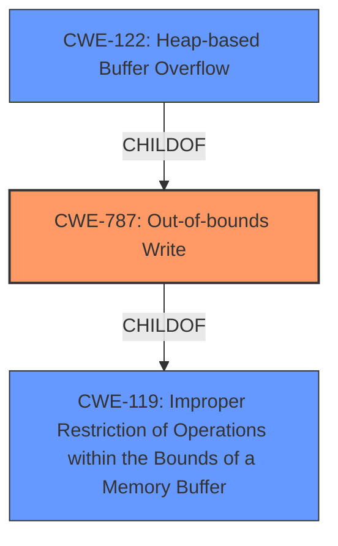

# Analysis for CVE-2021-21897

# Summary
| CWE ID | CWE Name | Confidence | CWE Abstraction Level | CWE Vulnerability Mapping Label | CWE-Vulnerability Mapping Notes |
|---|---|---|---|---|---|
| CWE-787 | Out-of-bounds Write | 0.9 | Base | Allowed | Primary CWE |
| CWE-122 | Heap-based Buffer Overflow | 0.7 | Variant | Allowed | Secondary Candidate |
| CWE-119 | Improper Restriction of Operations within the Bounds of a Memory Buffer | 0.6 | Class | Discouraged | Secondary Candidate |

## Evidence and Confidence

*   **Confidence Score:** 0.8
*   **Evidence Strength:** HIGH

## Relationship Analysis
The primary CWE is CWE-787, which is a base level CWE describing an out-of-bounds write. CWE-122 is a variant of CWE-787 specifying that the buffer is allocated on the heap. CWE-119 is a class-level CWE describing improper restriction of operations within the bounds of a memory buffer, and CWE-787 and CWE-122 are both children of CWE-119. The description specifically mentions a **heap buffer overflow**, so CWE-122 is a strong candidate, but the root cause is the out-of-bounds write, making CWE-787 the primary issue.

## Vulnerability Chain
The vulnerability chain starts with **incorrect index calculation** in the `DL_Dxf::handleLWPolylineData` function. This leads to an **out-of-bounds write** (CWE-787) on the heap, resulting in a **heap buffer overflow** (CWE-122) that can lead to arbitrary code execution.

## Summary of Analysis
The initial analysis pointed towards CWE-787 as the primary cause, an out-of-bounds write. The description specifically mentions a **heap buffer overflow**, and the CVE Reference Links Content Summary confirms this. The vulnerability occurs due to an **incorrect index calculation** when handling LWPOLYLINE data, leading to an out-of-bounds write to the heap.

The CWE-119 is too general, but the specific nature of the **heap buffer overflow** makes CWE-122 a strong secondary candidate. However, the root cause is the out-of-bounds write due to the **incorrect index calculation**, so CWE-787 is the most appropriate primary CWE.

The evidence provided is strong and clearly supports the selection of CWE-787 as the primary CWE, with CWE-122 as a secondary candidate providing more context on the location of the overflow.

Relevant CWE Information:

# Enhanced Context (25 CWEs)
The following CWEs were identified as potentially relevant to this vulnerability:

## CWE-131: Incorrect Calculation of Buffer Size
**Abstraction Level**: Base
**Similarity Score**: 0.79
**Source**: dense

**Description**:
The product does not correctly calculate the size to be used when allocating a buffer, which could lead to a buffer overflow.

**Mapping Guidance**:
- Usage: Allowed
- Rationale: This CWE entry is at the Base level of abstraction, which is a preferred level of abstraction for mapping to the root causes of vulnerabilities.

*CWE-131 was considered, but the vulnerability isn't related to the initial buffer size calculation, but instead stems from writing outside the bounds of the buffer due to an incorrect index.*

## CWE-191: Integer Underflow (Wrap or Wraparound)
**Abstraction Level**: Base
**Similarity Score**: 0.79
**Source**: dense

**Description**:
The product subtracts one value from another, such that the result is less than the minimum allowable integer value, which produces a value that is not equal to the correct result.

**Mapping Guidance**:
- Usage: Allowed
- Rationale: This CWE entry is at the Base level of abstraction, which is a preferred level of abstraction for mapping to the root causes of vulnerabilities.

*CWE-191 was considered, but there's no evidence of an integer underflow in the description.*

## CWE-805: Buffer Access with Incorrect Length Value
**Abstraction Level**: Base
**Similarity Score**: 0.77
**Source**: dense

**Description**:
The product uses a sequential operation to read or write a buffer, but it uses an incorrect length value that causes it to access memory that is outside of the bounds of the buffer.

**Mapping Guidance**:
- Usage: Allowed
- Rationale: This CWE entry is at the Base level of abstraction, which is a preferred level of abstraction for mapping to the root causes of vulnerabilities.

*CWE-805 was considered, but the incorrect length value isn't the primary issue. The problem is the **incorrect index calculation** leading to the write outside the bounds.*

## CWE-125: Out-of-bounds Read
**Abstraction Level**: Base
**Similarity Score**: 0.77
**Source**: dense

**Description**:
The product reads data past the end, or before the beginning, of the intended buffer.

**Mapping Guidance**:
- Usage: Allowed
- Rationale: This CWE entry is at the Base level of abstraction, which is a preferred level of abstraction for mapping to the root causes of vulnerabilities.

*CWE-125 was considered, but the vulnerability is related to writing, not reading, outside the bounds.*

## CWE-193: Off-by-one Error
**Abstraction Level**: Base
**Similarity Score**: 0.76
**Source**: dense

**Description**:
A product calculates or uses an incorrect maximum or minimum value that is 1 more, or 1 less, than the correct value.

**Mapping Guidance**:
- Usage: Allowed
- Rationale: This CWE entry is at the Base level of abstraction, which is a preferred level of abstraction for mapping to the root causes of vulnerabilities.

*CWE-193 was considered, but the issue is an **incorrect index calculation** not necessarily an off-by-one error.*

## CWE-681: Incorrect Conversion between Numeric Types
**Abstraction Level**: Base
**Similarity Score**: 0.76
**Source**: dense

**Description**:
When converting from one data type to another, such as long to integer, data can be omitted or translated in a way that produces unexpected values. If the resulting values are used in a sensitive context, then dangerous behaviors may occur.

**Mapping Guidance**:
- Usage: Allowed
- Rationale: This CWE entry is at the Base level of abstraction, which is a preferred level of abstraction for mapping to the root causes of vulnerabilities.

*CWE-681 was considered, but there's no evidence of type conversion issues.*

## CWE-129: Improper Validation of Array Index
**Abstraction Level**: Variant
**Similarity Score**: 0.76
**Source**: dense

**Description**:
The product uses untrusted input when calculating or using an array index, but the product does not validate or incorrectly validates the index to ensure the index references a valid position within the array.

**Mapping Guidance**:
- Usage: Allowed
- Rationale: This CWE entry is at the Variant level of abstraction, which is a preferred level of abstraction for mapping to the root causes of vulnerabilities.

*CWE-129 was considered. The issue is similar because the index is not correctly handled, but the description does not indicate that untrusted input is the cause. The **incorrect index calculation** due to how `vertexIndex` is handled is the root cause.*

## CWE-126: Buffer Over-read
**Abstraction Level**: Variant
**Similarity Score**: 0.76
**Source**: dense

**Description**:
The product reads from a buffer using buffer access mechanisms such as indexes or pointers that reference memory locations after the targeted buffer.

**Mapping Guidance**:
- Usage: Allowed
- Rationale: This CWE entry is at the Variant level of abstraction, which is a preferred level of abstraction for mapping to the root causes of vulnerabilities.

*CWE-126 was considered, but the vulnerability is related to writing, not reading, outside the bounds.*

## CWE-197: Numeric Truncation Error
**Abstraction Level**: Base
**Similarity Score**: 0.76
**Source**: dense

**Description**:
Truncation errors occur when a primitive is cast to a primitive of a smaller size and data is lost in the conversion.

**Mapping Guidance**:
- Usage: Allowed
- Rationale: This CWE entry is at the Base level of abstraction,