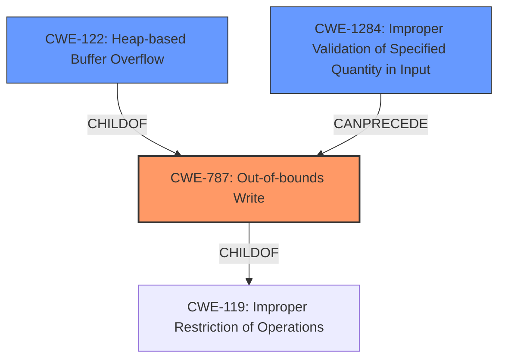

# Enhanced Analysis for CVE-2021-21899

# Summary
| CWE ID | CWE Name | Confidence | CWE Abstraction Level | CWE Vulnerability Mapping Label | CWE-Vulnerability Mapping Notes |
|---|---|---|---|---|---|
| CWE-787 | Out-of-bounds Write | 1.0 | Base | Allowed | Primary CWE |
| CWE-122 | Heap-based Buffer Overflow | 0.8 | Variant | Allowed | Secondary Candidate |
| CWE-1284 | Improper Validation of Specified Quantity in Input | 0.7 | Base | Allowed | Secondary Candidate |

## Evidence and Confidence

*   **Confidence Score:** 0.9
*   **Evidence Strength:** HIGH

## Relationship Analysis
The primary CWE is CWE-787, which is a base-level CWE describing an out-of-bounds write. CWE-122, Heap-based Buffer Overflow, is a variant of CWE-787, specifying the location of the buffer. CWE-1284, Improper Validation of Specified Quantity in Input, can precede CWE-787 because the lack of validation can lead to the out-of-bounds write.



## Vulnerability Chain
The vulnerability chain starts with **improper validation of a specified quantity in input** (CWE-1284). This leads to an **out-of-bounds write** (CWE-787) which is a **heap-based buffer overflow** (CWE-122), ultimately resulting in code execution.

## Summary of Analysis
The initial assessment identified CWE-787 as the primary weakness, supported by the description of a **heap buffer overflow** in the `dwgCompressorcopyCompBytes21` functionality. The analysis of CVE Reference Links Content Summary confirmed this, stating the root cause as a **lack of proper bounds checking** within the `copyCompBytes21` function, leading to writing data beyond the allocated boundary of the heap buffer.

CWE-122 (Heap-based Buffer Overflow) was considered as a more specific variant of CWE-787, due to the buffer being allocated on the heap. While this is relevant information, CWE-787 is more directly tied to the **out-of-bounds write** condition.

CWE-1284 (Improper Validation of Specified Quantity in Input) was added as a secondary weakness because the "CVE Reference Links Content Summary" section stated the length of the compressed data is read from the input file, and **not properly validated** before being passed to the copy function.

The selection of CWE-787 is at the optimal level of specificity because it directly describes the **out-of-bounds write** condition, which is the core weakness exploited in this vulnerability. The supporting evidence clearly points to this condition, and the relationship analysis shows how other CWEs contribute to the vulnerability chain.

Relevant CWE Information:

# Enhanced Context (25 CWEs)
The following CWEs were identified as potentially relevant to this vulnerability:

## CWE-131: Incorrect Calculation of Buffer Size
**Abstraction Level**: Base
**Similarity Score**: 0.79
**Source**: dense

**Description**:
The product does not correctly calculate the size to be used when allocating a buffer, which could lead to a buffer overflow.
**Analysis:** This CWE was considered but deemed less relevant than CWE-1284. The issue is not in the calculation of the buffer size, but in the validation of the length of data to be copied into the buffer.

## CWE-191: Integer Underflow (Wrap or Wraparound)
**Abstraction Level**: Base
**Similarity Score**: 0.79
**Source**: dense

**Description**:
The product subtracts one value from another, such that the result is less than the minimum allowable integer value, which produces a value that is not equal to the correct result.
**Analysis:** This CWE was considered but deemed not relevant because there is no indication of integer underflow in the vulnerability description.

## CWE-805: Buffer Access with Incorrect Length Value
**Abstraction Level**: Base
**Similarity Score**: 0.78
**Source**: dense

**Description**:
The product uses a sequential operation to read or write a buffer, but it uses an incorrect length value that causes it to access memory that is outside of the bounds of the buffer.
**Analysis:** This CWE was considered but deemed less relevant than CWE-787. The primary issue is not just an incorrect length value, but the lack of validation that allows the incorrect length to be used.

## CWE-125: Out-of-bounds Read
**Abstraction Level**: Base
**Similarity Score**: 0.77
**Source**: dense

**Description**:
The product reads data past the end, or before the beginning, of the intended buffer.
**Analysis:** This CWE was not selected because the vulnerability is related to writing out of bounds, not reading.

## CWE-681: Incorrect Conversion between Numeric Types
**Abstraction Level**: Base
**Similarity Score**: 0.77
**Source**: dense

**Description**:
When converting from one data type to another, such as long to integer, data can be omitted or translated in a way that produces unexpected values. If the resulting values are used in a sensitive context, then dangerous behaviors may occur.
**Analysis:** This CWE was not selected because there is no evidence of incorrect conversion between numeric types in the vulnerability description.

## CWE-129: Improper Validation of Array Index
**Abstraction Level**: Variant
**Similarity Score**: 0.77
**Source**: dense

**Description**:
The product uses untrusted input when calculating or using an array index, but the product does not validate or incorrectly validates the index to ensure the index references a valid position within the array.
**Analysis:** This CWE was considered but deemed less relevant than CWE-787 and CWE-1284. Although there is a lack of validation, the issue is with the length parameter, not the array index itself.

## CWE-130: Improper Handling of Length Parameter Inconsistency
**Abstraction Level**: Base
**Similarity Score**: 0.77
**Source**: dense

**Description**:
The product parses a formatted message or structure, but it does not handle or incorrectly handles a length field that is inconsistent with the actual length of the associated data.
**Analysis:** This CWE was considered but deemed less relevant than CWE-1284. The primary problem is the lack of validation of the length parameter, not the inconsistency between length fields.

## CWE-789: Memory Allocation with Excessive Size Value
**Abstraction Level**: Variant
**Similarity Score**: 0.77
**Source**: dense

**Description**:
The product allocates memory based on an untrusted, large size value, but it does not ensure that the size is within expected limits, allowing arbitrary amounts of memory to be allocated.
**Analysis:** This CWE was not selected because the vulnerability does not directly involve excessive memory allocation.

## CWE-126: Buffer Over-read
**Abstraction Level**: Variant
**Similarity Score**: 0.76
**Source**: dense

**Description**:
The product reads from a buffer using buffer access mechanisms such as indexes or pointers that reference memory locations after the targeted buffer.
**Analysis:** This CWE was not selected because the vulnerability is related to writing out of bounds, not reading.

## CWE-193: Off-by-one Error
**Abstraction Level**: Base
**Similarity Score**: 0.76
**Source**: dense

**Description**:
A product calculates or uses an incorrect maximum or minimum value that is 1 more, or 1 less, than the correct value.
**Analysis:** This CWE was not selected because there is no indication of an off-by-one error in the vulnerability description.

## CWE-190: Integer Overflow or Wraparound
**Abstraction Level**: Base
**Similarity Score**: 6822.86
**Source**: sparse

**Description**:
The product performs a calculation that can
         produce an integer overflow or wraparound when the logic
         assumes that the resulting value will always be larger than
         the original value. This occurs when an integer value is
         incremented to a value that is too large to store in the
         associated representation. When this occurs, the value may
         become a very small or negative number.
**Analysis:** This CWE was considered but deemed not directly applicable. While an integer overflow could potentially contribute to the


## CWE Relationship Analysis

Current CWEs represent these abstraction levels: .


### Vulnerability Chain Analysis

**Chain starting from CWE-787:**
- 787 (Out-of-bounds Write) - ROOT


**Chain starting from CWE-805:**
- 805 (Buffer Access with Incorrect Length Value) - ROOT


### CWE Relationship Diagram

```mermaid
graph TD
    classDef primary fill:#f96,stroke:#333,stroke-width:2px
    classDef secondary fill:#69f,stroke:#333
    classDef tertiary fill:#9e9,stroke:#333
```