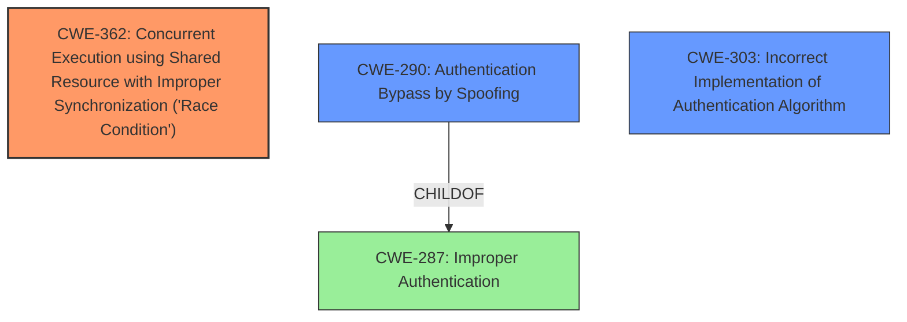

# Analysis Report for CVE-2021-21902

# Vulnerability Analysis Report: CVE-2021-21902

## Description


## Analysis (with Relationship Data)

# Summary
| CWE ID | CWE Name | Confidence | CWE Abstraction Level | CWE Vulnerability Mapping Label | CWE-Vulnerability Mapping Notes |
|---|---|---|---|---|---|
| CWE-362 | Concurrent Execution using Shared Resource with Improper Synchronization ('Race Condition') | 0.9 | Class | Allowed-with-Review | Primary CWE |
| CWE-290 | Authentication Bypass by Spoofing | 0.7 | Base | Allowed | Secondary Candidate |
| CWE-303 | Incorrect Implementation of Authentication Algorithm | 0.6 | Base | Allowed | Secondary Candidate |

## Evidence and Confidence

*   **Confidence Score:** 0.8
*   **Evidence Strength:** HIGH

## Relationship Analysis
The primary CWE is CWE-362 (Race Condition), which is a Class-level CWE. CWE-362 can lead to other issues, such as CWE-416 (Use After Free) or CWE-476 (NULL Pointer Dereference). CWE-290 (Authentication Bypass by Spoofing) and CWE-303 (Incorrect Implementation of Authentication Algorithm) are also relevant because the **impact** of the **race condition** is an **authentication bypass**. CWE-290 is a child of CWE-287 (Improper Authentication).



## Vulnerability Chain
The vulnerability chain starts with a **race condition** (CWE-362) in the `run_server_6877` functionality. Due to the flawed implementation, an attacker can supplant themselves as the socket associated with the authenticated connection, leading to an **authentication bypass** (CWE-290) and a bypass of the authentication algorithm (CWE-303). The **root cause** is the **race condition**, and the **impact** is gaining unauthorized access to the CLI interface.

## Summary of Analysis
The initial analysis focused on the authentication bypass, but the provided evidence points to a **race condition** as the **root cause**.

Evidence:
- "A race condition exists in the `run_server_6877` functionality"
- "flaw in the spawning of authenticated threads allows an attacker to supplant themselves as the socket associated with the recently authenticated connection"
- "**Authentication Bypass:** Due to the race condition, an attacker can gain access to the authenticated CLI without knowing the password."
- "**Incorrect Implementation of Authentication Algorithm (CWE-303):** The vulnerability is caused by a flawed implementation of the authentication process."

The **race condition** allows an attacker to take over a legitimate user's socket after authentication, leading to the **bypass**. Therefore, CWE-362 is the primary weakness. The subsequent **authentication bypass** by spoofing is a direct consequence of the **race condition**, making CWE-290 a secondary concern. The **incorrect implementation of the authentication algorithm** (CWE-303) is a description of how the **race condition** is exploitable.

CWE-362 is the most specific applicable CWE based on the **root cause**, and it has a higher retriever score than CWE-287 which the guidance suggests avoiding. CWE-362 accurately captures the concurrent execution issue. CWE-290 is a base level CWE and represents the **impact** of the vulnerability.

Relevant CWE Information:

# Enhanced Context (25 CWEs)
The following CWEs were identified as potentially relevant to this vulnerability:

## CWE-74: Improper Neutralization of Special Elements in Output Used by a Downstream Component ('Injection')
**Abstraction Level**: Class
**Similarity Score**: 0.77

## CWE-1391: Use of Weak Credentials
**Abstraction Level**: Class
**Similarity Score**: 0.76

## CWE-330: Use of Insufficiently Random Values
**Abstraction Level**: Class
**Similarity Score**: 0.75

## CWE-807: Reliance on Untrusted Inputs in a Security Decision
**Abstraction Level**: Base
**Similarity Score**: 0.75

## CWE-1289: Improper Validation of Unsafe Equivalence in Input
**Abstraction Level**: Base
**Similarity Score**: 0.75

## CWE-303: Incorrect Implementation of Authentication Algorithm
**Abstraction Level**: Base
**Similarity Score**: 0.75
**Description**:
The requirements for the product dictate the use of an established authentication algorithm, but the implementation of the algorithm is incorrect.
**Mapping Guidance**:
- Usage: Allowed
- Rationale: This CWE entry is at the Base level of abstraction, which is a preferred level of abstraction for mapping to the root causes of vulnerabilities.

## CWE-345: Insufficient Verification of Data Authenticity
**Abstraction Level**: Class
**Similarity Score**: 0.75

## CWE-294: Authentication Bypass by Capture-replay
**Abstraction Level**: Base
**Similarity Score**: 0.75

## CWE-129: Improper Validation of Array Index
**Abstraction Level**: Variant
**Similarity Score**: 0.74

## CWE-204: Observable Response Discrepancy
**Abstraction Level**: Base
**Similarity Score**: 0.74

## CWE-364: Signal Handler Race Condition
**Abstraction Level**: Base
**Similarity Score**: 7057.20

## CWE-362: Concurrent Execution using Shared Resource with Improper Synchronization ('Race Condition')
**Abstraction Level**: Class
**Similarity Score**: 6343.88
**Description**:
The product contains a concurrent code sequence that requires temporary, exclusive access to a shared resource, but a timing window exists in which the shared resource can be modified by another code sequence operating concurrently.
**Mapping Guidance**:
- Usage: Allowed-with-Review
- Rationale: This CWE entry is a Class and might have Base-level children that would be more appropriate

## CWE-367: Time-of-check Time-of-use (TOCTOU) Race Condition
**Abstraction Level**: Base
**Similarity Score**: 6105.70

## CWE-259: Use of Hard-coded Password
**Abstraction Level**: Variant
**Similarity Score**: 6069.84

## CWE-798: Use of Hard-coded Credentials
**Abstraction Level**: Base
**Similarity Score**: 6041.23

## CWE-123: Write-what-where Condition
**Abstraction Level**: base
**Similarity Score**: 5.03

## CWE-415: Double Free
**Abstraction Level**: variant
**Similarity Score**: 4.40

## CWE-416: Use After Free
**Abstraction Level**: variant
**Similarity Score**: 4.40

## CWE-364: Signal Handler Race Condition
**Abstraction Level**: base
**Similarity Score**: 4.33

## CWE-476: NULL Pointer Dereference
**Abstraction Level**: base
**Similarity Score**: 4.33

## CWE-120: Buffer Copy without Checking Size of Input ('Classic Buffer Overflow')
**Abstraction Level**: base
**Similarity Score**: 4.33

## CWE-321: Use of Hard-coded Cryptographic Key
**Abstraction Level**: variant
**Similarity Score**: 4.01

## CWE-259: Use of Hard-coded Password
**Abstraction Level**: Variant
**Similarity Score**: 4.01

## CWE-1284: Improper Validation of Specified Quantity in Input
**Abstraction Level**: base
**Similarity Score**: 3.89

## CWE-89: Improper Neutralization of Special Elements used in an SQL Command ('SQL Injection')
**Abstraction Level**: base
**Similarity Score**: 3.89


## CWE Relationship Analysis

Current CWEs represent these abstraction levels: .


### Vulnerability Chain Analysis

**Chain starting from CWE-123:**
- 123 (Write-what-where Condition) - ROOT


**Chain starting from CWE-362:**
- 362 (Concurrent Execution using Shared Resource with Improper Synchronization ('Race Condition')) - ROOT


### CWE Relationship Diagram

```mermaid
graph TD
    classDef primary fill:#f96,stroke:#333,stroke-width:2px
    classDef secondary fill:#69f,stroke:#333
    classDef tertiary fill:#9e9,stroke:#333
```


*Report generated on 2025-04-01 17:27:35*
