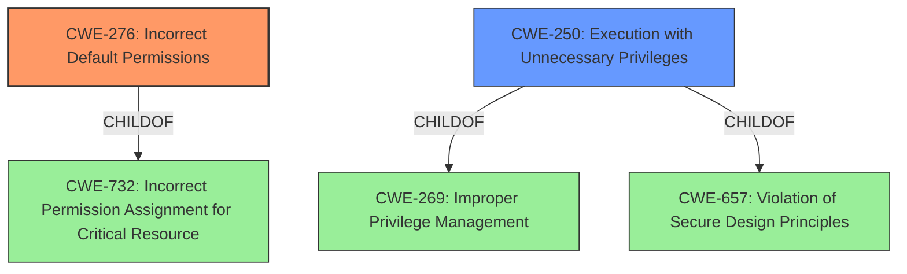

# Raw Analyzer Response for CVE-2021-21911

# Summary
| CWE ID | CWE Name | Confidence | CWE Abstraction Level | CWE Vulnerability Mapping Label | CWE-Vulnerability Mapping Notes |
|---|---|---|---|---|---|
| CWE-276 | Incorrect Default Permissions | 1.0 | Base | Allowed | Primary CWE |
| CWE-250 | Execution with Unnecessary Privileges | 0.7 | Base | Allowed | Secondary CWE |

## Evidence and Confidence

*   **Confidence Score:** 0.9
*   **Evidence Strength:** HIGH

## Relationship Analysis
The primary CWE is CWE-276, a Base level weakness describing incorrect default permissions. It is a child of CWE-732, which is a Class level weakness. The secondary CWE is CWE-250, also a Base level weakness, and a child of CWE-269 and CWE-657.

## Vulnerability Chain
The vulnerability chain begins with **incorrect default permissions** (CWE-276) on the installation directory and the service binary. Because the "Authenticated Users" group has "Full/Change" privileges, an attacker can replace the legitimate service binary with a malicious one. When the service restarts, it runs with NT SYSTEM privileges, leading to **privilege escalation**. Because the service is running with **unnecessary privileges** (CWE-250), the impact of the **incorrect permissions** (CWE-276) is amplified.

## Summary of Analysis
The initial assessment based on the "CWE for similar CVE Descriptions" and "Retriever Results" pointed towards CWE-276. The analysis of the vulnerability description and CVE reference links content summary strongly supports this classification. The **root cause** of the vulnerability is the **incorrect default permissions** on the installation directory and the service binary, allowing authenticated users to modify the `R_SeeNet.exe` file. This directly aligns with the description of CWE-276, which states that "During installation, installed file permissions are set to allow anyone to modify those files."
The analysis considered the retriever results and the provided context.
CWE-276 is at the Base level of abstraction, which is the preferred level.
The "CVE Reference Links Content Summary" provides strong evidence. "The "Authenticated Users" group has "Full/Change" privileges over the `SnmpMonSvs` service binary file (`R_SeeNet.exe`) located in the installation directory (`C:\R-SeeNet`). This allows any authenticated user to modify the binary file. The service is executed with NT SYSTEM privileges, leading to **privilege escalation** if the binary is replaced."
CWE-250, Execution with Unnecessary Privileges, is included as a secondary weakness because the service is running with NT SYSTEM privileges, amplifying the impact of CWE-276.

Relevant CWE Information:

# Enhanced Context (25 CWEs)

## CWE-1220: Insufficient Granularity of Access Control
**Abstraction Level**: Base
**Similarity Score**: 0.76
**Source**: dense

**Description**:
The product implements access controls via a policy or other feature with the intention to disable or restrict accesses (reads and/or writes) to assets in a system from untrusted agents. However, implemented access controls lack required granularity, which renders the control policy too broad because it allows accesses from unauthorized agents to the security-sensitive assets.
**Rationale for not selecting**: This CWE focuses on the granularity of the access control and policy but this vulnerability focuses on the **incorrect default permissions** being set for the service binary.

## CWE-653: Improper Isolation or Compartmentalization
**Abstraction Level**: Class
**Similarity Score**: 0.76
**Source**: dense

**Description**:
The product does not properly compartmentalize or isolate functionality, processes, or resources that require different privilege levels, rights, or permissions.
**Rationale for not selecting**: The vulnerability is not due to improper isolation or compartmentalization but due to **incorrect default permissions** on the installation directory.

## CWE-274: Improper Handling of Insufficient Privileges
**Abstraction Level**: Base
**Similarity Score**: 0.76
**Source**: dense

**Description**:
The product does not handle or incorrectly handles when it has insufficient privileges to perform an operation, leading to resultant weaknesses.
**Rationale for not selecting**: This vulnerability is not about handling insufficient privileges but about **incorrect default permissions** being assigned which allows unauthorized modification of the service binary.

## CWE-1289: Improper Validation of Unsafe Equivalence in Input
**Abstraction Level**: Base
**Similarity Score**: 0.75
**Source**: dense

**Description**:
The product receives an input value that is used as a resource identifier or other type of reference, but it does not validate or incorrectly validates that the input is equivalent to a potentially-unsafe value.
**Rationale for not selecting**: This vulnerability does not involve validating input values for resource identifiers, but focuses on the **incorrect default permissions** set on the service binary.

## CWE-184: Incomplete List of Disallowed Inputs
**Abstraction Level**: Base
**Similarity Score**: 0.75
**Source**: dense

**Description**:
The product implements a protection mechanism that relies on a list of inputs (or properties of inputs) that are not allowed by policy or otherwise require other action to neutralize before additional processing takes place, but the list is incomplete.
**Rationale for not selecting**: This vulnerability is not related to input validation or disallowed input lists. It's about **incorrect default permissions** on the service binary.

## CWE-807: Reliance on Untrusted Inputs in a Security Decision
**Abstraction Level**: Base
**Similarity Score**: 0.75
**Source**: dense

**Description**:
The product uses a protection mechanism that relies on the existence or values of an input, but the input can be modified by an untrusted actor in a way that bypasses the protection mechanism.
**Rationale for not selecting**: This vulnerability doesn't involve a protection mechanism relying on untrusted inputs. It's directly related to **incorrect default permissions** that allow modification of the service binary.

## CWE-691: Insufficient Control Flow Management
**Abstraction Level**: Pillar
**Similarity Score**: 0.75
**Source**: dense

**Description**:
The code does not sufficiently manage its control flow during execution, creating conditions in which the control flow can be modified in unexpected ways.
**Rationale for not selecting**: This CWE is too broad and doesn't directly address the **incorrect default permissions** that are the root cause of the vulnerability.

## CWE-280: Improper Handling of Insufficient Permissions or Privileges
**Abstraction Level**: Base
**Similarity Score**: 0.75
**Source**: dense

**Description**:
The product does not handle or incorrectly handles when it has insufficient privileges to access resources or functionality as specified by their permissions. This may cause it to follow unexpected code paths that may leave the product in an invalid state.
**Rationale for not selecting**: This vulnerability isn't about the product handling insufficient privileges. It is about **incorrect default permissions** that allow unauthorized modification of the service binary.

## CWE-183: Permissive List of Allowed Inputs
**Abstraction Level**: Base
**Similarity Score**: 0.75
**Source**: dense

**Description**:
The product implements a protection mechanism that relies on a list of inputs (or properties of inputs) that are explicitly allowed by policy because the inputs are assumed to be safe, but the list is too permissive - that is, it allows an input that is unsafe, leading to resultant weaknesses.
**Rationale for not selecting**: This vulnerability is unrelated to input validation or overly permissive lists. It is about **incorrect default permissions** on the service binary.

## CWE-664: Improper Control of a Resource Through its Lifetime
**Abstraction Level**: Pillar
**Similarity Score**: 0.75
**Source**: dense

**Description**:
The product does not maintain or incorrectly maintains control over a resource throughout its lifetime of creation, use, and release.
**Rationale for not selecting**: While this CWE is relevant, it is too high-level. The vulnerability stems specifically from **incorrect default permissions** assigned during installation, making CWE-276 a more appropriate choice.

## CWE-427: Uncontrolled Search Path Element
**Abstraction Level**: