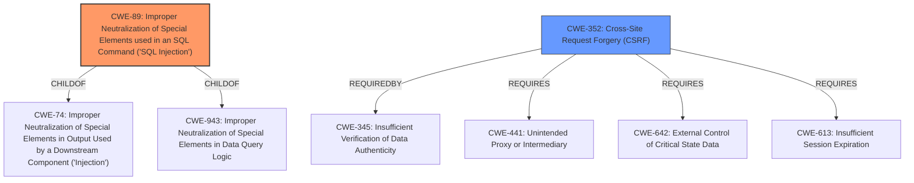

# Analysis for CVE-2021-21916

# Summary
| CWE ID | CWE Name | Confidence | CWE Abstraction Level | CWE Vulnerability Mapping Label | CWE-Vulnerability Mapping Notes |
|---|---|---|---|---|---|
| CWE-89 | Improper Neutralization of Special Elements used in an SQL Command ('SQL Injection') | 1.0 | Base | Allowed | Primary CWE. The vulnerability is due to **insufficient sanitization** of the `description_filter` parameter before being used in a SQL query. |
| CWE-352 | Cross-Site Request Forgery (CSRF) | 0.7 | Compound | Allowed | Secondary candidate. The vulnerability description mentions that the **SQL injection** can be exploited through cross-site request forgery. |

## Evidence and Confidence

*   **Confidence Score:** 0.9
*   **Evidence Strength:** HIGH

## Relationship Analysis
The primary CWE is CWE-89, which is a base-level CWE. It is a child of CWE-74 (Improper Neutralization of Special Elements in Output Used by a Downstream Component ('Injection')) and CWE-943 (Improper Neutralization of Special Elements in Data Query Logic). The secondary CWE is CWE-352, which is a compound CWE, indicating a combination of multiple weaknesses. The relationship between CWE-89 and CWE-352 is that the **SQL injection** vulnerability can be exploited via CSRF.

## Vulnerability Chain
The vulnerability chain starts with the **insufficient sanitization** of the `description_filter` parameter (CWE-89), which allows an attacker to inject arbitrary SQL commands. This can be exploited either by an authenticated user or through cross-site request forgery (CWE-352).

## Summary of Analysis
The initial analysis identified the primary weakness as CWE-89 due to the **SQL injection** vulnerability caused by **insufficient sanitization** of the `description_filter` parameter. The vulnerability description explicitly states that "The `description_filter` parameter is not properly sanitized before being used in a SQL query." This aligns perfectly with the description of CWE-89. The retriever results also strongly support this classification, with CWE-89 having the highest score.

The secondary weakness is CWE-352 because the **SQL injection** can be exploited through cross-site request forgery. This is explicitly mentioned in the vulnerability description: "This can be done as any authenticated user or through cross-site request forgery."

The relationship graph shows that CWE-89 is a child of CWE-74 and CWE-943, indicating that it is a specific type of injection vulnerability related to SQL commands. CWE-352 requires other weaknesses to be exploitable.

The selected CWEs are at the optimal level of specificity because CWE-89 is a base-level CWE that directly describes the root cause of the vulnerability, and CWE-352 describes how the vulnerability can be exploited from a different perspective. Other CWEs like CWE-74, CWE-79, and CWE-78 were considered but not selected because they do not accurately represent the specific nature of the vulnerability. For example, CWE-74 is a class-level CWE that is too general, and CWE-79 is specific to cross-site scripting, which is not the primary weakness here. CWE-78 is specific to OS command injection, which is also not relevant.