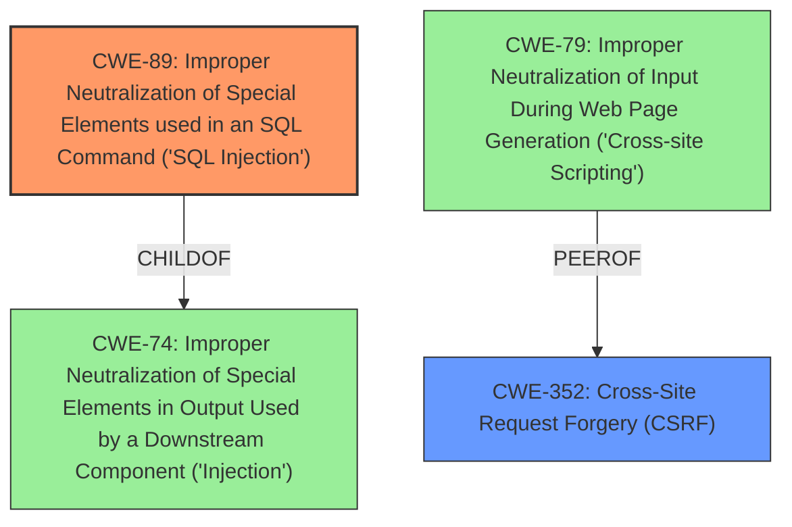

# Enhanced Analysis for CVE-2021-21920

# Summary
| CWE ID | CWE Name | Confidence | CWE Abstraction Level | CWE Vulnerability Mapping Label | CWE-Vulnerability Mapping Notes |
|---|---|---|---|---|---|
| CWE-89 | Improper Neutralization of Special Elements used in an SQL Command ('SQL Injection') | 1.0 | Base | Allowed | Primary CWE |
| CWE-352 | Cross-Site Request Forgery (CSRF) | 0.6 | Compound | Allowed | Secondary Candidate |

## Evidence and Confidence

*   **Confidence Score:** 0.8
*   **Evidence Strength:** HIGH

## Relationship Analysis
The primary relationship that influenced the decision was the ChildOf relationship between CWE-89 and CWE-74, where CWE-89 is a more specific case of **Improper Neutralization** within the context of SQL commands. The peer relationship between CWE-79 (Cross-Site Scripting) and CWE-352 (Cross-Site Request Forgery) was also considered, given the mention of CSRF in the vulnerability description, leading to the inclusion of CWE-352 as a secondary candidate.



## Vulnerability Chain
The chain of vulnerabilities starts with the **improper neutralization** of input, specifically the `surname_filter` parameter. This leads directly to **SQL injection**, allowing an attacker to manipulate SQL queries. The potential for Cross-Site Request Forgery (CSRF) could then be used to amplify the attack, tricking authenticated users into unknowingly executing malicious queries.

## Summary of Analysis
The initial assessment focused on the **SQL injection** vulnerability, aligning directly with CWE-89. The description explicitly mentions an **SQL injection** vulnerability through the `surname_filter` parameter. The "CWE for similar CVE Descriptions" section lists CWE-89 as the primary match. The CVE Reference Links Content Summary section describes the **root cause** as the **misuse of prepared statements** and **improper sanitization** leading to **SQL injection**. The attack vector is through HTTP GET requests, and the attacker either needs administrative privileges or can leverage CSRF.

The inclusion of CWE-352 is based on the statement that "An attacker can make authenticated HTTP requests to trigger this vulnerability at surname_filter parameter with the administrative account or through cross-site request forgery." While the primary vulnerability is SQL injection, the mention of CSRF as a potential attack vector suggests that the application does not sufficiently verify the origin of the requests. However, since CSRF is only a possible attack vector and not a direct result of the **SQL injection** itself, it is considered a secondary candidate.

The selection of CWE-89 is at the optimal level of specificity because it directly describes the **SQL injection** vulnerability, which is the core issue. The retriever results also list CWE-89 as the top combined result with a score of 1.000, further supporting this decision.

Relevant CWE Information:

# Enhanced Context (25 CWEs)

## CWE-134: Use of Externally-Controlled Format String
**Abstraction Level**: Base
**Similarity Score**: 0.80
**Source**: dense

**Description**:
The product uses a function that accepts a format string as an argument, but the format string originates from an external source.
**Not Used:** This CWE was not selected because the vulnerability description clearly states the issue is SQL injection and not related to format string usage.

## CWE-74: Improper Neutralization of Special Elements in Output Used by a Downstream Component ('Injection')
**Abstraction Level**: Class
**Similarity Score**: 0.77
**Source**: dense

**Description**:
The product constructs all or part of a command, data structure, or record using externally-influenced input from an upstream component, but it does not neutralize or incorrectly neutralizes special elements that could modify how it is parsed or interpreted when it is sent to a downstream component.
**Not Used:** CWE-74 is a higher-level class. The vulnerability is more specifically an SQL Injection, so CWE-89 is a better fit.

## CWE-138: Improper Neutralization of Special Elements
**Abstraction Level**: Class
**Similarity Score**: 0.77
**Source**: dense

**Description**:
The product receives input from an upstream component, but it does not neutralize or incorrectly neutralizes special elements that could be interpreted as control elements or syntactic markers when they are sent to a downstream component.
**Not Used:** CWE-138 is a higher-level class. The vulnerability is more specifically an SQL Injection, so CWE-89 is a better fit.

## CWE-184: Incomplete List of Disallowed Inputs
**Abstraction Level**: Base
**Similarity Score**: 0.77
**Source**: dense

**Description**:
The product implements a protection mechanism that relies on a list of inputs (or properties of inputs) that are not allowed by policy or otherwise require other action to neutralize before additional processing takes place, but the list is incomplete.
**Not Used:** The description does not indicate an incomplete list of disallowed inputs but rather a general lack of proper sanitization or escaping for SQL commands.

## CWE-116: Improper Encoding or Escaping of Output
**Abstraction Level**: Class
**Similarity Score**: 0.76
**Source**: dense

**Description**:
The product prepares a structured message for communication with another component, but encoding or escaping of the data is either missing or done incorrectly. As a result, the intended structure of the message is not preserved.
**Not Used:** While **improper encoding or escaping** can contribute to **SQL injection**, the root cause is the **improper neutralization** of SQL special elements. Therefore, CWE-89 is more appropriate.

## CWE-80: Improper Neutralization of Script-Related HTML Tags in a Web Page (Basic XSS)
**Abstraction Level**: Variant
**Similarity Score**: 0.76
**Source**: dense

**Description**:
The product receives input from an upstream component, but it does not neutralize or incorrectly neutralizes special characters such as "<", ">", and "&" that could be interpreted as web-scripting elements when they are sent to a downstream component that processes web pages.
**Not Used:** The vulnerability description focuses on SQL injection, not Cross-Site Scripting.

## CWE-125: Out-of-bounds Read
**Abstraction Level**: Base
**Similarity Score**: 0.76
**Source**: dense

**Description**:
The product reads data past the end, or before the beginning, of the intended buffer.
**Not Used:** The description focuses on SQL injection, not out-of-bounds read.

## CWE-1289: Improper Validation of Unsafe Equivalence in Input
**Abstraction Level**: Base
**Similarity Score**: 0.76
**Source**: dense

**Description**:
The product receives an input value that is used as a resource identifier or other type of reference, but it does not validate or incorrectly validates that the input is equivalent to a potentially-unsafe value.
**Not Used:** The description focuses on SQL injection, not unsafe equivalence.

## CWE-113: Improper Neutralization of CRLF Sequences in HTTP Headers ('HTTP Request/Response Splitting')
**Abstraction Level**: Variant
**Similarity Score**: 0.75
**Source**: dense

**Description**:
The product receives data from an HTTP agent/component (e.g., web server, proxy, browser, etc.), but it does not neutralize or incorrectly neutralizes CR and LF characters before the data is included in outgoing HTTP headers.
**Not Used:** The description focuses on SQL injection, not CRLF injection.

## CWE-41: Improper Resolution of Path Equivalence
**Abstraction Level**: Base
**Similarity Score**: 0.75
**Source**: dense

**Description**:
The product is vulnerable to file system contents disclosure through path equivalence. Path equivalence involves the use of special characters in file and directory names. The associated manipulations are intended to generate multiple names for the same object.
**Not Used:** The description focuses on SQL injection, not path equivalence.

## CWE-918: Server-Side Request Forgery (SSRF)
**Abstraction Level**: Base
**Similarity Score**: 7782.93
**Source**: sparse

**Description**:
The web server receives a URL or similar request from an upstream component and retrieves the contents of this URL, but it does not sufficiently ensure that the request is being


## CWE Relationship Analysis

Current CWEs represent these abstraction levels: .


### Vulnerability Chain Analysis

**Chain starting from CWE-113:**
- 113 (Improper Neutralization of CRLF Sequences in HTTP Headers ('HTTP Request/Response Splitting')) - ROOT


**Chain starting from CWE-79:**
- 79 (Improper Neutralization of Input During Web Page Generation ('Cross-site Scripting')) - ROOT


### CWE Relationship Diagram

```mermaid
graph TD
    classDef primary fill:#f96,stroke:#333,stroke-width:2px
    classDef secondary fill:#69f,stroke:#333
    classDef tertiary fill:#9e9,stroke:#333
```