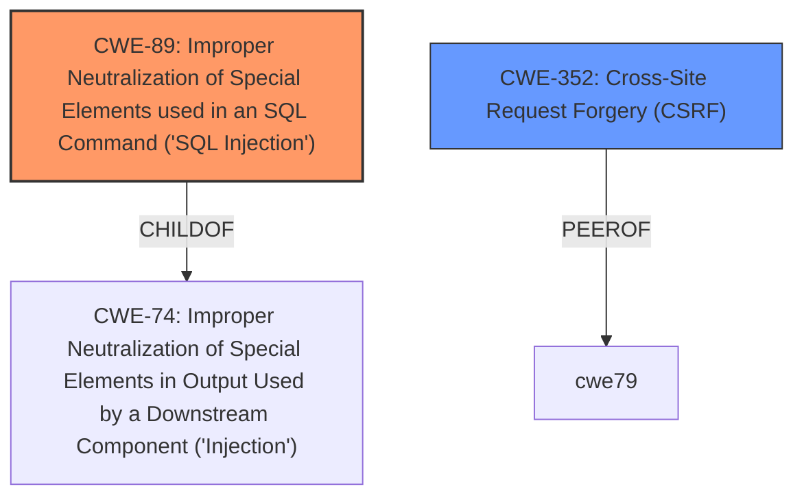

# Raw Analyzer Response for CVE-2021-21921

# Summary
| CWE ID | CWE Name | Confidence | CWE Abstraction Level | CWE Vulnerability Mapping Label | CWE-Vulnerability Mapping Notes |
|---|---|---|---|---|---|
| CWE-89 | Improper Neutralization of Special Elements used in an SQL Command ('SQL Injection') | 1.0 | Base | Allowed | Primary CWE. The vulnerability description clearly states "**SQL injection**" which directly matches the CWE-89 definition. The CVE Reference Links Content Summary details how user-controlled input (`name_filter` parameter) is used to construct an SQL command without proper neutralization, leading to the injection vulnerability. |
| CWE-352 | Cross-Site Request Forgery (CSRF) | 0.7 | Compound | Allowed | Secondary CWE. The vulnerability description mentions that the SQL injection can be triggered through cross-site request forgery. CWE-352 is a compound weakness, representing a combination of factors that allows an attacker to trick a user into making unintended requests. |

## Evidence and Confidence

*   **Confidence Score:** 0.9
*   **Evidence Strength:** HIGH

## Relationship Analysis
The primary relationship that impacted my decision was the parent-child relationship between CWE-74 (Improper Neutralization of Special Elements in Output Used by a Downstream Component ('Injection')) and CWE-89 (Improper Neutralization of Special Elements used in an SQL Command ('SQL Injection')), where CWE-89 is a specific type of injection. The vulnerability description directly states "SQL injection," making CWE-89 the more specific and appropriate choice. CWE-352 (Cross-Site Request Forgery) is included as a secondary weakness, as the attack vector involves potentially exploiting the SQL injection via CSRF.

## Vulnerability Chain
The chain of root cause and weaknesses for the Vulnerability Description is as follows:
1.  Improper Neutralization of Input: The root cause is the **lack of proper neutralization** of special elements in the `name_filter` parameter.
2.  SQL Injection: This leads to **SQL injection** (CWE-89), where an attacker can inject arbitrary SQL commands.
3.  Cross-Site Request Forgery (CSRF): The vulnerability can be exploited via **cross-site request forgery** (CWE-352), allowing an attacker to trigger the SQL injection on behalf of another user.
4.  Impact: The impact includes the ability to extract sensitive data, modify/delete data, and potentially gain unauthorized access.

## Summary of Analysis
My assessment is heavily based on the provided evidence, specifically the vulnerability description and the CVE Reference Links Content Summary. The vulnerability description explicitly mentions "**SQL injection**" and the CVE Reference Links Content Summary details the **improper use** of prepared statements, which is the root cause. The evidence from the CVE Reference Links Content Summary section states: "SQL queries are built by concatenating sanitized variables and SQL code in stored procedures... this protection is lost because the concatenated string is used to create a prepared statement from a variable (@sql) without specific parameter bindings." The relationship graph influenced my decision by highlighting the connection between CWE-74 and CWE-89, confirming that SQL injection is a specific type of injection.

The selection of CWE-89 is at the optimal level of specificity because it directly addresses the **SQL injection** vulnerability described. While CWE-74 is a broader class of injection vulnerabilities, CWE-89 is a more precise representation of the actual weakness. The inclusion of CWE-352 acknowledges the possibility of exploiting the SQL injection via CSRF.

Other CWEs Considered but Not Used:

*   CWE-79 (Improper Neutralization of Input During Web Page Generation ('Cross-site Scripting')): While the attack vector is through an HTTP request, the vulnerability is specifically SQL injection, not XSS.
*   CWE-918 (Server-Side Request Forgery (SSRF)): There's no evidence of the application making requests to arbitrary URLs, so SSRF doesn't apply.
*   CWE-134 (Use of Externally-Controlled Format String): There's no mention of format string vulnerabilities in the description.
*   CWE-184 (Incomplete List of Disallowed Inputs): Although sanitization is mentioned, the core issue is the improper use of prepared statements, not an incomplete list of disallowed inputs.
*   CWE-116 (Improper Encoding or Escaping of Output): While related to neutralization, the specific issue is SQL injection, making CWE-89 more appropriate.